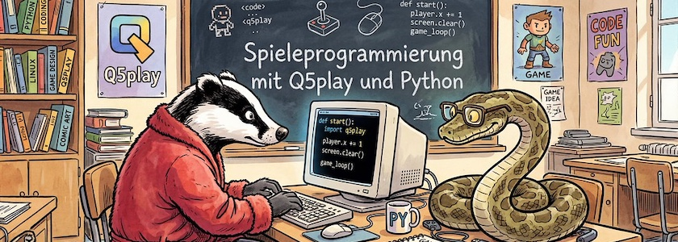

Es hatte sich [hier schon angekündigt](https://q5js.substack.com/p/q5play-in-python), nun [posaunte es *Quinton Ashley* »offiziell« hinaus](https://substack.com/home/post/p-195863194): [Q5play](https://q5play.org/home/), der Game-Engine-Ableger der »rasend schnellen« [P5.js](http://cognitiones.kantel-chaos-team.de/programmierung/creativecoding/processing/p5js.html)-Alternative [Q5.js](https://q5js.org/home/) kann jetzt auch Python. Damit könnt Ihr auch über Python auf die Leistungsfähigkeit von WebGPU-Graphiken und WASM-basierten Physiksimulationen zugreifen.

Dafür müsst Ihr im [Q5.js-Webeditor](https://codevre.com/q5-editor) oben rechts unter `Settings -> Template` die Einstellung lediglich auf `q5play Python project` ändern. Und damit Ihr Euch nicht völlig alleingelassen fühlt, gibt es das interaktive Online-Tutorial »[Learn Q5play](https://q5play.org/learn/)« auch als Python-Edition (einfach auf das Python-Logo klicken), eine 50-seitige, anfängerfreundlicher Dokumentation mit Codebeispielen.

Die Engine, die hinter allem werkelt ist [Brython](http://cognitiones.kantel-chaos-team.de/programmierung/python/brython.html) (**Br**owser P**ython**), eine freie (BSD-3 Lizenz) Python-3-Implementierung, die im Browser läuft und als Ersatz für JavaScript gedacht ist. Neben der Standardbibliothek können einmal auch andere (Pure Python) Module geladen werden, allerdings keine Module, die zum Beispiel C- oder FORTRAN-basierte Teile enthalten. Das schließt Module wie `numpy`, `scipy`, `matplotlib` oder `pandas`, aber auch Pythons Turtle, aus. Dafür gibt es aber noch das »eingebautes« Modul `browser`, das den Python-Skripten Zugriffe auf das DOM-API erlaubt.

Brython werkelt auch hinter der Python-Version von [microStudio](http://cognitiones.kantel-chaos-team.de/multimedia/spieleprogrammierung/microstudio.html). Auch hier werden die Nachteile von Brython (keinen Zugriff auf den *Scientific Stack*) mindestens teilweise dadurch ausgeglichen, daß man auch via Brython Zugriff auf JavaScript-Bibliotheken hat, in Q5play zum Beispiel auf [Box2D](https://en.wikipedia.org/wiki/Box2D) (JavaScript-Version).

Das alles klingt auf den ersten Blick ganz nett, doch leider steht Q5play unter einer [seltsamen Lizenz](https://github.com/q5play/q5play?tab=License-1-ov-file#readme), die für die Nutzung in der Ausbildung Knete verlangt. Ansonsten darf man -- außerhalb militärischer Einrichtungen -- das Teil kostenlos nutzen, aber mich überzeugt die Lizenz nicht. Daher ist Q5play für mich leider keine Alternative zu [microStudio](https://kantel.github.io/#category=microStudio) oder [Pyxel](http://cognitiones.kantel-chaos-team.de/multimedia/spieleprogrammierung/pyxel.html), wenn es um Python-Spieleprogrammierung für das Web geht. Was ein wenig schade ist, denn ohne diese seltsame Lizenz macht das Ding auf mich eigentlich einen guten Eindruck.

---

**Bild**: *[Q5play kann Python](https://www.flickr.com/photos/schockwellenreiter/55240301811/)*, erstellt mit [Scenario](http://cognitiones.kantel-chaos-team.de/technikgeschichte/rechnerundnetze/scenario.html). Prompt: »*A badger in a red dressing gown and a python wearing horn-rimmed glasses are sitting together in a classroom in front of a computer, programming games. On the blackboard behind them, written in chalk, are the words: "Spieleprogrammierung mit Q5play und Python". Colored Franco-Belgian comic style. Language: German. No speech bubbles, no textboxes, no headlines.*« Modell: Nano Banana&nbsp;2.