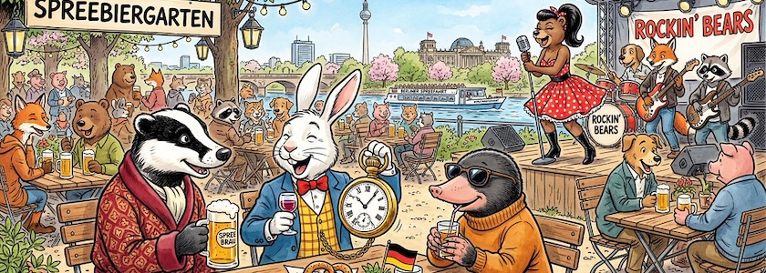

Der Mai will uns mit all seiner Pracht zeigen, was er kann. Heute, am 1.&nbsp;Mai, stieg das Thermometer auf 28°C und bescherte uns bei strahlend blauem Himmel den ersten Sommertag des Jahres. Trotzdem ist es Zeit für die Zahlen, die manches Mal hochtrabend auch *Mediadaten* genannt werden: Im April 2026 hatte der *Schockwellenreiter* laut seinem nicht immer zuverlässigen, aber dafür (hoffentlich!) DSGVO-konformen ~~Geißenpeter~~ [Neugiertool](https://www.goatcounter.com/) exakt **6.516&nbsp;Seitenaufrufe**. Auch wenn die Exaktheit dieser Ziffer eine Genauigkeit der Zahl nur vortäuscht, ist dies wieder ein schönes Ergebnis. Und so freue ich mich über jede Besucherin und jeden Besucher und bedanke mich bei allen meinen Leserinnen und Lesern.

😎 &nbsp; *Bleibt mir gewogen!*

Auch wenn sich an der Spitze nicht viel getan hat, in die *Top Five* des Vormonats scheint Bewegung gekommen zu sein.

1. An der Spitze steht immer noch unangefochten, aber mit deutlichen Einbrüchen, der über zwei Jahre alte und daher schon etwas überholte Klassiker »[Bildgeneratoren und Künstliche Intelligenz – ohne Zensoren](https://kantel.github.io/posts/2024011002_ki_ohne_zensor/)« vom 10.&nbsp;Januar&nbsp;2024.
2. Auch auf Platz&nbsp;zwei hat sich nicht viel geändert. Jedoch hat der schon ebenfalls etwas ältere Beitrag »[All about Anytype – meine neue, digitale Rumpelkammer?](https://kantel.github.io/posts/2024081201_anytype/)« vom 13.&nbsp;August&nbsp;2024 weiter an Popularität zugenommen.
3. Überraschend landete »[Capacities: Ein weiterer Kandidat für mein »Zweites Gehirn«?](https://kantel.github.io/posts/2025020301_capacities/)« vom 3.&nbsp;Februar&nbsp;2025 direkt hinter Anytpye auf dem dritten Platz.
4. Neu, aber nicht überraschend *(Sex sells)* landete »[Little Lilly: Weitere Experimente mit Monogatari](https://kantel.github.io/posts/2026040102_little_lilly_monogatari/)« vom 1.&nbsp;April&nbsp;2026 auf Platz&nbsp;vier.
5. Und den fünften Platz teilen sich mit der gleichen Anzahl von Seitenaufrufen die auch logisch zusammengehörenden Beiträge »[Statische Seiten mit MkDocs (Material)](https://kantel.github.io/posts/2025062101_mkdocs/)« vom 21.&nbsp;Juni&nbsp;2025 und »[Statische Seiten: Ist Zensical der legitime Nachfolger von MkDocs (Material)?](https://kantel.github.io/posts/2026042101_zensical/)« vom 21.&nbsp;April&nbsp;2026.

Das ist doch wieder ein bunter Gemischtwarenladen, den die *Top Five* des Aprils&nbsp;2026 da bieten, dem chaotischen Image des Monats *(»Der April, der April, der macht, was er will«)* angemessen.

---

**Bild**: *[Heraus zum 1. Mai](https://www.flickr.com/photos/schockwellenreiter/55242470698/)*, erstellt mit [Scenario](http://cognitiones.kantel-chaos-team.de/technikgeschichte/rechnerundnetze/scenario.html). Prompt: »*A badger in a red dressing gown, a white rabbit in a yellow checkered vest, a blue jacket and a red bow tie and carrying a giant pocket watch with a chain, and a mole wearing sunglasses sitting in a Berlin beer garden on the banks of the Spree River, enjoying the pleasant spring weather. At the other tables, many anthropomorphic animals are also sitting with their drinks. On a stage in the background, a rock and roll band is playing, featuring a sexy female bear in a petticoat as the singer and other anthropomorphic animals as musicians. Colored Franco-Belgian comic style. No speech bubbles, no textboxes.*« Modell: Nano Banana&nbsp;2.