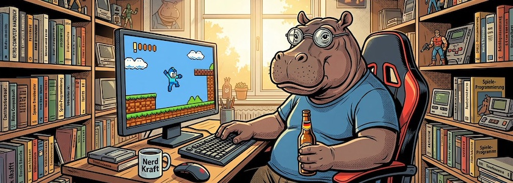

Nachdem ich mich gestern über Spieleprogrammierung in Python (mit [Q5play](https://q5play.org/home/) und [Brython](http://cognitiones.kantel-chaos-team.de/programmierung/python/brython.html)) [ausgelassen hatte](https://kantel.github.io/posts/2026043001_q5play_python/), hatte ich richtig Lust bekommen, meine [Tutorialreihe](https://kantel.github.io/index.html#category=Pyxel) mit der dort erwähnten, (gar nicht mal so) kleinen Python-Retrogame-Konsole [Pyxel](http://cognitiones.kantel-chaos-team.de/multimedia/spieleprogrammierung/pyxel.html) wieder aufzunehmen.

Und unser aller, allwissende Datenkrake hatte es natürlich schon vorhergesehen und spülte mir Links zu zwei recht jungen (die eine ist von Januar 2024, die zweite von Januar 2026), mehrteiligen Tutorials zu Pyxel in meinen Feedreader:

### Introduction to retrogame programming with Pyxel

Die erste Reihe heisst »Learning Pyxel« (oder im Original »Apprendre Pyxel«) und besteht aus vier Teilen, die ich -- da es keine Übersichtsseite gibt -- hier einzeln aufführe:

1. [Introduction to retrogame programming with Pyxel](https://blog.garambrogne.net/pyxel-initiation-en.html)
2. [Learning Pyxel: Moving Sprites with the Mouse](https://blog.garambrogne.net/pyxel-bat-en.html)
3. [Learning Pyxel: Fleeing Danger and Game Over](https://blog.garambrogne.net/pyxel-beholder-en.html)
4. [Apprendre Pyxel : carte de tuiles et collision](https://blog.garambrogne.net/pyxel-jones.html)

Der Autor dieser vier Tutorial scheint Franzose zu sein und hat es leider nicht geschafft, das letzte Tutorial ins Englische zu übersetzen. Wer -- wie ich -- nur marginale Französischkenntnisse besitzt, muß sich daher diesen Beitrag von Google übersetzen lassen (die Datenkrake macht das aber mittlerweile recht gut).

### Getting Started with 2D Games Using Pyxel

Von der jüngeren Tutorialreihe »Getting Started with 2D Games Using Pyxel« gibt es glücklicherweise eine [Übersichtseite](https://dev.to/sdkfz181tiger/series/34902), auf die ich verlinken kann, so daß ich die dort aufgeführten 15 Teile nicht einzeln abtippen und verlinken muss.

Allerdings gibt es davon noch einen (unvollendeten?) Teil 16 »[Vampire Shooting Game (Sample)](https://dev.to/sdkfz181tiger/getting-started-with-2d-games-using-pyxel-part-16-vampire-shooting-game-sample-42h7)«, der es aus irgendwelchen Gründen nicht auf die Übersichtsseite geschafft hat und den ich daher hier noch einzeln nachschiebe.

Für meine Reise mit Alice, [Twine](http://cognitiones.kantel-chaos-team.de/multimedia/spieleprogrammierung/twine2.html) und [Chapbook](https://klembot.github.io/chapbook/guide/) ins Wunderland habe ich noch zwei Folgen geplant. Danach darf sich Alice erst einmal ein wenig ausruhen und ich werde mich wieder verstärkt Pyxel, dieser kleinen Python-Retrogame-Konsole zuwenden. *Still digging!*

---

**Bild**: *[Jo Hippo als Spieleprogrammierer](https://www.flickr.com/photos/schockwellenreiter/55243065345/)*, erstellt mit [OpenArt](https://openart.ai/home). Prompt: »*A@Jo Hippo sit at a desk in front of a computer, in a wide gaming chair. A pixelated retro platformer game is displayed on the monitor. One hand is on the keyboard, the other holds an open bottle of beer. All the walls are lined with shelves crammed with computer books and knick-knacks. The summer sun shines through a large window in the background. Colored classic American comic style. Language: German. No speech bubbles, no textboxes.*« Modell: Nano Banana&nbsp;2.