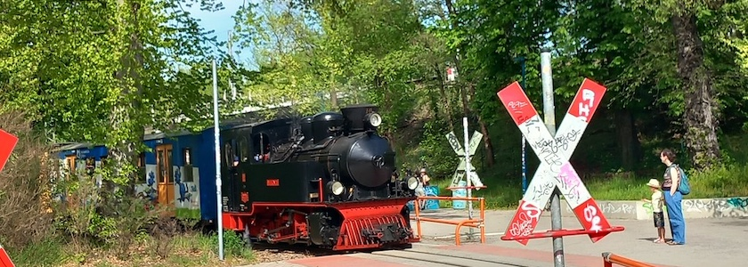
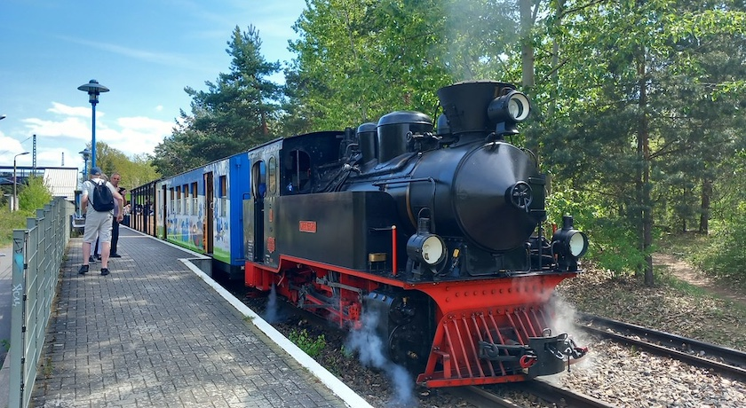
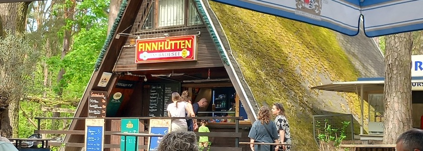

Das Wochenende vom 2. und 3. Mai dieses Jahres war der Auftakt der diesjährigen Jubiläumswochenenden »[70 Jahre Parkeisenbahn Wuhlheide](https://www.lok-report.de/news/deutschland/museum/70-jahre-parkeisenbahn-mit-volldampf-durch-die-wuhlheide.html)«. Denn seit dem 10.&nbsp;Juni&nbsp;1956 dampft, zischt und rattert die vorwiegend von Kindern und Jugendlichen betriebene, [ehemalige Pioniereisenbahn](https://de.wikipedia.org/wiki/Parkeisenbahn_Wuhlheide) durch den Freizeit- und Erhohlugspark [Wuhlheide](https://de.wikipedia.org/wiki/Wuhlheide). Aus diesem Grunde waren die liebste aller Freundinnen und ich am Sonntag unterwegs, um mit einem von der Dampflok »Merapi« gezogenen Zug bei einer Rundfahrt mit Volldampf durch die Wuhlheide zu zuckeln.

Die »Merapi« ist vor über 100 Jahren (1925) von *Hanomag* in Hannover gebaut worden, war später in Indonesien auf der Insel Java auf einer Zuckerrohrplantage im Einsatz und ist seit 1992 in der Wuhlheide unterwegs. Sie ist die älteste betriebsfähige Dampflok Berlins. Sie schnaufte uns auf einem etwa dreiviertelstündigen Rundkurs vom S-Bahnhof Wuhlheide über die Bahnhöfe Parkbühne und Stadion, den Hauptbahnhof der Parkeisenbahn und die Bahnhöfe Eichgestell und Badesee wieder zum Ausgangsbahnhof zurück. Für einen Pufferküsser wie mich war das ein phantastisches Erlebnis.

Wir waren allerdings schon am Bahnhof Badesee ausgestiegen, um in den [Finnhütten](https://wuhlheide-erleben.de/angebot/finnhutten-am-badesee/) bei einem Glas Bier der Hitze zu entfliehen und einer Gruppe von Vorschulkindern bei ihrer sehr ernsthaft betriebenen Dinosaurierjagd zuzuschauen. *Jurassic Park* 🦖 in der Wuhlheide -- doch das ist eine ganz andere Geschichte.

### Literatur und Quellen:

- Berliner Parkeisenbahn gGmbH: *[70 Jahre Parkeisenbahn Wuhlheide](https://www.parkeisenbahn.de/veranstaltungen/70-jahre-parkeisenbahn-wuhlheide.html)*, aufgerufen am 5.&nbsp;Mai&nbsp;2026
- Redaktion LokReport: *[70 Jahre Parkeisenbahn – Mit Volldampf durch die Wuhlheide](https://www.lok-report.de/news/deutschland/museum/70-jahre-parkeisenbahn-mit-volldampf-durch-die-wuhlheide.html)*, 15.&nbsp;April&nbsp;2026
- Wikipedia: *[Parkeisenbahn Wuhlheide](https://de.wikipedia.org/wiki/Parkeisenbahn_Wuhlheide)*, aufgerufen am 5.&nbsp;Mai&nbsp;2026

---

**Photos** ([cc](https://creativecommons.org/licenses/by-sa/4.0/deed.de)) 2026: *[Jörg Kantel](http://cognitiones.kantel-chaos-team.de/cv.html)*