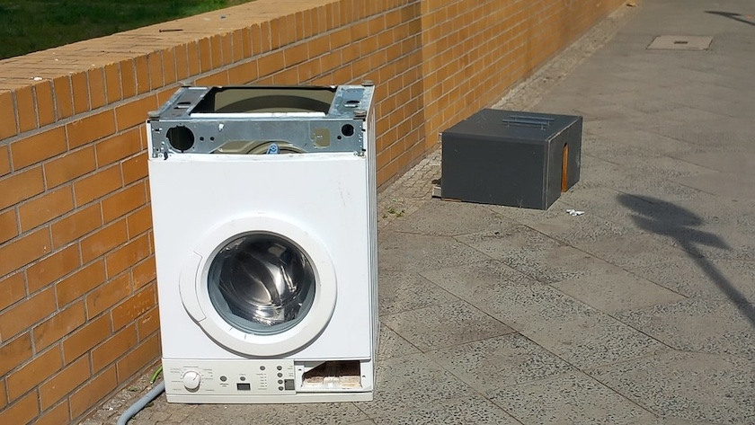

Kaum ist das Wetter etwas freundlicher geworden, kann auf den Straßen Neuköllns auch wieder im Freien gewaschen werden.

Wieder ein schönes Fundstück für meine mittlerweile knapp 2.000 Bilder umfassende Sammlung »[Wohnsitz Neukölln](https://www.flickr.com/photos/schockwellenreiter/albums/1244272/)«.

---

**Photo** ([cc](https://creativecommons.org/licenses/by-sa/4.0/deed.de)) 2026: *[Jörg Kantel](http://cognitiones.kantel-chaos-team.de/cv.html)*