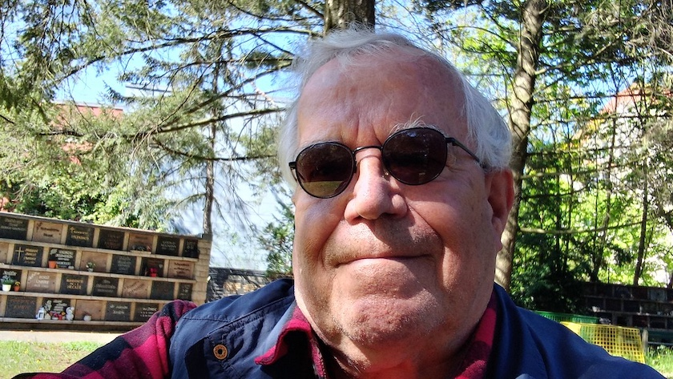

Vor ein paar Tagen war ich mal wieder auf dem [Emmauskirchhof](https://kantel.github.io/posts/2026042301_fruehling_emmauskirchhof/), um [Gabi](https://kantel.github.io/posts/2024041901_rip_gabi/) an ihrem Urnengrab zu besuchen, ein paar Erdnüsse an die dort lauernden Eichhörnchen zu verfüttern und -- weil das Wetter so sonnig war -- ein Selfie zu schießen.

Denn der größte Neuköllner (und kleinste Berliner) Wald, der [Emmauswald](https://emmauswald-bleibt.de/), war früher ebenfalls Teil des [Emmauskirchhofs](https://evfbs.de/start/friedhoefe/region-sued/einzeldarstellung/emmaus/kurzportraet). Und so nutze ich das Photo, um mal wieder an Gabis Vermächtnis zu erinnern: Der Emmauswald darf nicht einer skrupellosen Immobilienmafia (und ihren Handlangern im Berliner Senat) [geopfert werden](https://www.nd-aktuell.de/artikel/1188194.stadtentwicklung-emmauswald-in-neukoelln-kahlschlag-gegen-zahlung.html), die dort in der Hauptsache [teure Eigentumswohnungen hochziehen](https://taz.de/Debatte-um-den-Neukoellner-Emmauswald/!6013694/) wollen. Der Emmauswald gehört den Neuköllnern und der Emmauswald bleibt!

---

**Photo** ([cc](https://creativecommons.org/licenses/by-sa/4.0/deed.de)) 2026: *[Jörg Kantel](http://cognitiones.kantel-chaos-team.de/cv.html)*