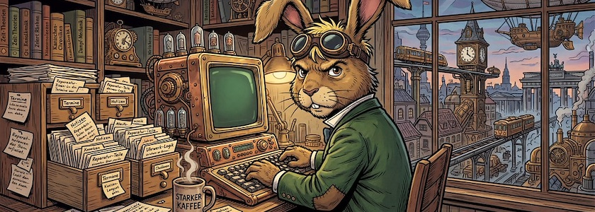

Es gibt mal wieder Neues von [Anytype](https://anytype.io/) zu berichten, der Software, die zusammen mit [Joplin](http://cognitiones.kantel-chaos-team.de/webworking/staticsites/joplin.html) die [Basis für mein »zweites Gehirn«](https://kantel.github.io/posts/2025112701_anytype_051/) bildet. Dabei ist Joplin so etwas wie mein täglicher Zettelkasten, während Anytype wegen der Möglichkeit, die Seiten aufzuhübschen und auch (einzelne) Seiten für das Web zu exportieren, ein Zwischending zwischen einem digitalen Garten und einer digitalen Rumpelkammer darstellt.

Schon Ende April wurde von [Anytype Desktop](https://download.anytype.io/) die Version 0.55 veröffentlicht. Diese Version führt Objektdiskussionen ein -- kommentieren und verschachtelte Unterhaltungen direkt in jedem Objekt führen. Bereiche und Chats werden in Kanäle mit einem überarbeiteten Erstellungsprozess integriert, Dateien werden zu vollwertigen Objekten, die Ihr hochladen und organisieren könnt, Lesezeichen erhalten ein eigenes Layout, und die neue Anytype Agents' Skill ermöglicht es KI-Programmieragenten, Ihre Daten zu lesen, zu erstellen und zu bearbeiten.

<iframe class="if16_9" src="https://www.youtube.com/embed/ugbq3ZG2YX4?si=HhgwVLXssb9MjNuj" title="YouTube video player" frameborder="0" allow="accelerometer; autoplay; clipboard-write; encrypted-media; gyroscope; picture-in-picture; web-share" referrerpolicy="strict-origin-when-cross-origin" allowfullscreen></iframe>

Darüber hinaus: Ein neu gestalteter Papierkorb mit Löschberechtigungen, ein neuer Seitenleisten-Ansichtsmodus, angeheftete Nachrichten und eine lange Liste von Fehlerbehebungen und Verbesserungen der Benutzerfreundlichkeit in der gesamten App. Wie immer führt die *fokussierte Neugierde* in [obigem Video](https://www.youtube.com/watch?v=ugbq3ZG2YX4) durch die wichtigsten Neuerungen dieses Updates. Eine komplette Liste aller Änderungen findet Ihr in den [Release Notes](https://community.anytype.io/t/anytype-desktop-0-55-0-let-s-discuss/30672).

<iframe class="if16_9" src="https://www.youtube.com/embed/6wB7GXuOazU?si=-ONYhfauiUrhMBD3" title="YouTube video player" frameborder="0" allow="accelerometer; autoplay; clipboard-write; encrypted-media; gyroscope; picture-in-picture; web-share" referrerpolicy="strict-origin-when-cross-origin" allowfullscreen></iframe>

Darüber hinaus gibt es von der *fokussierten Neugierde* auch noch ein Bonus-Video: Anläßlich des [Star-Wars-Tages](https://de.wikipedia.org/wiki/Star_Wars_Day) am 4.&nbsp;Mai *(May the ~~fourth~~ force be with you)* hat sie als ein Beispiel der Graphansicht von Anytype die Familienbeziehungen der Star-Wars-Personen visualisiert. Auch wenn dies nur ein kleines -- und dazu auch noch ein unvollständiges -- Beispiel ist, zeigt es, welche Möglichkeiten in der Graphansicht stecken. Ganz Hartgesottene können sich ja mal an die Verwandschaftsbeziehungen des griechischen Götterolymps wagen. Das wäre dann eine echte Herkulesaufgabe.

---

**Bild**: *[Die Zettelkästen des Märzhasen](https://www.flickr.com/photos/schockwellenreiter/55253912422/)*, erstellt mit OpenArt. Prompt: »*The March Hare sits at a desk in front of an antiquated, steampunk-style computer, typing on a keyboard. He wears a pair of aviator goggles, which he has pushed up onto his forehead. On the desk stands an open card catalog, its contents a chaotic jumble of handwritten index cards and loose scraps of paper. Beside the keyboard sits a mug of steaming coffee. Shelves crammed with books and steampunk knick-knacks line the walls. Through a window, one looks out upon a steampunk version of Berlin. Colored classic American comic style. Language: German. No speech bubbles, no textboxes. No German flags.*« Modell: Nano Banana&nbsp;2.