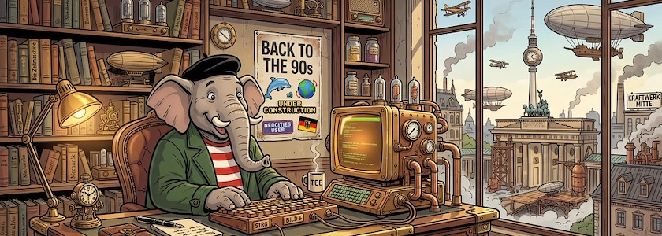

Es geht weiter mit [meiner frisch erwachten Begeisterung](https://kantel.github.io/posts/2026042902_zurueck_90er/), genau [wie damals in den 90er Jahren](https://kantel.github.io/posts/2026050602_indieweb/) einfach Webseiten [ohne Sinn und Verstand](http://blog.schockwellenreiter.de/2022/05/2022052401.html) (und vor allem auch ohne Kommerzdruck) zusammenzubasteln. Denn auch den »Happy Coder« *[Kevin Workman](https://happycoding.io/)* hat es erwischt: In seinem letztjährigen Seminar »[Intro to Web Dev – Fall 2024](https://www.youtube.com/playlist?list=PLty5Qt07EFvBEWemeNHQj25R1I-PQhvtj)« setzte er -- genau wie ich -- noch auf [Glitch&nbsp;🎏 als Spielplatz](https://www.youtube.com/watch?v=5g5laQST0Tg) für seine Webexperimente (und die Experimente seiner Studentinnen und Studenten).

<iframe class="if16_9" src="https://www.youtube.com/embed/Dq5MYv2BUwg?si=XoiB4RwiY4AUNVcN" title="YouTube video player" frameborder="0" allow="accelerometer; autoplay; clipboard-write; encrypted-media; gyroscope; picture-in-picture; web-share" referrerpolicy="strict-origin-when-cross-origin" allowfullscreen></iframe>

Doch nach dem überraschenden [Ende von Glitch&nbsp;🎏](https://kantel.github.io/posts/2025052402_glitch_ende/) musste auch er umdisponieren und so verlegte er den Spielplatz für seinen aktuellen Kurs »[Intro to Web Dev - Fall 2025](https://www.youtube.com/playlist?list=PLty5Qt07EFvBrbNMCg04Q2vUleiasg54M)« für sich und seine Studentinnen und Studenten nach Neocities. Diesen Umzug hat er in dem obigen, einleitenden Video für diesen Kurs »[Coding HTML with Neocities](https://www.youtube.com/watch?v=Dq5MYv2BUwg)« dokumentiert und gleichzeitig in seinem Beitrag »[Online Code Editors](https://happycoding.io/tutorials/html/online-code-editors)« begründet.

Doch Vorsicht, *Kevin Workmans* aktuelle Playlisten sind wie Blogposts organisiert, der jüngste Beitrag steht immer oben. Wenn Ihr die Videos daher in chronologischer Reihenfolge schauen und mit dem zeitlich ältesten beginnen wollt, müsst Ihr mit dem Video mit der höchsten Nummer -- in diesem Fall »$18$« -- beginnen und Euch dann rückwärts vorarbeiten. Aber Kevins Videos sind nicht nur lehrreich, sondern auch sehr kurzweilig. Die Mühe lohnt sich also auf jeden Fall.

Und ob [Neocities](https://de.wikipedia.org/wiki/Neocities), [Nekoweb](https://nekoweb.org/) oder [Netlify](https://www.netlify.com/), das [IndieWeb](https://en.wikipedia.org/wiki/IndieWeb) hat auch mich gepackt: Ich kann es kaum erwarten, wieder wie früher in den wilden 90ern Webseiten ohne Sinn und Verstand zusammenzuschrauben. *Still digging!*

---

**Bild**: *[Steampunk Qumbo](https://www.flickr.com/photos/schockwellenreiter/55237849572/)*, erstellt mit [OpenArt](https://openart.ai/home). Prompt: »*@Qumbo sits at a massive desk in front of a steampunk-style computer, using an old-fashioned keyboard. Shelves line the wall, crammed with books and steampunk knick-knacks. Through a window, one can see an alternative steampunk Berlin. A poster on one wall, between the shelves, reads “Back to the 90s,” adorned with a few Neocities-style stickers. Colored classic American comic style. Language: German. No textboxes, no speech bubbles, no headlines.*« Modell: Nano Banana 2.