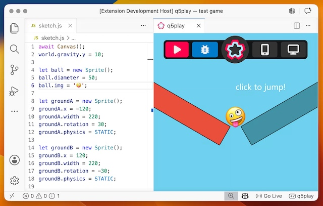

Stolz verkündete es letzte Woche *Quinton Ashley* [in seinem Substack](https://substack.com/home/post/p-196807851): [Q5play](https://q5play.org/home/), der Game-Engine-Ableger der »rasend schnellen« [P5.js](http://cognitiones.kantel-chaos-team.de/programmierung/creativecoding/processing/p5js.html)-Alternative [Q5.js](https://q5js.org/home/), und das interaktive Lehrbuch »[Learn q5play](https://q5play.org/learn)« sind zu 100 Prozent fertiggestellt -- und zwar sowohl in der JavaScript wie auch [in der Python/Brython-Version](https://kantel.github.io/posts/2026043001_q5play_python/).

Doch das ist noch nicht alles: Schon [drei Tage später kündigte](https://substack.com/home/post/p-197101018) er die neue [Q5play VSCode-Erweiterung](https://marketplace.visualstudio.com/items?itemName=quinton-ashley.q5play-vscode) an, die es Nutzern ermöglicht, Q5play-Projekte schnell in [Visual Studio Code](http://cognitiones.kantel-chaos-team.de/produktivitaet/visualstudiocode.html) zu erstellen und auszuführen.

Die Erweiterung erstellt lokal ein neues Q5play-Projekt, das Ihr in Visual Studio Code editieren und mit Hilfe des Live-Servers auch offline ausführen könnt. Die GitHub-Seite [q5play-template](https://github.com/q5play/q5play-template) enthält nicht nur ein einfaches Q5play-Projekt für die Offline-Nutzung, sondern auch eine Anleitung:

>For offline use, install [bun](https://bun.sh/) or [npm](https://nodejs.org/). Then in the file menu hover over `Terminal` and select `New Terminal`. In your q5play project folder run `bun i` to install the q5, box2d3-wasm, and q5play packages.

Alles weitere findet Ihr in der Dokumentation zu dieser Erweiterung auf der [Q5play VSCode Webseite](https://marketplace.visualstudio.com/items?itemName=quinton-ashley.q5play-vscode).

---

**Bild**: *[Q5play kann Python](https://www.flickr.com/photos/schockwellenreiter/55240540784/)*, erstellt mit [Scenario](http://cognitiones.kantel-chaos-team.de/technikgeschichte/rechnerundnetze/scenario.html). Prompt: »*A badger in a red dressing gown and a python wearing horn-rimmed glasses are sitting together in a classroom in front of a computer, programming games. On the blackboard behind them, written in chalk, are the words: “Spieleprogrammierung mit Q5play und Python”. Colored Franco-Belgian comic style. Language: German. No speech bubbles, no textboxes, no headlines.*« Modell: Nano Banana 2.