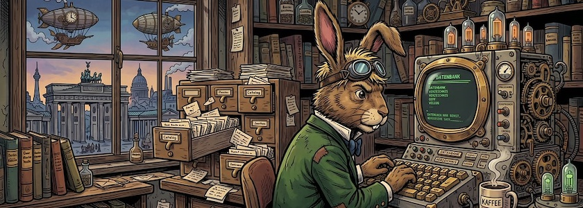
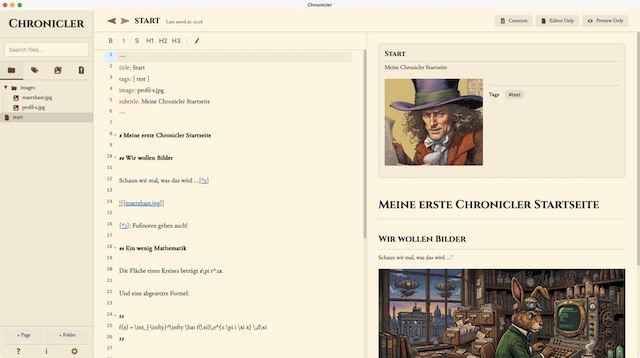

**[Chronicler](https://chronicler.pro/)** ist ein kostenloses, offline nutzbares, plattformübergreifendes (Windows, macOS, Linux) Werkzeug und lokales Wiki, ursprünglich gedacht zum Erstellen von Spielewelten, entwickelt für Autoren, Romanautoren und Spielleiter von Tabletop-Rollenspielen. Im Gegensatz zu cloudbasierten SaaS-Plattformen speichert Chronicler alle Daten lokal als einfache Markdown-Textdateien. So behalten Ihr die volle Kontrolle und Eure Privatsphäre.

Chronicler bietet leistungsstarke Verlinkungs- und Tagging-Funktionen, Infoboxen im Wiki-Stil, einen Live-Splitscreen-Editor, benutzerdefinierte Designs, Vorlagen, Spoilerblöcke und Importfunktionen für Word, Google Docs und MediaWiki. Keine Abonnements, keine Server und keine Datenbindung -- daher bewahrt Chronicler Eure digitale Souveränität.

Die Software wird von vielen mit den proprietären Zettelkasten-Apps [Obsidian](http://cognitiones.kantel-chaos-team.de/webworking/auszeichnungssprachen/obsidian.html) oder [Notion](https://www.notion.com/de) verglichen. Das schreit geradezu danach, Chronicler als lokalen Zettelkasten und private, digitale Rumpelkammer aufzubohren. Erste Tests dazu von mir verliefen durchaus positiv. Neben dem üblichen Markdown-Elementen beherrscht das Teil Fußnoten, mathematischen Formelsatz (via [KaTeX](http://cognitiones.kantel-chaos-team.de/mathematik/katex.html)) und Wikilinks.

Es besitzt nur einen, schwerwiegenden Nachteil: Es kann seinen *Vault* nicht nach HTML exportieren, auch nicht einzelne Seiten (wie zum Beispiel [Anytype](https://kantel.github.io/posts/2025021401_anytype_web/)). Daher eignet sich die Software nicht für ein öffentliches Wiki oder einen öffentlichen [Digitalen Garten](https://kantel.github.io/posts/2024050701_digital_garden/). Aber die Software ist ja noch jung (erstmals im Juni 2025 veröffentlicht), vielleicht hat der Autor ein Einsehen und bietet noch einen Webexport an.

Denn nach meinen ersten Tests hat Chronicler durchaus das Zeug, [Anytype](https://anytype.io/) als meine digitale Rumpelkammer abzulösen. Da die Software -- im Gegensatz zu Anytype -- die einzelnen Seiten in sauberem Standard-Markdown abspeichert, kann ich einzelne HTML-Seiten aus den Quellen auch mit jedem anderen Markdown-Tool herausschreiben lassen. *Still digging!*

### Links

- [Chronicler Home](https://chronicler.pro/)
- [Chronicler @ GitHub](https://github.com/mak-kirkland/chronicler)
- [Chronicler Documentation](https://chronicler.pro/getting-started)
- [Chronicler Community Blog](https://chronicler.pro/community)
- [Chronicler Tutorials @ YouTube](https://www.youtube.com/playlist?list=PLdABl_Kol0eWLH5TtodTZUT8Wqz30zbDc) (under construction)

---

**Bild**: *[Die Zettelkästen des Märzhasen](https://www.flickr.com/photos/schockwellenreiter/55253910782/)*, erstellt mit [OpenArt](https://openart.ai/home). Prompt: »*The March Hare sits at a desk in front of an antiquated, steampunk-style computer, typing on a keyboard. He wears a pair of aviator goggles, which he has pushed up onto his forehead. On the desk stands an open card catalog, its contents a chaotic jumble of handwritten index cards and loose scraps of paper. Beside the keyboard sits a mug of steaming coffee. Shelves crammed with books and steampunk knick-knacks line the walls. Through a window, one looks out upon a steampunk version of Berlin. Colored classic American comic style. Language: German. No speech bubbles, no textboxes. No German flags.*« Modell: Nano Banana 2.