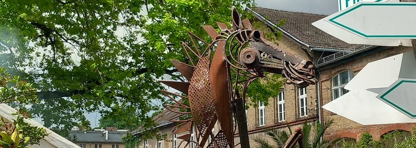
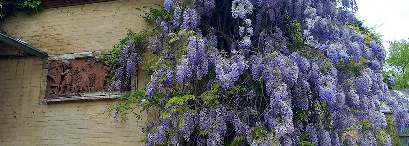
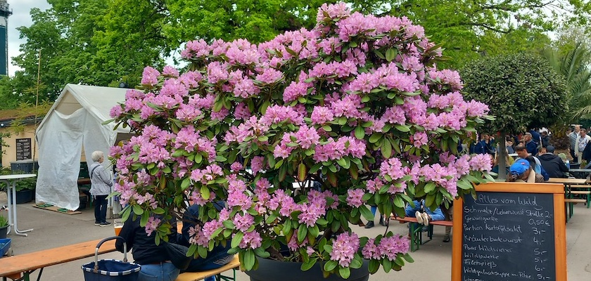
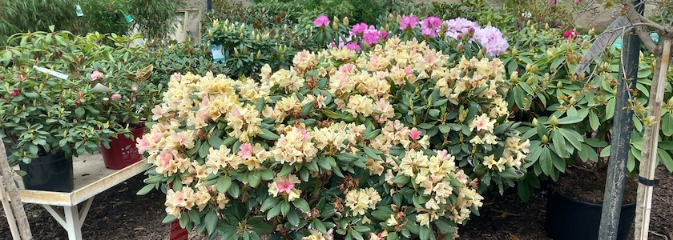

Letzten Sonnabend waren die liebste aller Freundinnen und ich in Treptow unterwegs, um das [Fühlingsfest Spaeth'er Frühling](https://www.spaethsche-baumschulen.de/veranstaltungen/jahreszeitliche-feste/fruehlingsfest-spaether-fruehling/) der [Spaeth'schen Baumschule](https://www.spaethsche-baumschulen.de/) zu erleben. Das [Unternehmen im Ortsteil Baumschulenweg ist eines der ältesten von Berlin](https://de.wikipedia.org/wiki/Baumschule_Sp%C3%A4th) und geht auf eine 1720 von *Christoph Späth* in Kreuzberg gegründete Obst- und Gemüsegärtnerei zurück. Sie war um 1900 die größte Baumschule der Welt. Zwei Weltkriege, die DDR und die Treuhand haben die Späth’schen Baumschulen überstanden, doch nun sollen Wohnhäuser auf den Gartenflächen entstehen.

Denn der Berliner Senator für Stadtentwicklung, Bauen und Wohnen, *Christian Gäbler* (SPD), will das Gelände der Späth’schen Baumschulen bebauen. Zwischen blauer Märchenhütte und Ligusterweg sollen künftig vielgeschossige Gebäude in die Höhe ragen. Heute bietet diese öffentlich zugängliche Fläche den Menschen Anregungen, Erholung und Weite. Künftig sollen Gehölz-Sortengarten und Weltacker Berlin, Staudenproduktion, Obstbaumflächen, Garten-Biotop am Karpfenteich und so viel mehr verschwinden. Stattdessen: Versiegelung, Mauern und Enge.

Besucher des Frühlingsfests waren wütend über diese Bebauungspläne und auch das [Unternehen protestierte (nicht nur auf diesem Fest) -- unterstützt vom Bezirk](https://www.spaethsche-baumschulen.de/eroeffnung-des-spaether-fruhling-2026-starke-auftritte-und-unterstuetzung-fur-spaeth/). Denn zwar werden durch die neuen Pläne des Senats rund 300 Kleingärten »gerettet« (sie hätten wegen des neuen [Kleingartensicherungsgesetzes](https://www.rbb24.de/politik/beitrag/2026/02/berlin-kleingartensicherungsgesetz-dauerhafter-schutz-kleingaerten.html) sowieso Schutz genossen), dafür sollen da, wo die Gewächshäuser stehen, die Obstplantage, der Sortengarten, der Weltenacker, wo im Jahr 150 Schulklassen zu Besuch kommen, ungezählte Gartenbaustudierende lernen und wo auch die Humboldt-Universität forscht, [viergeschossige Häuser gebaut werden und in der Sichtachse sogar sieben- bis achtgeschossige Häuser stehen](https://www.rbb24.de/content/rbb/r24/politik/beitrag/2026/05/berlin-treptow-neubaugebiet-spaethsfelde-wohnungsbau-kleingaerten.html). Selbst den »geretteten« Kleingärtnern bleibt ob dieser Gigantomanie des Senats die Freude im Halse stecken.

Gegen diese Pläne wurde auf dem Frühlingsfest Spaeth'er Frühling eine [Unterschriftenaktion gestartet](https://www.spaethsche-baumschulen.de/spaeth-muss-gruen-bleiben-online-petition-gestartet/) und eine Online-Petition ins Leben gerufen: [Späth’sche Baumschulen muss grünes Zentrum bleiben. Keine Bebauung!](https://www.openpetition.de/petition/online/spaethsche-baumschulen-muss-gruenes-zentrum-bleiben-keine-bebauung) Die Spaeth'schen Baumschulen weisen außerdem noch darauf hin, daß die Senatspläne das Unternehmen in einer Situation treffen, in der gelungen ist, was viele andere Traditionsunternehmen nicht schaffen: Im Zuge der Unternehmensnachfolge führen drei junge, starke Frauen die Geschäfte. Sie haben Energie, neue Ideen und viele Pläne.

Und die liebste aller Freundinnen und ich haben unseren Besuch des Spaeth'en Frühlings trotz der schlechten Nachrichten aus der Politik genossen. Wir sind da aus Erfahrung verhalten optimistisch, denn dieser Senat bekommt sowieso nichts auf die Reihe, wieso sollte dann das [Bauprojekt Spaethsfelde](https://www.entwicklungsstadt.de/spaethsche-baumschulen-in-treptow-senat-plant-bis-zu-2-500-wohnungen/) ausgerechnet die Ausnahme sein?

---

**Photos**: ([cc](https://creativecommons.org/licenses/by-sa/4.0/deed.de)) 2026: *[Jörg Kantel](http://cognitiones.kantel-chaos-team.de/cv.html)*