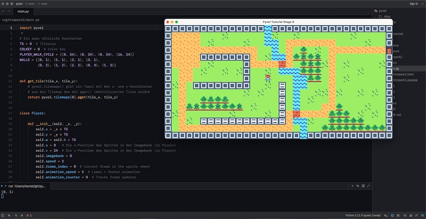

Es tut sich was in der lange Zeit durch die erdrückende Vorherrschaft von [Visual Studio Code](http://cognitiones.kantel-chaos-team.de/produktivitaet/visualstudiocode.html) gelähmten Entwicklerszene für Texteditoren. Hatte ich [hier](https://kantel.github.io/posts/2026042201_coteditor_7/) mit [CotEditor](https://coteditor.com/) einen vielversprechenden, kleinen Editor für macOS vorgestellt, kommt nun [Zed](https://zed.dev/) und ist bereit für einen [Angriff auf Visual Studio Code](https://www.golem.de/news/zed-1-0-bereit-fuer-den-angriff-auf-vs-code-2605-208447.html) (€).

Denn das (im Kern) [freie Zed 1.0](https://de.wikipedia.org/wiki/Zed_(Texteditor)) (Linux, macOS, Windows) ([GitHub Repo](https://github.com/zed-industries/zed)) ist ein plattformübergreifender, in Rust geschriebener Code Editor mit Fokus auf Kollaboration und Einbindung von Künstlicher Intelligenz. Entwickelt wurde es von den Menschen hinter GitHubs (von Mircosoft leider eingestellten) [Atom-Editor](http://cognitiones.kantel-chaos-team.de/produktivitaet/atom.html). Der entscheidende Unterschied zu Visual Studio Code liegt in der Architektur. Während Microsofts Editor auf Electron und Chromium basiert, setzt Zed auf Rust das eigene Framework GPUI. Dieses nutzt direkt die Graphikprozessoren für die Darstellung -- ähnlich wie moderne Videospiele.

Meine ersten Tests zeigten, daß dies Zed gegenüber dem eher behäbigen Platzhirschen Visual Studio Code rasend schnell macht, die Startzeit liegt bei meinem betagten Mac Mini mit Intel-Prozessor unter einer Sekunde. Und auch die von den Entwicklern stolz hervorgehobene KI-Unterstützung hält sich gegenüber Microsofts Boliden (wo ich sie oft als aufdringlich empfinde) im Hintergrund angenehm zurück.

Die Nutzerschnittstelle macht einen aufgeräumten Eindruck, aber die wichtigsten Funktionen wie zum Beispiel die Auswahl der passenden Python-Umgebung, sind leicht zu finden.

[Das Geschäftsmodell setzt auf gehostete KI-Dienste und Team-Features in »Zed for Business«](https://borncity.com/news/zed-1-0-rust-editor-fordert-visual-studio-code-heraus/) (ein Grund vielleicht für die angenehme KU-Zurückhaltung im Normalbetrieb) -- der Kern-Editor bleibt Open Source.

Auch wenn zur Zeit das Ökosystem an Erweiterungen noch eingeschränkt ist, halte ich Zed für eine großartige Alternative zu Micorsofts Boliden. Ich werde das Teil mal für meine geplanten Wiederaufnahme der [Pyxel](http://cognitiones.kantel-chaos-team.de/multimedia/spieleprogrammierung/pyxel.html)-[Tutorials](https://kantel.github.io/#category=Pyxel) einsetzen und auf Herz und Nieren testen. *Still digging!*

---

**Bild**: *[Steampunk Rabbit](https://www.flickr.com/photos/schockwellenreiter/55224001700/)*, erstellt mit [Scenario](http://cognitiones.kantel-chaos-team.de/technikgeschichte/rechnerundnetze/scenario.html). Prompt: »*A white rabbit wearing a yellow and black checkered vest, blue jacket, white shirt, and red bow tie sits at an enormous desk in front of a steampunk-style computer. It wears glasses and a large pocket watch on a chain, which lies beside it on the desk. An old-fashioned desk lamp illuminates the table. In the background are shelves with books and all sorts of steampunk knick-knacks. Through a window, a Victorian cityscape is visible. Colored Franco-Belgian comic style. Language: German. No speech bubbles, no textboxes, no headlines.*« Modell: Nano Banana 2