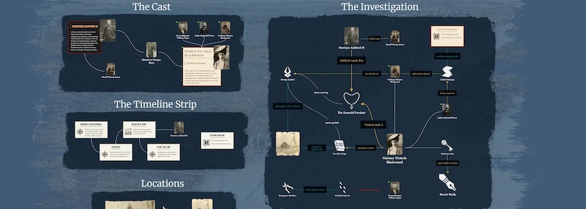

Vor fünf Tagen hatte ich [Chronicler](https://chronicler.pro/) auf diesen Seiten [vorgestellt](https://kantel.github.io/posts/2026051301_chronicler/) und dabei gefragt, ob dieses Werkzeug zum Entwurf von Spielewelten nicht auch als »digitale Rumpelkammer« aufgebohrt werden kann. Jetzt spülte mir unsere allwissende Datenkrake **[Alkemion Studio](https://alkemion.com/)** in meinen Feedreader und die Frage stellte sich mir erneut.

Alkemion Studio ist als ein kostenloses, visuelles (Online-) Werkzeug für die Tabletop-Rollenspiel-Community gedacht. Es bietet eine zentrale Plattform, um Abenteuer zu entwerfen, Welten zu erschaffen, Kampagnen zu verwalten und das Vorbereitungsmaterial stets griffbereit am Spieltisch zu haben.

<iframe class="if16_9" src="https://www.youtube.com/embed/A0i9LhgFZa0?si=DjbUeQjR8CFDOgoP" title="YouTube video player" frameborder="0" allow="accelerometer; autoplay; clipboard-write; encrypted-media; gyroscope; picture-in-picture; web-share" referrerpolicy="strict-origin-when-cross-origin" allowfullscreen></iframe>

Alles ist in Module unterteilt: In sich abgeschlossene Projekte, die ein visuelles Board zur Visualisierung Ihrer Ideen und einen Rich-Text-Editor zum Ausarbeiten dieser Ideen kombinieren. Auf dem Board werden Ihre Inhalte als Knoten dargestellt: Orte, Charaktere, Hinweise, Ereignisse oder alles andere, was Ihr benötigt. Verbindet Ihr diese mit Links, nimmt die Struktur Eures Abenteuers oder Eurer Welt vor Euren Augen Gestalt an.

Doch wie oben schon erwähnt: Ihr schreibt (und speichert) nicht in Markdown, sondern in einem »Rich-Text-Editor«. Zwar gibt es die Möglichkeit, Eure Entwürfe nach einem Obsidian-kompatiblen Markdown oder direkt nach HTML zu exportieren, aber es wäre immer ein Umweg. Daher halte ich das Teil für einen Zettelkasten nur bedingt geeignet.

Aber als Entwurfswerkzeut für Spiele macht Alkemiom Studio auf mich bei einer ersten Betrachtung einen guten Eindruck. Aber es ist ein Online-Tool und Eure Daten liegen auf irgendeinem, womöglich US-amerikanischen Server. Das spricht nicht gerade für Eure digitale Souveränität. Zwar scheint eine [Desktop-Version auf Kickstarter](https://www.kickstarter.com/projects/alkemion/alkemion-studio) in Vorbereitung zu sein, diese ist allerdings nach der Ankündigung auf der Website des Projekts kostenpflichtig.

### Links

- [Alkemion Home](https://alkemion.com/)
- [10 ways Alkemion Studio could be useful for you](https://blog.alkemion.com/10-ways-alkemion-studio-could-be-useful-for-you/)
- [Alkemion User Manual](https://alkemion.com/docs/introduction)
- [Alkemion Blog](https://blog.alkemion.com/)

Ich werde mir die Software dennoch für seine Eignung als Entwurfswerkzeug für interaktive Geschichten und Spiele nach meiner Chronicler-Erkundung mal genauer anschauen. Denn das Tool scheint einige Features zu besitzen, die über den Umfang von Chronicler hinausgehen. *Soviel zu entdecken, so wenig Zeit!*
