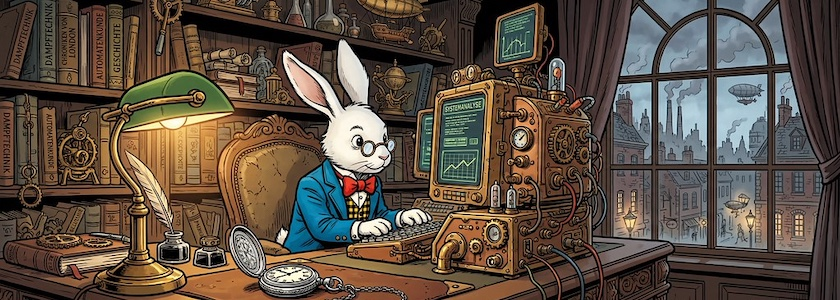
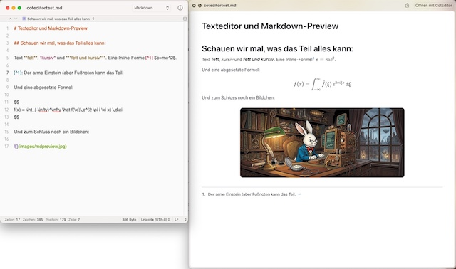

**[Markdown Preview](https://markdownpreview.app/)** ist ein freier (MIT-Lizenz) Reader für Markdown-Dateien unter macOS. Er konzentriert sich auf das Lesen, die Schnellansicht und das Öffnen von Dateien aus dem Finder. Es soll Euren Editor nicht ersetzen, sondern zum Beispiel mit und neben [Visual Studio Code](http://cognitiones.kantel-chaos-team.de/produktivitaet/visualstudiocode.html), den am Donnerstag hier [vorgestellten](https://kantel.github.io/posts/2026051401_zed/) Editor [Zed](https://zed.dev/), der [leichtgewichtigen](https://kantel.github.io/posts/2026042201_coteditor_7/) macOS-App [CotEditor](https://coteditor.com/) oder jeden anderen Texteditor, den Ihr zum Schreiben von Markdown verwendet, funktionieren.

Die mitgelieferte Quick Look-Erweiterung rendert Markdown direkt im Finder, so daß durch Drücken der Leertaste auf einer `.md`-Datei das formatierte Dokument angezeigt wird, ohne daß ein Editor geöffnet werden muss.

Die Downloads werden als `.dmg`-Datei über [GitHub Releases](https://github.com/pluk-inc/markdown-preview) bereitgestellt, so daß Ihr Eure Seele nicht an den App-Store verkaufen müsst.

Da Visual Studio Code ja selber eine recht brauchbare Markdown-Vorschau besitzt, habe ich mal getestet, wie gut Markdown Preview mit der schlanken, nativen macOS-App CotEditor zusammenarbeitet. Es funktioniert wie versprochen, allerdings gibt es in der Quick Look-Vorschau keine Live-Preview, nach jeder Änderung im Editor muss die Datei vom Finder neu angezeigt werden. Wenn man allerdings die Datei in der Markdown-Preview-App direkt aufruft kann man sich mit einem einfachen *Reload* die Änderungen leichter und schneller anzeigen lassen.

---

**Bild**: *[Steampunk Rabbit](https://www.flickr.com/photos/schockwellenreiter/55222688002/)*, erstellt mit [Scenario](http://cognitiones.kantel-chaos-team.de/technikgeschichte/rechnerundnetze/scenario.html). Prompt: »*A white rabbit wearing a yellow and black checkered vest, blue jacket, white shirt, and red bow tie sits at an enormous desk in front of a steampunk-style computer. It wears glasses and a large pocket watch on a chain, which lies beside it on the desk. An old-fashioned desk lamp illuminates the table. In the background are shelves with books and all sorts of steampunk knick-knacks. Through a window, a Victorian cityscape is visible. Colored Franco-Belgian comic style. Language: German. No speech bubbles, no textboxes, ne headlines.*« Modell: Nano Banana 2.