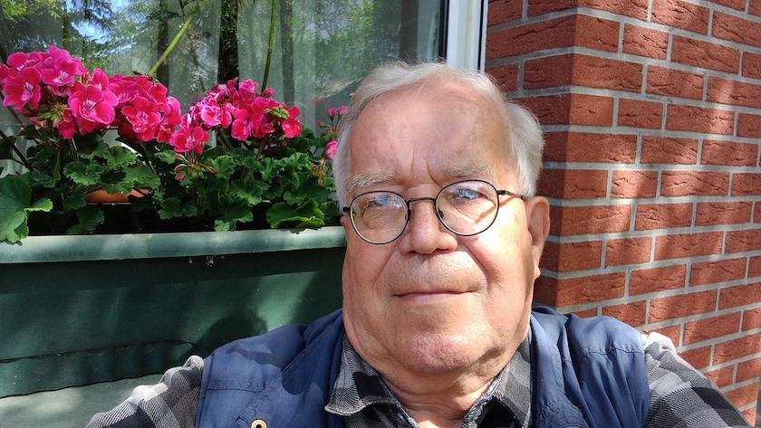

Der Zahn der Zeit nagte an mein schon schütteres Haupt und sowohl der Blick in den Spiegel wie auch der kritische Blick der allerliebsten Freundin von allen verlangten nach einem neuen Haarschnitt. Daher bin ich heute [wieder](https://kantel.github.io/posts/2026031001_haare_schoen/) nach ~~Schweineöde~~ Schöneweide gepilgert und habe mir bei [Coiffeure Marina & Team](https://www.facebook.com/coiffeuremarinaundteam/?locale=de_DE) *(Facebook-Link)*, den Haarkünstlerinnen meines Vertrauens, die Frisur richten lassen. Und obwohl die Berliner S-Bahn wieder alles unternommen hatte, [mich an diesem Vorhaben zu hindern](https://www.rbb24.de/panorama/beitrag/2026/05/kabeldiebstahl-berlin-sbahn-baumschulenweg-einschraenkungen.html), kann ich mit diesem ~~Photo~~ Selfie Vollzug melden.

Und da bekanntlich das Gesichtsbuch und ich in diesem Leben keine Freunde mehr werden, muss ich das Beweisphoto hier in diesem ~~Blog~~ Kritzelheft veröffentlichen. Denn dafür sind Kritzelhefte schließlich da.

---

**Photo** ([cc](https://creativecommons.org/licenses/by-sa/4.0/deed.de)) 2026: *[Jörg Kantel](http://cognitiones.kantel-chaos-team.de/cv.html)*

