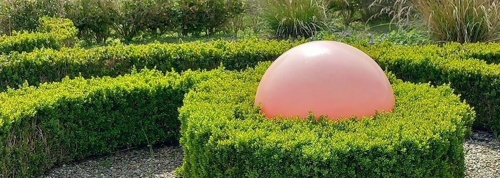
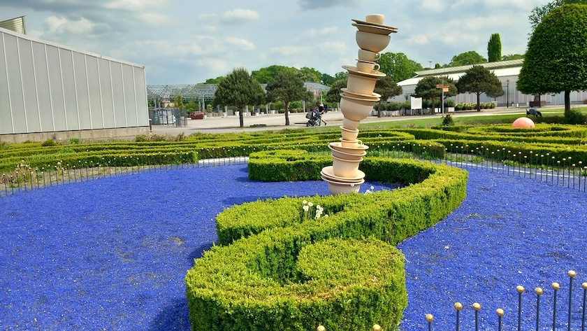
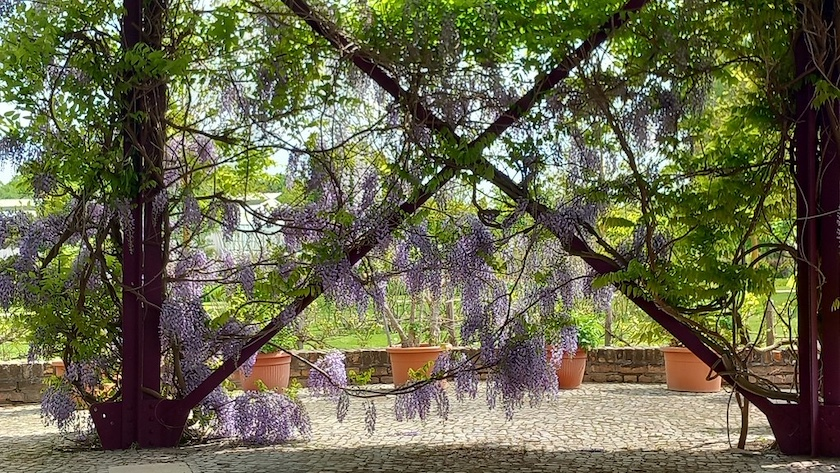
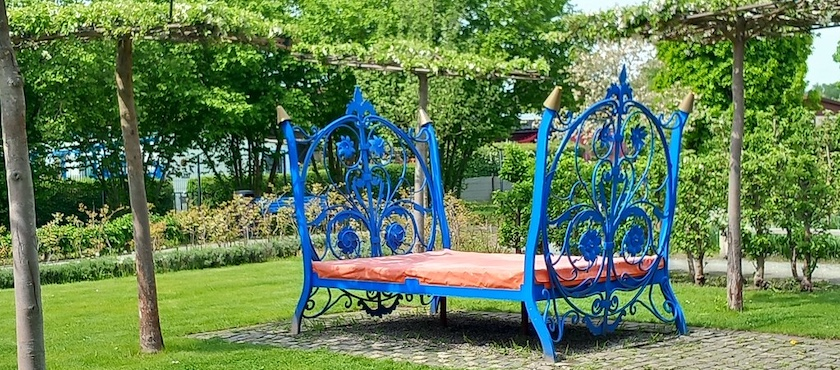
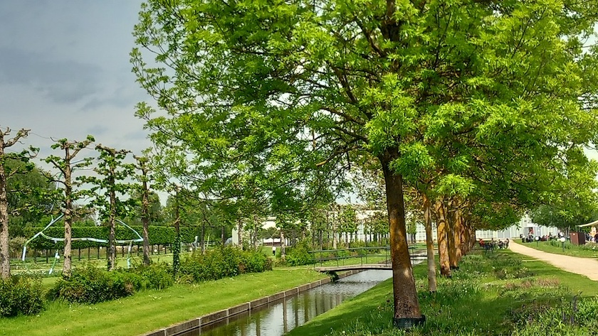
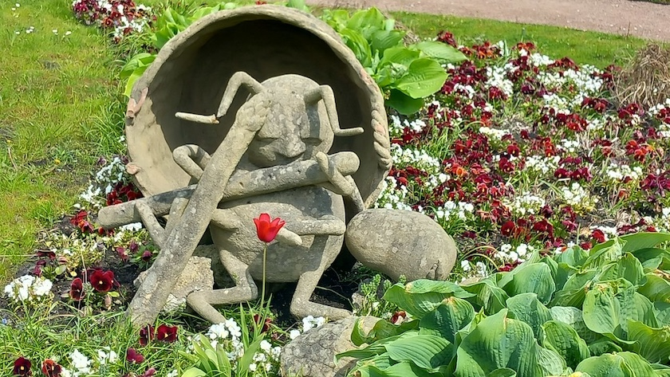

Vor etwas mehr als einer Woche, am 10. Mai -- einen Tag nach unserem [Besuch in der Spaeth'schen Baumschule](https://kantel.github.io/posts/2026051302_spaether_fruehling/) --, waren die liebste aller Freundinnen und ich zum [Schloss Oranienburg](https://de.wikipedia.org/wiki/Schloss_Oranienburg) gefahren und haben den dortigen Schlosspark besucht. Genauer, da wir beide nicht mehr so gut zu Fuß sind, haben wir unseren Besuch auf den östlichen Teil des Schlossparks beschränkt, in dem [2009 die Landesgartenschau](https://de.wikipedia.org/wiki/Schloss_Oranienburg#Landesgartenschau_2009) ausgerichtet wurde.

Dort fanden frau und ihr Begleiter lauter kleine, verspielte Themengärten, die unter dem Motto der Landesgartenschau »Traumlandschaften einer Kurfürstin« stehen.

Die barocken Gartenzimmer im neuen Teil des Parks laden zum Träumen und zu einer Reise in die Vergangenheit ein: Sie erzählen Geschichten über das Leben, Denken und Fühlen der Gründerin und Namensgeberin der Stadt, der Kurfürstin *Louise Henriette von Oranien*.

Sie setzen die Sehnsucht nach der Heimat, den festen Glauben, die Liebe oder die Bedeutung der Familie in (manchmal ironischen) Blumenbildern um.

Auch bei der Gestaltung des Parks spielte der Rückbezug auf die Kurfürstin *Louise Henriette* eine entscheidende Rolle. Besonders deutlich lässt sich dies an den neu angelegten Grachten im Park nachvollziehen.

Und das aus Korb geflochtene, flötenspielende Insekt in einem der Themengärten mahnte uns, wiederzukommen und auch den historischen, barocken Teil des Schlossparks zu besuchen.

### Literatur

- Museum.de: *[Schlosspark Oranienburg](https://www.museum.de/museen/schlosspark-oranienburg)*, aufgerufen am 19.&nbsp;Mai&nbsp;2026
- Stadt Oranienburg: *[Schlosspark Oranienburg](https://oranienburg.de/Rathaus-Service/B%C3%BCrgerinformationen/Leichte-Sprache/Sehensw%C3%BCrdigkeiten/index.php?object=tx,2967.1&ModID=9&FID=2967.436.1&NavID=2967.145&La=1)*, aufgerufen am 19.&nbsp;Mai&nbsp;2026
- Wikipedia: *[Schloss Oranienburg](https://de.wikipedia.org/wiki/Schloss_Oranienburg)*, aufgerufen am 19.&nbsp;Mai&nbsp;2026

---

**Photos** ([cc](https://creativecommons.org/licenses/by-sa/4.0/deed.de)) 2026: *[Jörg Kantel](http://cognitiones.kantel-chaos-team.de/cv.html)*

