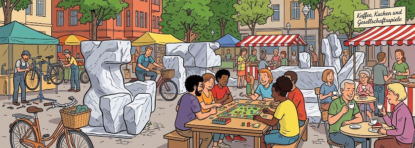

Am **Donnerstag, den 28. Mai 2026 von 14:30 Uhr bis 17:30 Uhr** ist es mal wieder soweit: Es findet das schon [traditionelle Kaffeetrinken](https://qm-glasower-strasse.de/kaffeetafel-und-spielefest-auf-dem-kranoldplatz/) der sozialen Einrichtungen aus dem Kranoldkiez auf dem **Neuköllner Kranoldplatz** statt. Und weil der 28. Mai auch wieder Weltspieltag ist, wird an diesem Tag nicht nur Kaffee getrunken und Kuchen gegessen, sondern auch fleißig gewürfelt, gemischt, und gewonnen!

Die Veranstaltung wird von [proNeubritz e.V.](https://proneubritz.jimdofree.com/) und vielen (nicht nur sozialen) Einrichtungen aus dem Kranoldkiez in Kooperation mit dem Projekt »[KiezGewinnt: Gesellschaft und Spiele](https://qm-glasower-strasse.de/vorgestellt-projekt-kiez-gewinnt-gesellschaft-und-spiele/)« im [Quartiersmanagement Glasower Straße](https://qm-glasower-strasse.de/) organisiert. Es wird vielseitige Brettspielangebote sowie einen Tauschmarkt für Brettspiele geben. Hier können eigene Spiele mitgebracht und gegen andere getauscht werden.

Außerdem wird mit Musik, einer Fahrradwerkstatt und vielen weiteren Angeboten der beteiligten Einrichtungen für ein buntes Begleitprogramm gesorgt. Der Eintritt ist natürlich frei, kommt einfach vorbei und habt Spaß.

**Caveat**: Ihr könnt dort auch auf Euren ~~Lieblingsblogger~~ Lieblingskritzelheftvollschreiber treffen, denn er hat das Fest mitorganisiert.

---

**Bild**: *[Kaffeetrinken und Spielefest auf dem Kranoldplatz](https://www.flickr.com/photos/schockwellenreiter/55284644395/)*, erstellt mit [OpenArt](https://openart.ai/home). Prompt: »*A square in Neukölln featuring several colorful market stalls and red-and-white awnings. It is filled with cheerful people drinking coffee and eating cake at the stalls. At a large table in the center of the square, people are playing board games. Along the edge of the square, bicycles are being repaired. The background is the same as in @image1. Colored classic French comic style. Language: German. No speech bubbles, no textboxes. No German flags.*« Nodell: Nano Banana&nbsp;2, [Vorlagenphoto](https://www.flickr.com/photos/schockwellenreiter/52983314573/) ([cc 2023](https://creativecommons.org/licenses/by-nc-nd/2.0/deed.de)) von *[Jörg Kantel](http://cognitiones.kantel-chaos-team.de/cv.html)*.