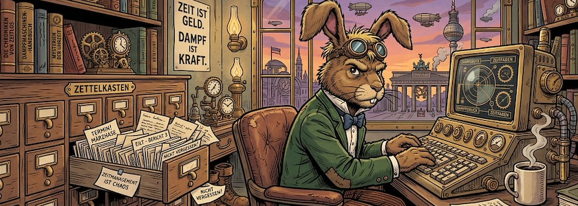

In meinem Feedreader überschlagen sich zur Zeit die Hinweise auf Programme, die sich als Alternative zu [Anytype](https://kantel.github.io/posts/2025021401_anytype_web/), meiner digitalen Rumpelkammer, vorstellen. Erst vor wenigen Tagen weckte dieser Beitrag »[Tolaria: The Local‑First, Open‑Source Note App That Blends the Best of Obsidian and Notion](https://kurtis-redux.medium.com/tolaria-the-local-first-open-source-note-app-that-blends-the-best-of-obsidian-and-notion-82a090bc9672)« mein Interesse. Denn **[Tolaria](https://tolaria.md/)** emfiehlt sich als *Second Brain* mit lokal gespeicherten Markdown-Dateien (mit YAML-Frontmatter und bidirektionalen Links (`[[wikiLink]]`)), einer Synchronisation und Versionierung via Git (-Hub) und mit einer (unaufdringlichen) einer KI-Unterstützung. Natürlich ist die Anwendung plattformübergreifend (macOS, Linux, Windows) und *Open Source* (AGPL-3.0-Lizenz), sonst hätte sie gar nicht erst nicht mein Interesse erweckt.

Tolaria besitzt kein Black-Box-Datenbank (was mich damals von [Logseq](http://cognitiones.kantel-chaos-team.de/webworking/auszeichnungssprachen/logseq.html) mehr oder weniger panisch [vertrieben hatte](https://kantel.github.io/posts/2024050402_logseq_oder_zettlr/)) und es gibt auch keine erzwungene Cloud-Abhängigkeit. In Tolaria ist jede Notiz eine saubere `.md`-Datei mit YAML-Frontmatter. Das bedeutet: Selbst wenn Tolaria morgen verschwinden würde, bleiben die Daten Euer Eigentum. Das ist gerade in der heutigen Zeit, wo die digitale Souveränität immer notwendiger wird, ein gewichtiges Argument.

Und es erleichtert die Zusammenarbeit mit anderen Wissenstools, wie zum Beispiel [Joplin](http://cognitiones.kantel-chaos-team.de/webworking/staticsites/joplin.html) oder eben Anytype oder auch das von mir [jüngst entdeckte Chronicler](https://kantel.github.io/posts/2026051301_chronicler/).

In Toleria wird der gesamte *Vault* zu einem Git-Repositorium. Jede Änderung und Löschung wird versioniert und protokolliert. Das erhöht die Sicherheit und die Verfügbarkeit einer Wissensdatenbank ungemein.

### Links und Literatur

- [Tolaria Home](https://tolaria.md/)
- [Tolaria @ GitHub](https://github.com/refactoringhq/tolaria)
- [Tolaria Handbuch](https://tolaria.md/start/install)
- Nicolas Oestreich: *[Tolaria: Freie Mac-Anwendung organisiert Wissen](https://www.ifun.de/tolaria-frei-mac-anwendung-organisiert-wissen-278673/)*, ifun.de vom 27.&nbsp;April&nbsp;2026
- Kurtis Redux: *[Tolaria: The Local‑First, Open‑Source Note App That Blends the Best of Obsidian and Notion](https://kurtis-redux.medium.com/tolaria-the-local-first-open-source-note-app-that-blends-the-best-of-obsidian-and-notion-82a090bc9672)*, Medium.com vom 28.&nbsp;April&nbsp;2026
- Luca Rossi (das ist der ursprüngliche Entickler von Tolaria): *[Introducing Tolaria 💧](https://refactoring.fm/p/introducing-tolaria)*, Refactoring vom 22.&nbsp;April&nbsp;2026

Tolaria ist noch jung (etwa drei Monate alt), daher hat die Software vermutlich noch etliche Ecken und Kanten. Ich werde ihr daher sicher nicht sofort mein vollständiges zweites Gehirn anvertrauen (unabhängig davon, daß ich sowieso nicht gerne **einer** eierlegenden Wollmichsau vertraue), aber einen Test hat das Teil auf jeden Fall verdient. *Still digging!*

---

**Bild**: *[Die Zettelkästen des Märzhasen](https://www.flickr.com/photos/schockwellenreiter/55255042834/)*, erstellt mit [OpenArt](https://openart.ai/home). Prompt: »*The March Hare sits at a desk in front of an antiquated, steampunk-style computer, typing on a keyboard. He wears a pair of aviator goggles, which he has pushed up onto his forehead. On the desk stands an open card catalog, its contents a chaotic jumble of handwritten index cards and loose scraps of paper. Beside the keyboard sits a mug of steaming coffee. Shelves crammed with books and steampunk knick-knacks line the walls. Through a window, one looks out upon a steampunk version of Berlin. Colored classic American comic style. Language: German. No speech bubbles, no textboxes. No German flags.*« Nodell: Nano Banana&nbsp;2.