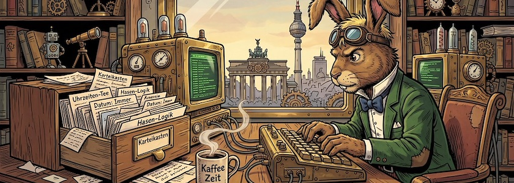
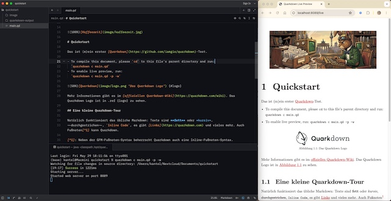

Der wunderbare Artikel »[Markdown in 2026: Not Just for Writing Anymore](https://kurtis-redux.medium.com/markdown-in-2026-not-just-for-writing-anymore-d4433fa1ec9a)« von *Kurtis Redux* über die Renaissance der Markdown-Editorn im Zeitalter der KI machte mich unter anderem auch auf **[Quarkdown](https://quarkdown.com/)** aufmerksam. Dieses freie (GPL), aus Italien stammende Quarkdown ([GitHub-Repo](https://github.com/iamgio/quarkdown)) will mehr sein, als ein herkömmlicher Markdown-Editor, es versteht sich als ein Markdown-basiertes Satzsystem.

Mit vordefinierten Dokumenttypen lassen sich aus ein und demselben Quellcode seitenweise Artikel und Bücher, Dokumentationsseiten oder interaktive Präsentationen erstellen. Es vereint Markdown und LaTeX und bietet reaktive Vorschauen, Skripte und wiederverwendbare Komponenten – ideal für alle, die formellere, reproduzierbare und qualitativ hochwertige Markdown-Ausgaben wünschen.

Das »andere« beginnt schon mit der [Installation](https://quarkdown.com/#install). Quarkdown ist keine App, sondern ein Kommandozeilen-Werkzeug, das auch mit der Kommandozeile installiert werden will. Auf meinem Mac-Mini war dies der Befehl,

~~~bash
curl -fsSL https://raw.githubusercontent.com/quarkdown-labs/get-quarkdown/refs/heads/main/install.sh | sudo env "PATH=$PATH" bash
~~~

der das Teil in den Tiefen meines Macs installierte. Dann habe ich erste Tests durchgeführt. Auch die Bedienung verlangt nach der Kommandozeile und einem Texteditor. Daher habe ich als Editor den [hier vorgestellten](https://kantel.github.io/posts/2026051401_zed/) VS-Code-Konkurrenten [Zed](https://zed.dev/) verwendet[^1], da dieser ein Terminal-Fenster für die Kommandozeile eingebaut hat (siehe [Screenshot](https://www.flickr.com/photos/schockwellenreiter/55301463746/) unten).

[^1]: Es gibt allerdings auch eine »offizielle« [Quarkdown-Erweiterung](https://marketplace.visualstudio.com/items?itemName=quarkdown.quarkdown-vscode) für Visual Studio Code die eine Unterstützung für Quarkdowns `.qd`-Syntax und eine Live-Vorschau im Editor bietet.

Für meinen ersten Test habe ich mich durch die [Quarkdown Quickstart-Seite](https://quarkdown.com/wiki/quickstart/) gehangelt. Quarkdown beherrscht fast die komplette GFM-Syntax *(GitHub Flavoured Markdown)* mit einigen Abweichungen und vielen Erweiterungen. Das kann Fluch und Segen zugleich sein. Da ist zum einen die Quarkdown-eigene Makro-Syntax in den `.qd`-Dateien, zum anderen, daß die Schreibweise sowohl für Inline- wie auch für freistehende Gleichungen von der gewohnten Syntax abweicht. Zwar ist es »nur« ein Leerzeichen, das sich zwischen die gewohnten Dollarzeichen mogelt `$ `, aber es bedeutet, daß sich `.qd`-Dateien unter Umständen nicht mehr mit einem anderen Markdown-Editor übersetzen lassen.

Auf der anderen Seite erweitert diese `.qd`-Syntax die Möglichkeiten für eine Autorin oder einen Autoren. Sie oder er können damit Dinge anstellen, die mit Standard-Markdown (ob GitHub-Flavoured-Markdown oder andere Dialekte) nicht möglich sind. Wie Ihr merkt, bin ich hin- und hergerissen. Ich werde wohl noch einiges mit Quarkdown anstellen müssen, bevor ich zu einem endgültigen Urteil komme. *Still digging!*

---

**Bild**: *[Die Zettelkästen des Märzhasen](https://www.flickr.com/photos/schockwellenreiter/55255041409/)*, erstellt mit [OpenArt](https://openart.ai/home). Prompt: »*The March Hare sits at a desk in front of an antiquated, steampunk-style computer, typing on a keyboard. He wears a pair of aviator goggles, which he has pushed up onto his forehead. On the desk stands an open card catalog, its contents a chaotic jumble of handwritten index cards and loose scraps of paper. Beside the keyboard sits a mug of steaming coffee. Shelves crammed with books and steampunk knick-knacks line the walls. Through a window, one looks out upon a steampunk version of Berlin. Colored classic American comic style. Language: German. No speech bubbles, no textboxes. No German flags.*« Nodell: Nano Banana&nbsp;2.