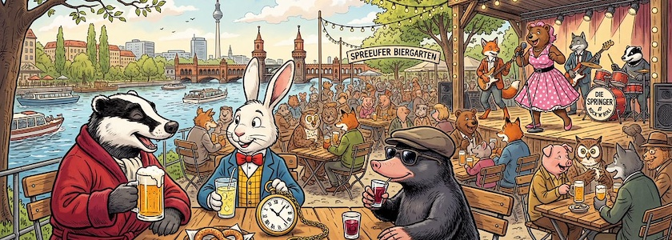

Der Mai ist vorüber und heute beginnt der meteorologische Sommer. Daher ist es mal wieder Zeit für ein paar Zahlen, die manches Mal hochtrabend auch *Mediadaten* genannt werden: Im Mai 2026 hatte der *Schockwellenreiter* laut seinem nicht immer zuverlässigen, aber dafür (hoffentlich!) DSGVO-konformen ~~Geißenpeter~~ [Neugiertool](https://www.goatcounter.com/) exakt **6.371&nbsp;Seitenaufrufe**. Auch wenn die Exaktheit dieser Ziffer eine Genauigkeit der Zahl nur vortäuscht, ist dies wieder ein schönes Ergebnis. Und so freue ich mich über jede Besucherin und jeden Besucher und bedanke mich bei allen meinen Leserinnen und Lesern.

😎 &nbsp; *Bleibt mir gewogen!*

Wie sich schon im letzten Monat [andeutete](https://kantel.github.io/posts/2026050101_zahlen_am_1_mai/), ist in die *Top Five* des Vormonats viel Bewegung eingekehrt:

1. Zwar steht an der Spitze immer noch der über zwei Jahre alte und damit schon etwas überholte Klassiker »[Bildgeneratoren und Künstliche Intelligenz – ohne Zensoren](https://kantel.github.io/posts/2024011002_ki_ohne_zensor/)« vom 10.&nbsp;Januar&nbsp;2024, aber er hat weiter an Zugriffen eingebüßt.
2. Auch auf Platz zwei steht immer noch der ebenfalls ältere Beitrag »[All about Anytype – meine neue, digitale Rumpelkammer?](https://kantel.github.io/posts/2024081201_anytype/)« vom 13.&nbsp;August&nbsp;2024, aber ich habe ihn mit »[Neues von meiner digitalen Rumpelkammer: Anytype Desktop v0.55 veröffentlicht](https://kantel.github.io/posts/2026050701_anytype_v055/)« vom 7.&nbsp;Mai dieses Jahres zusammenlegen müssen, damit er diesen Spitzenplatz behauptet.
3. Und auf den dritten Platz hat sich ein Newcomer hochgedrängelt: Aus der Reihe *[Atlas Curiosa](https://kantel.github.io/index.html#category=Atlas%20Curiosa)* der Bericht über den »[Ernst-Thälmann-Park im Prenzlauer Berg](https://kantel.github.io/posts/2026042102_thaelmann_park/)« vom 21.&nbsp;April&nbsp;2026.
4. Dann folgt wieder ein technischer Artikel: »[New Kids on the Blog: Zed – Ein Texteditor greift Visual Studio Code an](https://kantel.github.io/posts/2026051401_zed/)« vom 14.&nbsp;Mai&nbsp;2026.
5. Und Platz fünf teilen sich punktgleich sogar drei Blogposts, die alle mehr oder weniger das Thema »Digitale Rumpelkammer« gemein haben: Einmal das knapp ein Jahr alte »[Statische Seiten mit MkDocs (Material)](https://kantel.github.io/posts/2025062101_mkdocs/)« vom 21.&nbsp;Juni&nbsp;2025, dann die brandneue Entdeckung »[Chronicler: Eine neue, private und digitale Rumpelkammer?](https://kantel.github.io/posts/2026051301_chronicler/)« vom 13.&nbsp;Mai&nbsp;2026 und schließlich noch »[Neues von meinem digitalen Zettelkasten: Bidirektionale Links in Joplin](https://kantel.github.io/posts/2026043002_joplin_bidirektionale_links/)« vom 30.&nbsp;April&nbsp;2026.

Auch wenn dieser dreifache fünfte Platz keine Absicht war, meine Reihe mit Tests möglicher digitaler Rumpelkammern werde ich in Kürze fortsetzen. Ich habe da noch einiges in petto. *Still digging!*

---

**Bild**: *[Biergarten an der Spree](https://www.flickr.com/photos/schockwellenreiter/55242470693/)*, erstellt mit [Scenario](http://cognitiones.kantel-chaos-team.de/technikgeschichte/rechnerundnetze/scenario.html). Prompt: »*A badger in a red dressing gown, a white rabbit in a yellow checkered vest, a blue jacket and a red bow tie and carrying a giant pocket watch with a chain, and a mole wearing sunglasses sitting in a Berlin beer garden on the banks of the Spree River, enjoying the pleasant spring weather. At the other tables, many anthropomorphic animals are also sitting with their drinks. On a stage in the background, a rock and roll band is playing, featuring a sexy female bear in a petticoat as the singer and other anthropomorphic animals as musicians. Colored Franco-Belgian comic style. No speech bubbles, no textboxes.*« Nodell: Nano Banana&nbsp;2.