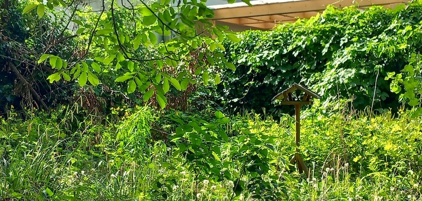

Das warme und feuchte Frühlingswetter des Wonnemonats Mai hat meinen kleinen Britzer Garten (nicht zu verwechseln mit dem [»großen« Britzer Garten](https://www.britzergarten.de/)) in eine grüne Hölle verwandelt.

---

**Photo** ([cc](https://creativecommons.org/licenses/by-sa/4.0/deed.de)) 2026: *[Jörg Kantel](http://cognitiones.kantel-chaos-team.de/cv.html)*