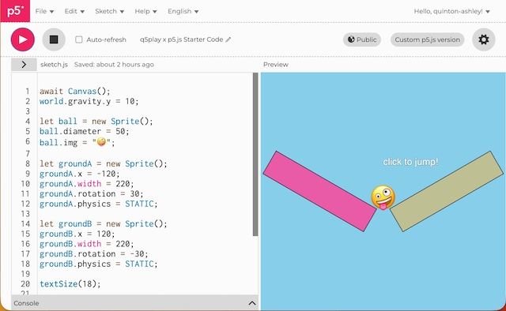

Darauf haben sicher einige von Euch gewartet: [Q5play ist jetzt mit P5.js v2 kompatibel](https://substack.com/home/post/p-200011153). Wie *Quinton Ashley* gestern verkündete: Auch wenn ihr dem traditionellen [P5.js](http://cognitiones.kantel-chaos-team.de/programmierung/creativecoding/processing/p5js.html)-Ökosystem treu bleiben wollt, könnt Ihr nun die Power der [Q5play](https://q5play.org/home/)-Spieleengine damit nutzen. Dafür hat er eine [q5play-p5-compat.js](https://q5play.github.io/p5-compat/q5play-p5-compat.js) entwickelt, eine [Kompatibilitätsschicht](https://q5play.github.io/p5-compat/), die Q5play-Programme mit P5.js ausführt.

Dabei gibt es jedoch -- so *Quinton Ashley* -- folgendes zu beachten:

>Um P5.js besser für die Spieleentwicklung geeignet zu machen, passt diese Kompatibilitätsschicht den standardmäßigen P2D-Renderer automatisch an die Standardeinstellungen von Q5play an. Sie verschiebt den Koordinatenursprung $(0,0)$ in die Mitte der Zeichenfläche, stellt den Winkelmodus auf Grad ein und konfiguriert den Farbmodus auf RGB mit Werten zwischen $0$ und $1$. Außerdem stellt sie Polyfills für einige Q5-Funktionen bereit.

Außerdem benötigt Ihr noch dieses [p5-global-Add-on](https://github.com/quinton-ashley/p5-global), das Ihr in Eurer HTML-Datei zusätzlich zu P5.js v2 laden müsst und der Typ des `sketch.js`-Skripts muss auf `module` gesetzt werden. Die genaue HTML-Syntax könnt Ihr aus [diesem Beispiel im P5.js-Webeditor](https://editor.p5js.org/quinton-ashley/sketches/EfJ_atCs5) entnehmen.

---

**Bild**: *[Qumbo und Rudi Rabbit auf dem Montmartre](https://www.flickr.com/photos/schockwellenreiter/55129302147/)*, generiert mit [OpenArt](https://openart.ai/home). Prompt: »*@Qumbo stands at an easel on a busy street corner in Paris-Montmartre, painting. In one hand he holds a brush, in the other a colorful palette. Beside him stands @Rudi Rabbit, impatiently pointing at his watch. In the background, a large poster proclaims in bold, colorful letters, “Q5.play is coming soon.” Passersby hurry past, oblivious to their presence. The street is bustling with buses and cars. It is late afternoon, and the spring sun illuminates the scene. Colored Franco-Belgian comic style. No textboxes, no speech-bubbles.*« Modell: Nano Banana 2