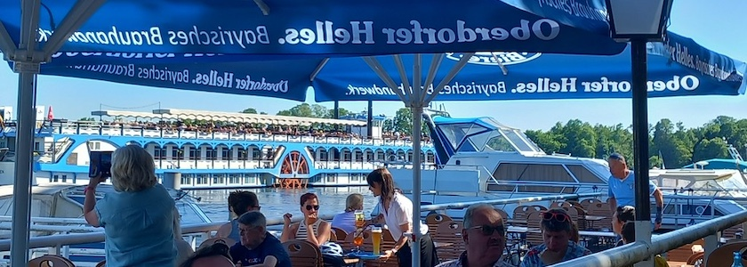

Um 1900 gab es in Tegelort zwar nur 173 Einwohner, aber zehn große Gartenlokale mit etwa 2.500 Garten- und 550 Saalplätzen. Die meisten sind heute verloren und vergessen. Auch die über 125 Jahre alten **Terrassen am See** standen seit 2008 meistens leer. Aber sie standen noch, alle anderen Gasthäuser waren inzwischen abgebrannt, abgerissen und durch Wohnhäuser mit Seeblick für die Betuchteren ersetzt oder sie sind nur noch häßliche Ruinen am Seeufer.

Und seit dem 20. Mai dieses Jahres sind die Terrassen am See wieder geöffnet, mit herrlichem Blick auf den Tegeler See und auf die unter Naturschutz stehende Insel Scharfenberg. Am Pfingstmontag haben die liebste aller Freundinnen und ich dieses Gartenlokal besucht und einen wunderschönen und sonnigen Nachmittag dort verbracht (auch wenn die Bedienung sicherlich noch etwas Einarbeitung bedarf).

Wir wünschen der Gaststätte jedenfalls eine erfolgreiche Zukunft, damit wir auch weiterhin an schönen Sommertagen dort einkehren können.

**Anschrift**: Terrassen am See, Scharfenberger Straße 41, 13505 Berlin

### Literatur

- Holger Lehmann: *Berliner Ausflüge. Unterwegs zu den schönsten Zielen des alten Berlin*, Berlin (Verlag für Berlin-Brandenburg) 4. aktualisierte und erweiterte Auflage 2010, Seiten 162ff.
- Wikipedia: *[Tegelort](https://de.wikipedia.org/wiki/Tegelort)*, aufgerufen am 2.&nbsp;Juni&nbsp;2026
- Michael Zaremba: *Reinickendorf im Wandel der Geschichte. »Laß' hinter dir, was trüb und wild …«*. Berlin (be.bra Verlag) 1999, Seiten 36ff.

---

**Photo** ([cc](https://creativecommons.org/licenses/by-sa/4.0/deed.de)) 2026: *[Jörg Kantel](http://cognitiones.kantel-chaos-team.de/cv.html)*