[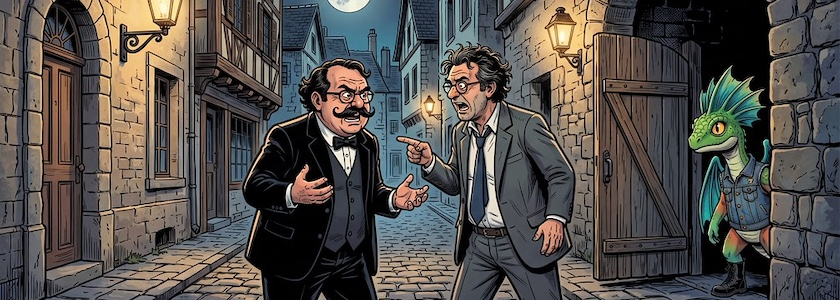](https://www.flickr.com/photos/schockwellenreiter/55310930517/)

Während die gekünstelten Intelligenzien meines Vertrauens (derzeit [Scenario](http://cognitiones.kantel-chaos-team.de/technikgeschichte/rechnerundnetze/scenario.html) und [OpenArt](https://openart.ai/home)) für meine Ausflüge ins Wunderland mittlerweile hinreichend konsistente Charaktere erzeugen können, da kleine Abweichungen in den Zeichnungen in interaktiven Geschichten und Spielen zum Beispiel in [Twine](http://cognitiones.kantel-chaos-team.de/multimedia/spieleprogrammierung/twine2.html) noch tolerierbar sind, nehmen *Visual Novel Engines* wie [Ren'Py](http://cognitiones.kantel-chaos-team.de/multimedia/spieleprogrammierung/renpy.html), [Monogatari](https://monogatari.io/) oder [Tuesday&nbsp;JS](http://cognitiones.kantel-chaos-team.de/multimedia/spieleprogrammierung/tuesdayjs.html) selbst kleinste Abweichungen bei den einzelnen Posen übel.

Doch ich habe es mittlerweile geschafft, die oben genannten Künstlichen Intelligenzien zur Erzeugung konsistenter Charaktere zu überreden, die auch für *Visual Novels* geeignet sind (es klappt zwar nicht immer, aber immer öfter). Da gibt es zum Beispiel *Drago Filz* mit insgesamt sieben Posen:

[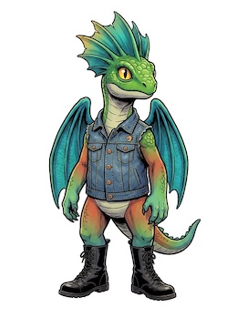](https://www.flickr.com/photos/schockwellenreiter/55305301341/)&nbsp;[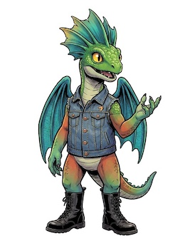](https://www.flickr.com/photos/schockwellenreiter/55305538464/)&nbsp;[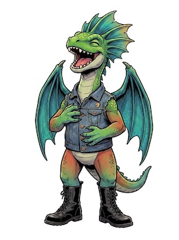](https://www.flickr.com/photos/schockwellenreiter/55305714230/)

*Sylvia Berlin*, die intrigante Chefin von *Hans Blond* in meiner geplanten Räuberpistole *Berlin Attack* (sie ist eine Hauptperson, daher insgesamt 38 Posen):

[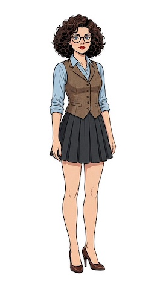](https://www.flickr.com/photos/schockwellenreiter/55253781755/)&nbsp;[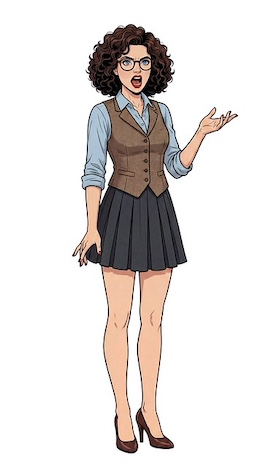](https://www.flickr.com/photos/schockwellenreiter/55253624769/)&nbsp;[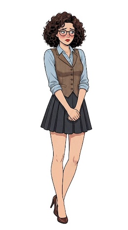](https://www.flickr.com/photos/schockwellenreiter/55252578477/)

Oder der auf diesen Seiten schon einmal bei einem [Monogatari-Test](https://kantel.github.io/posts/2026031201_reichspressekonferenz/) zum Einsatz gekommene *Mark Word* (sieben Posen):

[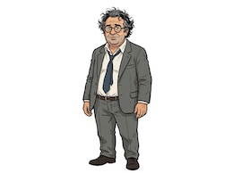](https://www.flickr.com/photos/schockwellenreiter/55142661882/)&nbsp;[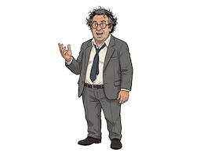](https://www.flickr.com/photos/schockwellenreiter/55142676842/)&nbsp;[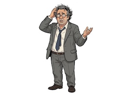](https://www.flickr.com/photos/schockwellenreiter/55143751653/)

Und schließlich -- keine Räuberpistole ohne Detektiv -- der sagenumwobene und unvergleichliche *Hercule Poirot* (elf Posen):

&nbsp;[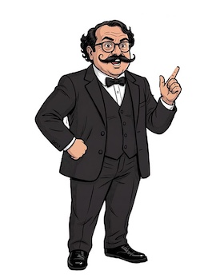](https://www.flickr.com/photos/schockwellenreiter/55310957689/)&nbsp;[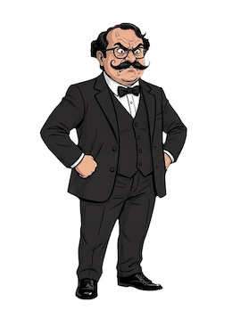](https://www.flickr.com/photos/schockwellenreiter/55311138580/)

Und meine ersten Versuche in dieser Richtung mit dem *Mad Hatter* (neun Posen) hatte ich [hier schon einmal vorgestellt](https://kantel.github.io/posts/2026022701_charakterkonsitenz/).

Alle diese Bilder habe ich nun als hochaufgelöste `.png`-Dateien mit freigestelltem Hintergrund auf [Itch.io hochgeladen](https://kantel.itch.io/visual-novel-projects-1). Weitere Lieferungen werden folgen. Ihr könnt mit diesen Bildern anstellen, was Ihr wollt, doch würde ich mich freuen, wenn Ihr mir einen Link zu Eurem Ergebnis schickt, das ich dann auf diesen Seiten vorstellen kann.

---

**Bild**: *[Alien Attack](https://www.flickr.com/photos/schockwellenreiter/55310930517/)*, erstellt mit [OpenArt](https://openart.ai/home). Prompt: »*OpenArt,
Prompt: @Hercule Poirot and @Mark Word stand in a small-town alleyway, arguing, while @Dino Filz peers out from a gate set in a wall. The small town appears very picturesque; all the houses are at least a hundred years old. No one else is to be seen on the street. It is night, with a full moon, and gas lamps illuminate the scene. Classic American comic-book style—no speech bubbles, no text boxes.*« Modell: Nano Banana 2.
