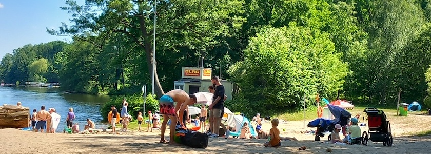

Noch eine Erinnerung an unsere diesjährigen Pfingstausflüge: Die **[Bürgerablage](https://de.wikipedia.org/wiki/B%C3%BCrgerablage)** ist eine Badestelle im Berliner Ortsteil Hakenfelde des Bezirks Spandau. Der Name entstand nicht etwa daduch, weil sich hier Bürger in der Sonne ablegten und bräunen ließen, sondern weil hier am Ufer der Havel Flößer ihr Holz ablegten und dafür einen Obolus in in die Kasse der Spandauer Bürger entrichteten. Doch nachdem der Transport von Baumstämmen nicht mehr über den Wasserweg erfolgte, entschied der Spandauer Bürgermeister *Fröhner*, diesen Ort umzuwidmen. So entstand ein Ausflugsort, den angeblich sogar Kronprinz *Friedrich Wilhelm*, der spätere *Kaiser Friedrich&nbsp;III.*, und seine Frau *Victoria*, zur Erholung aufgesucht haben sollen.

Übergangsweise befand sich von 1940 bis etwa 1947 das *Kinderheim Bredden* an der Bürgerablage. Wann dieses genau geschlossen wurde, ist heute nicht mehr bekannt.

Nach dem Zweiten Weltkrieg war die Bürgerablage eine westliche Exklave auf dem Gebiet der DDR, die nur diejenigen betreten durften, die auch nachweislich ein Grundstück dort besaßen. Erst mit dem Mauerbau und einem einhergehenden Landtausch war die Exklave wieder für alle Westberliner zugänglich.

Nach dem Mauerbau wurde wieder vereinzelt Holz an der Bürgerablage abgelegt, das von hier per Eisenbahn verschickt wurde. An der [Bötzowbahn](https://de.wikipedia.org/wiki/Bahnstrecke_B%C3%B6tzow%E2%80%93Berlin-Spandau) gab es einen Bahnhof Bürgerablage. Die Bahnstrecke wurde beim Bau der Berliner Mauer unterbrochen und später abgebaut. Seit 1970 wird die Bürgerablage nur noch als öffentliche Erholungs- und Badestelle genutzt.

Am Pfingstsonntag dieses Jahres hatten die liebste aller Freundinnen und ich diese Badestelle, genauer den Biergarten des dortigen »[Jagdhaus an der Bürgerablage](https://jagdhaus-berlin.de/location/das-jagdhaus/)«, besucht und dort einen wunderschönen Nachmittag verbracht. Man hat von der Terrasse aus einen weiten Blick über die Havel und auf die Aktivitäten am Strand. Und die Eiskarte des Jagdhauses ist ebenfalls zu empfehlen. Wir werden bestimmt wiederkommen.

---

**Photo** ([cc](https://creativecommons.org/licenses/by-sa/4.0/deed.de)) 2026: *[Jörg Kantel](http://cognitiones.kantel-chaos-team.de/cv.html)*