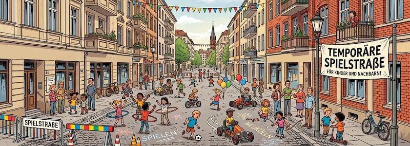

Morgen, am **Dienstag, den 9. Juni 2026 zwischen 15:00 Uhr und 18:00 Uhr** können alle Neuköllner Kids ihr Lieblingsspielzeug mit nach draußen nehmen. Denn dann wird die **Glasower Straße zwischen Benda- und Bruno-Bauer-Straße** in 12051 Berlin-Neukölln für den Autoverkehr gesperrt und zur [temporären Spielstraße umgewidmet](https://qm-glasower-strasse.de/glasower-strasse-wird-wieder-zur-spielstrasse/). Wie schon im letzten Jahr kann dann fröhlich und unbehelligt vom Autoverkehr auf der Straße gespielt, getobt, getanzt und gelacht werden.

**Autofahrer, bitte aufgepasst**: Die Straße ist im besagten Abschnitt nicht nur gesperrt, sondern von 13:00 Uhr bis 18:00 Uhr gilt auch absolutes Halteverbot. Autos, die dennoch dort parken, werden abgeschleppt.

In diesem Jahr ist das Event nicht mehr nur ein einmaliges Ereignis, sondern die temporäre Spielstraße wird auch am 7.&nbsp;Juli, 25.&nbsp;August und am 22.&nbsp;September, jeweils auch wieder von 15:00 Uhr bis 18:00 Uhr, wiederholt werden. Die Veranstalterinnen und Veranstalter freuen sich über viele, fröhliche Kinder und ihre erwachsenen Begleitpersonen.

---

**Bild**: *[Temporäre Spielstraße](https://www.flickr.com/photos/schockwellenreiter/55322168579/)*, erstellt mit [Scenario](http://cognitiones.kantel-chaos-team.de/technikgeschichte/rechnerundnetze/scenario.html). Prompt: »*A cordoned-off city street in Berlin-Neukölln lined with multi-story residential and commercial buildings, some featuring red brick facades. No shops. Many children are playing in the street with hoops, balls, balloons, and a few pedal cars, supervised by a handful of adults. Colorful triangular pennants are strung across the street. A banner reading "Temporäre Spielstraße" (Temporary Play Street) hangs on the right side of the street. Franco-Belgian comic book style. Language: German. No speech bubbles, no text boxes.*« Modell: Nano Banana&nbsp;2.