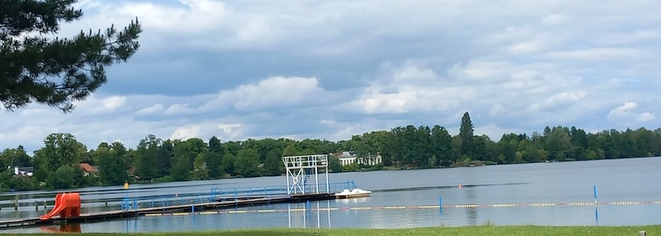

Ganz im Norder Berlins, dicht an der Havel, liegt ein kleiner See, der dem Reinickendorfer Ortsteil *Heiligensee* seinen Namen gegeben hat. Um den See ranken sich viele Sagen. So erzahlt man sich, daß tief auf dem Grunde des Heiligensees Glocken liegen, die vor langer Zeit dort versunken seien. Zuweilen kommen sie zum Vorschein. Man sieht sie dann meistens in der Mitte des Sees auf einer flachen Stelle liegen. Dort wärmen sie sich im Strahle der Mittagssonne. Einige Leute hörten sie auch schon sprechen. Es war gerade am Johannistag. Sie kamen aus dem See heraus und die eine sagte zur anderen:

»Anne Susanne, wist mett to Lanne?«

Darauf antwortete die andere: »Nimmermeh!« Dann sanken sie, nachdem sie noch einmal angeschlagen hatten, wieder in die Tiefe.

Dann gibt es die Sage, hier habe vor langer Zeit ein Schloss gestanden, indem eine Prinzessin gewohnt habe, die aber verwünscht worden und das Schloss im See versunken sei.

Auch erzählt man, der See sei alle einhundert Jahre mit einem silbernen Heiligen geweiht und das Wasser dann von weit und breit abgeholt worden.

Die Dorfbewohner hingegen erzählten, es habe vor alter Zeit im Dorf zwischen der Dorfschmiede und der Kirche ein Heiligtum gestanden, das große Heilkraft besessen habe, und die älteren Leute könnten sich noch gar wohl erinnern, daß eine große Anzahl von Krücken, die die geheilten Lahmen zurückließen, in der Dorfkirche hingen.

Ferner seien in uralter Zeit alljährlich an einem bestimmten Tag, den jedoch niemand mehr weiß, zwei schwarze Stiere vor einem Wagen geschirrt worden, und sobald dies geschehen sei, wären die Stiere nicht mehr zu bändigen gewesen, sondern seien mit aller Kraft geradewegs aus dem Dorf hinaus und in den See hineingestürzt. Aus dessen grundloser Tiefe wären sie nie wieder aufgetaucht.

### Quellen

- Ingeborg Drewitz (Hg.): *Märkische Sagen. Berlin und die Mark Brandenburg*, Reinbek (rororo) 1995, S. 235; Orginalausgabe: München (Diedrichs) 1979
- Gerd Koischwitz: *Sechs Dörfer in Sumpf und Sand. Geschichte des Bezirkes Reinickendorf von Berlin*, Berlin (Verlag »Der Nord-Berliner«) 1984, S. 113

---

**Photo** ([cc](https://creativecommons.org/licenses/by-sa/4.0/deed.de)) 2026: *[Jörg Kantel](http://cognitiones.kantel-chaos-team.de/cv.html)*