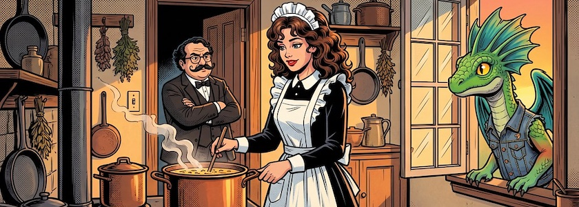
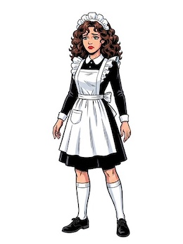
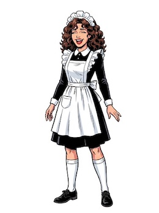
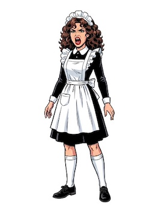
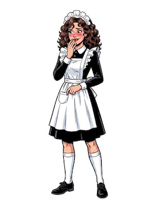

Angeregt durch den Erfolg des [vorausgegangenen Beitrags](https://kantel.github.io/posts/2026060301_konsistente_charaktere/) habe ich eine weitere Figur für die Verwendung interaktiver Geschichten und Spielen von den gekünstelten Intelligenzien meines Vertrauens (derzeit [Scenario](http://cognitiones.kantel-chaos-team.de/technikgeschichte/rechnerundnetze/scenario.html) und [OpenArt](https://openart.ai/home)) erzeugen lassen, die wegen ihrer Konsistenz auch für *Visual Novels* geeignet ist. Ich habe sie *Maid Mary* genannt und [auf Itch.io hochgeladen](https://kantel.itch.io/maid-mary-visual-novel-assets).

&nbsp;&nbsp;  
&nbsp;&nbsp;

Die Bilder oben sind nur eine Auswahl, insgesamt besteht das Set aus 23 Posen.

Da das verwendete Modell Googles Nano Banana 2 war, ist die Auswahl des KI-Dienstleisters eigentlich nebensächlich, da diese den Prompt nur durchreichen. Ich habe die einzelnen Posen mit Scenario generieren lassen, da diese ein in meinen Augen über besseres Tool zur Freistellung des Hintergrunds verfügen. Allerdings habe ich die Referenzbilder aller Figuren auch nach OpenArt hochgeladen und sie dort zusätzlich als *Charaktere* mit `Character 2.0` erstellt. So habe ich dann zusätzlich die Möglichkeit, mit ihnen solche Szenen wie im obigen [Bannerbild](https://www.flickr.com/photos/schockwellenreiter/55327030304/) zu erzeugen.

---

**Bild**: *[Geschichten aus der Küche](https://www.flickr.com/photos/schockwellenreiter/55327030304/)*. erstellt mit [OpenArt](https://openart.ai/home). Prompt: »*@Marimam stands in an old-fashioned kitchen from the late 19th century in front of a coal stove, cooking soup in a huge copper pot. @lPoirot stands in the doorway, looking somewhat impatient. @Drago is peering in through the open window, smiling kindly at @Mariam . It is early evening, and the setting sun casts a warm glow over the scene. Classic American comic book style. No speech bubbles or text boxes.*« Modell: Nano Banana&nbsp;2.