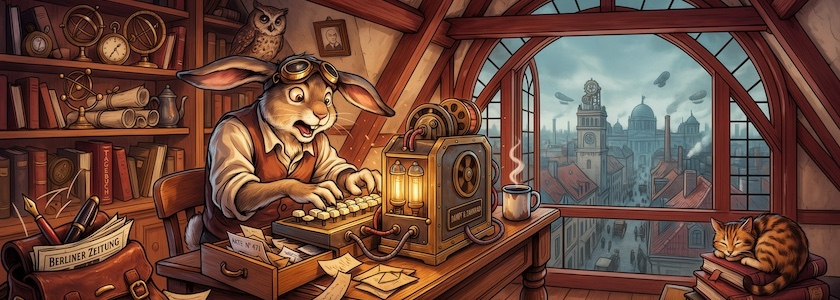

Von *David Bates* flatterte mir der begeisterte Bericht »[Astounding AI Image Update — Ideogram Drops v.4.0!](https://medium.com/kinomoto-mag/astounding-ai-image-update-ideogram-drops-v-4-0-aeb651ed38f2)« (Medium.com, daher leider hinter einer Bezahlschranke (€) versteckt) in meinen Feedreader. Der KI-Bildgenerator [Ideogram&nbsp;4.0](https://ideogram.ai/models/4.0/) soll wahrhaft Erstaunliches leisten. Hier einige der Funktionen:

- Branchenführende Typografie – inklusive bearbeitbarer Textebenen
- Native 2K-Auflösung – Seitenverhältnis 1:1 mit 2048 x 2048 Pixel bis Seitenverhältnis 23:9 mit 2944 x 1152 Pixel (und das sowohl im Quer- wie auch im Hochformat)
- Native Hintergrundtransparenz

Entfernt klingelte es bei mir: Ideogram hatte ich vor über zwei Jahren doch schon einmal [getestet](https://kantel.github.io/posts/2024030102_ideogram_pikaso/). Die generierten Bilder waren schon für damalige Verhältnisse nicht schlecht, aber nicht so herausragend, daß ich mich darauf einlassen wollte.

Aber jetzt hat das neue Update auf die Version 4.0 nicht nur die oben erwähnten Features, sondern die Entwickler von Ideogram haben dieses Modell als das erste Text-zu-Bild-Modell mit offener Gewichtung veröffentlicht. Das bedeutet, daß die Entwickler dieses Modells die Trainingsdaten freigeben, so daß andere das Modell einsehen, nutzen und gemeinsam daran arbeiten können.

Als erstes überzeugte mich aber erst einmal das Seitenverhältnis 23:9, damit muß ich meine Bannerbilder nun nur noch minimal beschneiden. Also habe ich erst einmal meinen bewährten Märzhasen (ohne vorherige Charakter-Generierung, die soll aber Ideogram ebenfalls beherrschen) generieren lassen und damit das [Bannerbild oben](https://www.flickr.com/photos/schockwellenreiter/55327464975/) erzeugt. Und ich bin ziemlich begeistert, für einen naiven ersten Versuch ist das Ergebnis geradezu ideal. Und der von mir im Prompt gewünschte Comic-Stil ist weit dynamischer als die doch eher statischen, mit dem gleichen Prompt von Nano Banana erzeugten Bilder.

Die Auflösung von 2K sollte für meine Anwendungen mehr als ausreichend sein. Und natürlich lockt mich auch die eingebaute Möglichkeit, Bilder mit transparentem Hintergrund zu erzeugen, weil dies (nicht nur) bei Figuren für *Visual Novels* unabdingbar ist. Aber auch die bearbeitbaren Textebenen sind ein gewichtiges Argument. Wie oft erfindet die gekünstelte Intelligenzia Texte (zum Beispiel Geschäftsnamen in Schaufenstern), die man so gar nicht haben will, die durch andere Texte ersetzt werden müssten.

Der kostenlose Plan, der (Stand heute) 10 (»Slow«-) Credits alle zwei Tage erneuert und mit dem man die generierten Bilder nur als JPEG herunterladen kann, reicht vermutlich nicht weit, so daß für eine sinnvolle Nutzung mindestens der »Plus«-Plan ($15 Dollar/Monat, jährliche Abrechnung) her muss, der 1.000 Credits im Monat und unbegrenzte »Slow Credits« bereitstellt.

Aber erst einmal möchte ich mit ein paar weiteren Tests ausprobieren, ob meine anfängliche Begeisterung dann noch anhält, ob das Teil wirklich hält, was es verspricht. *Still digging!*

---

**Bild**: *[Die Zettelkästen des Märzhasen](https://www.flickr.com/photos/schockwellenreiter/55327464975/)*. erstellt mit [Ideogram 4.0](https://ideogram.ai/). Prompt: »*The March Hare sits at a desk in front of an antiquated, steampunk-style computer, typing on a keyboard. He wears a pair of aviator goggles, which he has pushed up onto his forehead. On the desk stands an open card catalog, its contents a chaotic jumble of handwritten index cards and loose scraps of paper. Beside the keyboard sits a mug of steaming coffee. Shelves crammed with books and steampunk knick-knacks line the walls. Through a window, one looks out upon a steampunk version of Berlin. Colored classic American comic style. Language: German. No speech bubbles, no textboxes. No German flags.*«