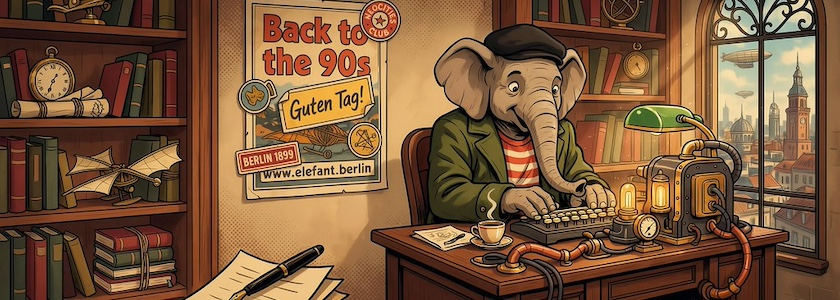
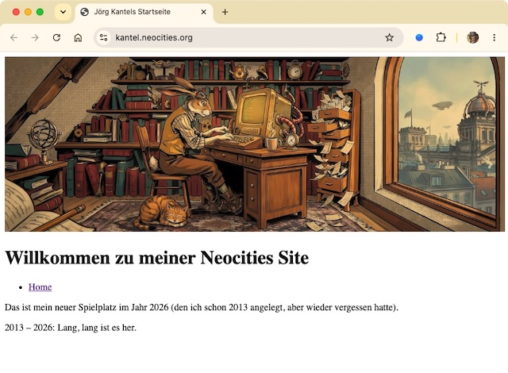

Die Neugierde hatte mich übermannt. Ich wollte unbedingt wieder Webseiten ohne Sinn und Verstand basteln, den asozialen Medien den Stinkefinger zeigen und mich unabhänig und frei wie zu den Flegelzeiten des Internets in den 199er Jahren fühlen. Kurzum: Ich wollte mir einen Account bei [Neocities](https://de.wikipedia.org/wiki/Neocities) zulegen und schauen, was es denn mit dem [IndieWeb](https://kantel.github.io/index.html#category=IndieWeb) so auf sich hat.

Doch Überraschung! Neocities sagte mir, daß ich einen Account schon 2013 angelegt, aber nie etwas damit angestellt hatte. Ich war also schon vor dreizehn Jahren Trendsetter und hatte es völlig vergessen.

Also habe ich erst einmal die verwaiste und vergessene `index.html` auf [kantel.neocities.org](https://kantel.neocities.org/) mit minimalem Inhalt gefüttert und dabei gemerkt, wie viel ich von den *Basics* von HTML und CSS vergessen hatte. Wenn man immer nur mit Frameworks bastelt und in höheren Ebenen schwebt, vergisst man leicht die Grundlagen. Allein diese sich wieder draufzuschaffen, ist ein hinreichender Grund, ein freier und unabhängiger Bürger des IndieWebs zu werden.

Ich habe daher als erstes das Default-Neocities-CSS-Framework gleich mit rausgeworfen. Denn wenn ich schon zurück zu meinen Wurzeln will, dann konsequent, ohne zu ~~googlen~~ mogeln.

Ich weiß also, womit ich mich in der nächsten Zeit beschäftigen werde. Sicher nicht immer, denn es gibt schließlich noch so viel anderes zu entdecken, aber immer öfter. Ich werde dabei hoffentlich mein Ziel nicht aus den Augen verlieren. *Still digging!*

---

**Bild**: *[Auf ins IndieWeb](https://www.flickr.com/photos/schockwellenreiter/55329446355/)*. erstellt mit [Ideogram 4.0](https://ideogram.ai/). Prompt: »*A friendly, anthropomorphic elephant wearing a green coat, a red-and-white striped T-shirt, and a black beret sits at a massive desk in front of a steampunk-style computer, using an old-fashioned keyboard. Shelves line the wall, crammed with books and steampunk knick-knacks. Through a window, one can see an alternative steampunk Berlin. A poster on one wall, between the shelves, reads "Back to the 90s," adorned with a few Neocities-style stickers. Colored classic Amiercan comic style. Language: German. No textboxes, no speech bubbles, no headlines.*«