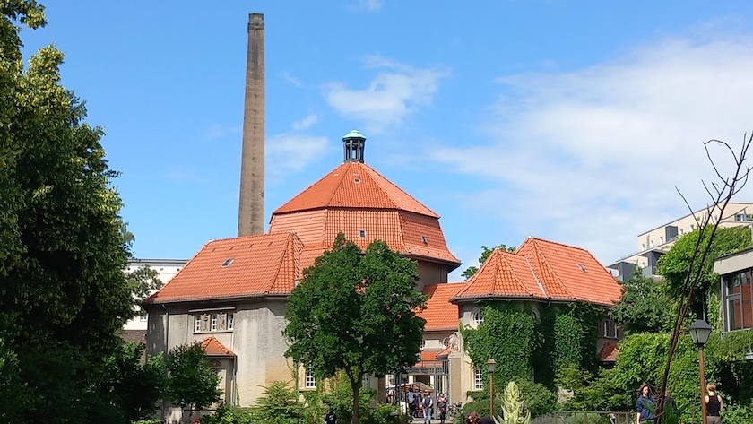
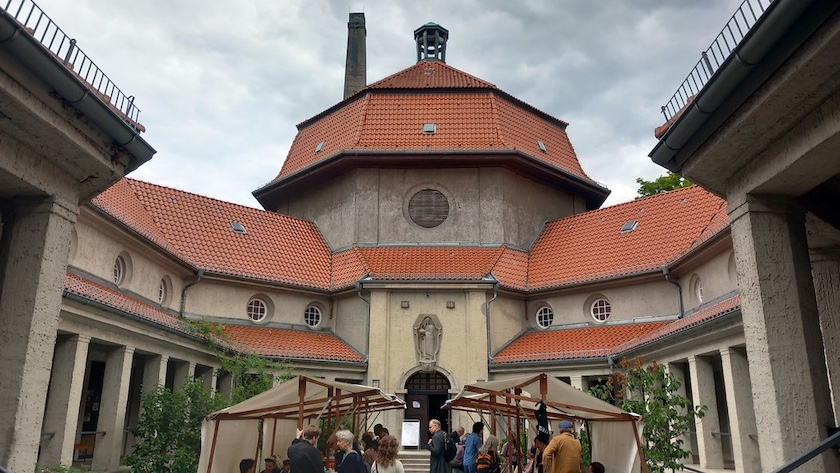

Das ehemalige [Krematorium Wedding](https://de.wikipedia.org/wiki/Krematorium_Berlin-Wedding) in der Gerichtsstraße&nbsp;35 in 13347&nbsp;Berlin wurde zwischen 1909 und 1910 (noch bevor 1911 die gesetzliche Grundlage für Feuerbestattungen in Preußen erfolgte) als [erstes Krematorium der Stadt und insgesamt drittes in Preußen](https://www.silent-green.net/haus/historie) erbaut. Gegen massive kirchliche Widerstände -- die katholische Kirche räumte ihren Mitgliedern erst 1964 offiziell die Option der Feuerbestattung ein -- wurde die erste Einäscherung 1878 im als liberal geltenden Herzogtum Sachsen-Coburg und Gotha durchgeführt und setzte sich danach als Ausdruck von Fortschritt, Säkularisierung, Umwelt- und Hygienebewusstsein zunehmend im gesamten Kaiserreich durch.

Das Krematorium erhielt seinen Standort auf dem ersten kommunalen, 1828 angelegten Friedhof Berlins, der eine Fläche von 31.000 Quadratmetern aufwies. Dieser war als Bestattungsstätte 1879 aufgegeben worden und sollte ursprünglich in einen Park umgestaltet werden. Das Hauptgebäude des Krematoriums ist eine große, zentral angelegte 17 Meter hohe Feierhalle, in der auch die Urnen abgestellt wurden. Diese achteckige Urnenhalle ist in neoklassizistischen und frühchristlichen Architekturformen gehalten. Das ziegelgedeckte Mansarddach wird mit einer zentralen Laterne bekrönt, die einen der beiden Schornsteine verdeckt. Im Jahr 1995 wurde das Krematorium Wedding in die Berliner Denkmalliste aufgenommen.

Nachdem das Krematorium zwischen 1993 und 1996 noch um eine unterirdische Leichenhalle vergrößert wurde und im Anschluss daran die Ofen- und Filteranlagen komplett erneuert wurden, ließ die Stadt es Ende 2002 schließen. Danach stand es lange Jahre leer. Seit dem Sommer 2015 beherbegt der Gebäudekomplex das interdisziplinäre Kulturquartier *[silent green](https://www.silent-green.net/)*.

Seitdem wird die historische Kuppelhalle für Konzerte, Lesungen, Filmscreenings, Konferenzen und besondere Feierlichkeiten genutzt. Im baulichen Kontrast dazu steht die 2019 fertiggestellte unterirdische Betonhalle. Auf einer Gesamtfläche von 1.600 m² finden hier medienübergreifende Ausstellungen und Produktionen größeren Zuschnitts aus den Bereichen Film, Musik und Diskurs ihren Platz. Im Zusammenspiel von historischem Gebäudeteil und den neuen Bauten Betonhalle und Atelierhaus ist so ein großflächiger kreativer Campus entstanden.

Am letzten Sonnabend, den 13. Juni, besuchten die liebste aller Freundinnen und ich dort das [Poesiefestival Berlin 2026](https://www.hausfuerpoesie.org/de/poesiefestival-berlin/poesiefestival-berlin-2026/info). Leider fanden wegen des unbeständigen Wetters die angekündigten Lesungen nicht wie vorgesehen auf der Wiese des *silent green* statt, sondern in der Feierhalle des Krematoriums -- was aber wegen der Architektur des Gebäudes auch sehr beeindruckend war.

---

**Photos** ([cc](https://creativecommons.org/licenses/by-sa/4.0/deed.de)) 2026: *[Jörg Kantel](http://cognitiones.kantel-chaos-team.de/cv.html)*