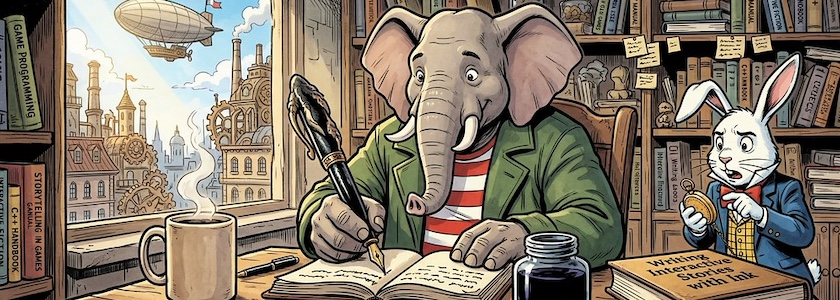

Nachdem ich im März dieses Jahres mal wieder über [Ink](https://www.inklestudios.com/ink/), die freie (MIT-Lizenz) Skriptsprache für interaktive Fiktion und den dazugehörenden Editor [Inky](http://cognitiones.kantel-chaos-team.de/multimedia/spieleprogrammierung/inkle.html) ausführlich [berichtet hatte](https://kantel.github.io/posts/2026032501_ink_und_inky/), fühlte sich unser aller Datenkrake bemüßigt, mir weiteres Material dazu in meinen Feedreader zu spülen. Ich habe momentan (noch) nicht wirklich vor, etwas mit Ink und Inky anzustellen (oder?), aber da es ein wirklich nettes Spielzeug ist, möchte ich Euch die Informationen nicht vorenthalten:

<iframe class="if16_9" src="https://www.youtube.com/embed/uTO7yVNlU4I?si=9LHmRlENjB1QRFLr" title="YouTube video player" frameborder="0" allow="accelerometer; autoplay; clipboard-write; encrypted-media; gyroscope; picture-in-picture; web-share" referrerpolicy="strict-origin-when-cross-origin" allowfullscreen></iframe>

Aus den [Learning Labs](https://www.gwinnettpl.org/learninglabs/) der *Gwinnett County Public Library* stammt das Video »[How to Write Interactive Narrative with Inky](https://www.youtube.com/watch?v=uTO7yVNlU4I)«, das einen halbstündigen Einführungskurs in das Tool gibt. Zeil war es, die Teilnehmer fit für eine anstehende Game Jam zu machen.

<iframe class="if16_9" src="https://www.youtube.com/embed/dewPlUhv6sM?si=M4GF-wn1IwLveQbq" title="YouTube video player" frameborder="0" allow="accelerometer; autoplay; clipboard-write; encrypted-media; gyroscope; picture-in-picture; web-share" referrerpolicy="strict-origin-when-cross-origin" allowfullscreen></iframe>

Auch der »Solo Adventurer« *Chris Chinchilla* versucht sich in »[How to create interactive fiction and game scripts with Inky](https://www.youtube.com/watch?v=dewPlUhv6sM)« an Ink und Inky. Er geht völlig ahnungslos an das Teil heran, und daß er sich in den 25 Minuten nicht völlig verrennt, zeigt, wie einfach diese Skriptsprache zu bedienen ist. Ansonsten sind alle Aussagen in diesem Video mit Vorsicht zu genießen.

<iframe class="if16_9" src="https://www.youtube.com/embed/qe-rP7Mfh-A?si=ZC9ZFu55IylfFJvi" title="YouTube video player" frameborder="0" allow="accelerometer; autoplay; clipboard-write; encrypted-media; gyroscope; picture-in-picture; web-share" referrerpolicy="strict-origin-when-cross-origin" allowfullscreen></iframe>

Bedeutend besser und informativer ist das einstündige Tutorial »[Ink Crash Course](https://www.youtube.com/watch?v=qe-rP7Mfh-A)« von *Seth Paxton*. Er gibt einen Einblick in die Skriptsprache und einen Überblick über das Ink-Öko-System. Die [Folien zu diesem Tutorial](https://docs.google.com/presentation/d/1iAA5xu88musYsr0izgPR-xkMweNncm14y-PZtzr69UM/edit?slide=id.gc6f889893_0_0#slide=id.gc6f889893_0_0) mit vielen weiterführenden Links hat er online gestellt.

Auch dieses Video diente der Vorbereitung einer [Ink-Jam im Jahre 2024](https://itch.io/jam/inkjam-2024).

---

**Bild**: *[Writing Interactive Stories with Ink](https://www.flickr.com/photos/schockwellenreiter/55167098212/)*, generiert mit [OpenArt](https://openart.ai/home). Prompt: »*@Qumbo sits behind an old-fashioned desk, an open notebook in front of him, which he writes in with an old-fashioned, monstrous fountain pen. Next to the notebook is a huge, open inkwell. Beside the desk stands @Rudi Rabbit, glancing impatiently and frantically at his pocket watch. On the desk, to the right, lies a thick book titled “Writing Interactive Stories with Ink,” and to the left, a steaming, large coffee mug. Shelves line the walls, crammed with books on game programming, game design, and writing interactive stories. A fair amount of knick-knacks are crammed in between. The afternoon sun streams into the room through a large window. The window reveals a steampunk city, with a zeppelin gliding high in the sky. Colored Franco-Belgian comic style. No textboxes, no speech-bubbles.*« Modell: Nano Banana 2.