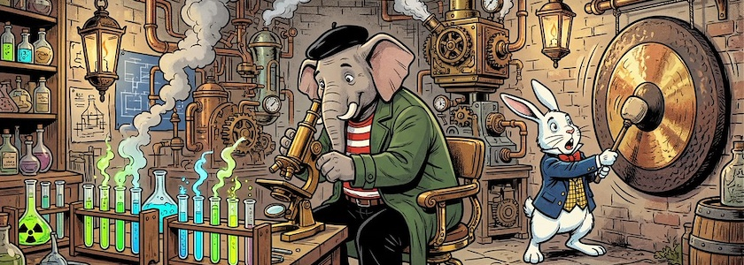
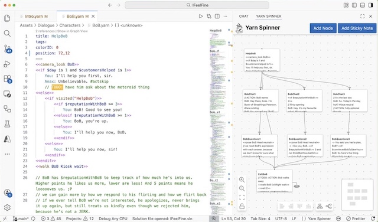

**[Yarn Spinner](http://cognitiones.kantel-chaos-team.de/multimedia/spieleprogrammierung/yarn.html)** ist ein Set von freien Tools, ein Spinoff der tasmanischen Spieleschmiede *[Secret Lab](https://secretlab.games/)*, für narrative Spiele -- für Autoren , Programmierer , Spieledesigner und alle dazwischen. Es sieht ein wenig so aus wie eine wüste Mischung zwischen [Twine](http://cognitiones.kantel-chaos-team.de/multimedia/spieleprogrammierung/twine2.html) und [Ink](http://cognitiones.kantel-chaos-team.de/multimedia/spieleprogrammierung/inkle.html). Es ist sehr stark auf die Zusammenarbeit mit [Unity](http://cognitiones.kantel-chaos-team.de/multimedia/spieleprogrammierung/unity.html) fokussiert, es gibt aber auch ein Plugin/eine Version (?) für für [Godot](http://cognitiones.kantel-chaos-team.de/multimedia/spieleprogrammierung/godot.html) (GDScript und C#). Außerdem soll es auch -- ähnlich wie Ink mit Inkle -- standalone funktionieren und HTML-Seiten/-Spiele herausschreiben können.

Ich hatte das Teil vor ziemlich genau zehn Jahren [schon einmal](http://blog.schockwellenreiter.de/2019/06/2019061601.html) auf dem Schirm. Damals kam es noch mit einem eigenen Editor, der mir sehr gut gefallen hatte. Heute setzt man auf eine [Erweiterung für Visual Studio Code](https://docs.yarnspinner.dev/write-yarn-scripts/yarn-spinner-editor), die mir nicht so gut gefällt (es sei denn, es gäbe auch Plugins für andere Editoren wie zum Beispiel [Zed](https://kantel.github.io/posts/2026051401_zed/) oder [CotEditor](https://kantel.github.io/posts/2026042201_coteditor_7/)).

Auch Yarn, die Skriptsprache selber, wirkt ein wenig, als hätte man Ink und Twine ([SugarCube](http://www.motoslave.net/sugarcube/2/)) in ein Reagenzglas gegossen und dann wild geschüttelt. Aber sie scheint ihren Zweck zu erfüllen, wie diese beiden Videos zu beweisen versuchen:

<iframe class="if16_9" src="https://www.youtube.com/embed/549J0eHE88k?si=9akngNHw5MOld93M" title="YouTube video player" frameborder="0" allow="accelerometer; autoplay; clipboard-write; encrypted-media; gyroscope; picture-in-picture; web-share" referrerpolicy="strict-origin-when-cross-origin" allowfullscreen></iframe>

In dem Vortrag »[Building Narrative Games with Yarn Spinner](https://www.youtube.com/watch?v=549J0eHE88k)« aus dem Jahre 2021 erklären *Mars Buttfield-Addison* und *Jon Manning* von der University of Tasmania und Secret Lab, wie man Yarn Spinner einrichtet, wie man sein vorhandenes Wissen aus Tools wie Twine nutzt, wie man Dialoge in die Spielszene integriert und wie es weitergeht. Es erwartet Euch ein kompakter und kurzweiliger Einblick in die Spieleentwicklung.

<iframe class="if16_9" src="https://www.youtube.com/embed/7R-XzOoWTNA?si=b7ltpupD9LTQ3XX_" title="YouTube video player" frameborder="0" allow="accelerometer; autoplay; clipboard-write; encrypted-media; gyroscope; picture-in-picture; web-share" referrerpolicy="strict-origin-when-cross-origin" allowfullscreen></iframe>

Der fünzig-minütige Vortrag »[Let’s learn to write narrative games with Yarn Spinner](https://www.youtube.com/watch?v=7R-XzOoWTNA)« von *Dr. Paris Buttfield* aus dem Jahre 2024 bietet eine rasante Einführung und einen Überblick darüber, wie man Spiele mit dem kostenlosen Open-Source-Tool Yarn Spinner entwickelt. Es ist die Basis für Spiele wie Dredge, Venba, Night in the Woods und viele weitere. In dieser Session wird gezeigt, wie einfach Autoren, Spieledesigner und Produzenten mit Yarn Spinner komplexe Geschichten schreiben und das Gameplay gestalten können, um diese anschließend in Spiele zu integrieren, die mit [Unreal Engine](http://cognitiones.kantel-chaos-team.de/multimedia/spieleprogrammierung/unrealengine.html), Godot oder Unity erstellt wurden.

### Links

- [Yarn Spinner Home](https://yarnspinner.dev/)
- [Yarn Spinner @ GitHub](https://github.com/YarnSpinnerTool)
- [Yarn Spinner Documentation](https://docs.yarnspinner.dev/)
- [Yarn Spinner for Visual Studio Code](https://marketplace.visualstudio.com/items?itemName=SecretLab.yarn-spinner)

Ich habe momentan nicht vor, irgendetwas mit Yarn Spinner anzustellen. Aber für den Fall der Fälle möchte ich gewappnet sein. Darum habe ich alles, was ich Stand heute über Yarn Spinner weiß, in diesem Beitrag zusammengefasst und aufgeschrieben. *Still digging!*

---

**Bild**: *[Steampunk Laboratorium](https://www.flickr.com/photos/schockwellenreiter/55168522998/)*, generiert mit [OpenArt](https://openart.ai/home). Prompt: »*@Qumbo sits in a steampunk-style laboratory in front of a large microscope. Next to him on the lab table are test tubes in racks filled with neon-colored, steaming liquids. @Rudi Rabbit stands to the side, striking a giant gong hanging on the wall with a mallet. In the background, strange, large machines belch out clouds of steam. The scene is illuminated by antique gas lanterns hanging from the ceiling. Colored Franco-Belgian comic style. No textboxes, no speech-bubbles.*« Modell: Nano Banana 2.