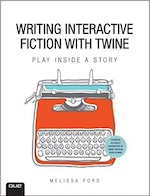

Ich habe heute das sonnige Wetter ausgenutzt und den ganzen Nachmittag auf meiner Terrasse im Neuköllner Hinterhofgärtchen (aka »[Grüne Hölle](https://kantel.github.io/posts/2026060102_gruene_hoelle/)«) mit einer Flasche Rosé verbracht (ich darf das, ich bin schließlich so alt und seit über sieben Jahren Rentner) und zum [wiederholten](http://blog.schockwellenreiter.de/2020/07/2020071502.html) [Male](http://blog.schockwellenreiter.de/2020/07/2020071101.html) in dem wunderbaren Buch »[Writing Interactive Fiction with Twine](https://www.melissafordauthor.com/writing-interactive-fiction-with-twine/)« von *Melissa Ford* geschmökert. Das Buch ist trotz seines Alters ein *must have* nicht nur für jede und jeden, die oder der an der Erstellung interaktiver Geschichten und Spiele mit [Twine](http://cognitiones.kantel-chaos-team.de/multimedia/spieleprogrammierung/twine2.html) interessiert ist, sondern es geht weit darüber hinaus.

Denn zwar besteht es zur Hälfte aus einer Einführung in Twine&nbsp;2, die nahezu alle Makros von [Harlowe](https://twine2.neocities.org/) und [SugarCube](https://www.motoslave.net/sugarcube/2/docs/) abdeckt, die beim Erscheinen des Buches vor zehn Jahren (2016) existierten, aber die andere Hälfte besteht aus allgemeinen Informationen zum Erstellen interaktiver Geschichten und Spiele: Glaubwürdige Charaktere entwickeln, Handlungsbögen gestalten, lebendige Welten erschaffen -- all das, was man unabhängig vom verwendeten Tool beachten sollte, ist hier ebenfalls enthalten und wird ausführlich erläutert.

Und da die Entwickler von Twine und den zugehörigen Storyformaten in der Regel darauf achten, daß alle Updates rückwärtskompatibel sind, braucht auch niemand zu befürchten, daß das Buch veraltet sei, es ist immer noch eine sinnvolle Anschaffung (zumal es gebraucht mittlerweile zu einem einigermaßen vernünftigen Preis (Stand heute: etwa 13&nbsp;€ für die über 400 Seiten) zu bekommen ist).

**War sonst noch was?** Ach ja, interaktive Geschichten und Spiele sind im Kommen. Behauptet zumindest *Christan Schiffer* im Bayerischen Rundfunk in seinem Beitrag »[Literatur aus der Konsole](https://www.br.de/nachrichten/kultur/literatur-aus-der-konsole-was-hinter-den-disco-likes-steckt,VMajr3J)«, in dem er fragt, was hinter den Disco-Likes steckt:

>Keine Kämpfe, keine Beute, dafür Politik, Psychologie und endlose Dialoge: Sieben Jahre nach dem legendären Computerspiel [Disco Elysium](https://de.wikipedia.org/wiki/Disco_Elysium) entstehen immer mehr neue Titel, die in dessen Fußstapfen treten wollen.

Er meint, daß Disco-Likes das Beste sind, was der Videospielkultur seit Jahren passiert sei. Wir ständen am Anfang von etwas. Und an einem Anfang zu stehen, sei immer ein seltenes Glück. Da will ich doch auch dabei sein.&nbsp;🤓

---

**Photo** ([cc](https://creativecommons.org/licenses/by-sa/4.0/deed.de)) 2026: *[Jörg Kantel](http://cognitiones.kantel-chaos-team.de/cv.html)*