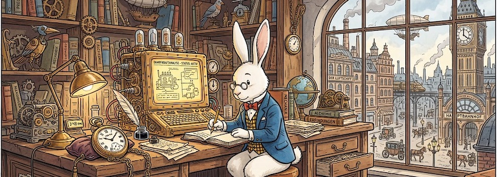
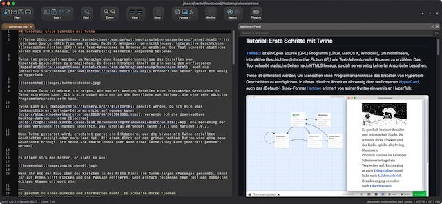

Es tut sich etwas auf dem Gebiet der [Visual-Studio-Code](http://cognitiones.kantel-chaos-team.de/produktivitaet/visualstudiocode.html)-Alternativen, auch für den Mac. Hatte ich vor zwei Monaten [hier schon](https://kantel.github.io/posts/2026042201_coteditor_7/) den [CotEditor](https://coteditor.com/) als leichtgewichte Mac-Alternative zu Microsofts Boliden vorgestellt, und im letzten Monat [Zed](https://zed.dev/), den plattformübergreifenden Editor, der sich als Atom-Nachfolger versteht und zum direkten [Angriff auf Visual Studio Code](https://kantel.github.io/posts/2026051401_zed/) bläst, so stelle ich heute die freie (GPL&nbsp;3.0) Mac-Applikation **[Nextpad++](https://nextpad.org/)** vor.

Nextpad++ geht einen anderen Weg. Er ist eine Mac-native Fork des Windows-Klassikers [Notepad++](https://notepad-plus-plus.org/). Der Editor wurde vollständig in Objective-C++ entwickelt und nutzt die Scintilla-Engine. Er benötigt weder Wine, Emulationsschichten noch Porting Kits und ist somit eine echte native Anwendung. Er läuft sowohl auf Intel-Prozessoren als auch auf Apple Silicon von M1 bis M5. Er ist damit auch entsprechend schlank (40&nbsp;MB) geraten. Beim ersten Start sah er für meinen Geschmack zu sehr nach Windows aus, da waren einige Anpassungen notwendig, bis mir das Aussehen gefiel. Mit der aktuellen [Version 1.0.8](https://nextpad.org/news/?slug=npp_v1.0.8_updates) wurde jedoch ein [optionales Design geliedert, das auf den Namen Tahoe](https://stadt-bremerhaven.de/nextpad-1-0-8-bringt-neues-design-und-viele-funktionen-auf-den-mac/) hört. Damit und mit ein paar weiteren, kleinen Änderungen sieht das Teil schon wie eine »richtige« Mac-Applikation aus (vergleiche [Screenshot](https://www.flickr.com/photos/schockwellenreiter/55341860687/) unten).

Zuerst hatte ich mich gefragt: Brauche ich das eigentlich? Doch dann viel mir beim Einrichten auf, daß Nextpad++ ein [Plugin](https://github.com/nextpad-plus-plus/NppMarkdownPanel) besitzt, das in der App eine Live-Vorschau von Markdown-Dokumenten ermöglicht. Zwar muß man das [Plugin separat installieren](https://nextpad.org/plugins/) (in der App über `Plugins -> Plugins Admin…`), aber dann hat man einen schnellen und schlanken Markdown-Editor.

Das Programm hat eine bewegte Geschichte. *Caschy* hat sie in [seinem Blog für Euch aufgedröselt](https://stadt-bremerhaven.de/nextpad-fuer-macos-veroeffentlicht/). Und Nextpad++ ist nicht nur als Markdown-Editor interessant, sondern auch für die Wanderer zwischen den Welten, die (gezwungenermaßen) zwischen Windows (Arbeit) und Mac (Zuhause) wechseln müssen, ist die App eine ziemliche Arbeitserleichterung.

---

**Bild**: *[Steampunk Rabbit](https://www.flickr.com/photos/schockwellenreiter/55223754688/)*, erstellt mit [Scenario](http://cognitiones.kantel-chaos-team.de/technikgeschichte/rechnerundnetze/scenario.html). Prompt: »*A white rabbit wearing a yellow and black checkered vest, blue jacket, white shirt, and red bow tie sits at an enormous desk in front of a steampunk-style computer. It wears glasses and a large pocket watch on a chain, which lies beside it on the desk. An old-fashioned desk lamp illuminates the table. In the background are shelves with books and all sorts of steampunk knick-knacks. Through a window, a Victorian cityscape is visible. Colored Franco-Belgian comic style. Language: German. No speech bubbles, no textboxes, ne headlines.*« Modell: Nano Banana 2.