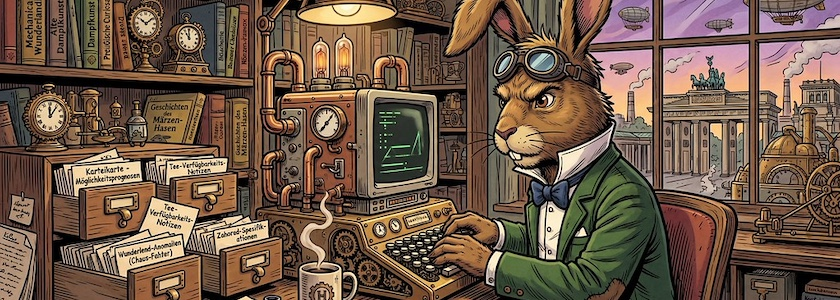
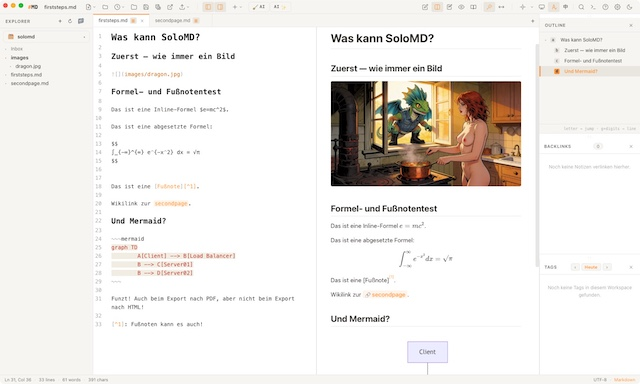

Momentan überschlagen sich die Meldungen über Programme, die die Nachfolge von [Anytype](https://kantel.github.io/posts/2025021401_anytype_web/), meiner derzeitigen, digitalen Rumpelkammer, antreten möchten. Ein vielversprechender Kandidat ist **[SoloMD](https://solomd.app/de/)**, das sich als »kostenloses Markdown Komplettpaket« empfiehlt, mit eingebauter Live-Vorschau, Wiki-Links, diversen GUI-Themen, einen Pomodoro-Wecker für Menschen, die sich leicht verzetteln, ein plattformübergreifendes Sync (denn SoloMD gibt es für Windows, macOS, Linux, iOS und Android) und natürlich optionaler massiver, auch lokaler, KI-Untersstützung. (Ohne die macht es wohl heute kein *Second Brain* mehr, greift das auf die KI dann als *Third Brain* zurück?)

SoloMD ist frei (MIT-Lizenz, [Quellcode auf GitHub](https://github.com/zhitongblog/solomd)), arbeitet *Offline-first*, ihr braucht keinen Account bei irgendeinem Dienste-Provider, es ist werbefrei, Eure Daten bleiben bei Euch und es gibt optional eine Ende-zu-Ende-Verschlüsselung.

Ich habe für einen ersten Test mir einmal eine kleine Umgebung gebastelt: Als Markdown-Editor leistet SoloMD alles, was man von einem Markdown-Editor erwartet, inklusive Formeln (via KaTeX) und Fußnotenunterstützung. Hinzu kommt, daß [Mermaid](http://cognitiones.kantel-chaos-team.de/webworking/auszeichnungssprachen/mermaid.html)-Diagramme in der Vorschau als Diagramme herausgerendert werden und natürlich die Unterstützung von Wiki-Links.

Schwierigkeiten gab es beim Export nach HTML, da funzte weder das Mermaid-Diagramm noch wurde das Bild angezeigt. Ein Blick in den Quellcode zeigte, daß hier für das Bild eine seltsame URL generiert wurde: `src="asset://localhost/%2F…"`. Hier muss vermutlich noch an der Konfiguration geschraubt werden, genau wie auch bei den Mermaid-Diagrammen. Ein prinzipielles Problem dürfte es nicht sein, denn [Pandoc](http://cognitiones.kantel-chaos-team.de/webworking/auszeichnungssprachen/pandoc.html), der Konverter, der hinter den Exporten werkelt, kann Markdown nach HTML.

Der Export nach PDF war nicht zu beanstanden und der Export nach `.docx` … na ja, es ist halt `.docx`, da kann man nicht viel erwarten. Am Besten sah aber der Export nach `.png` aus, das daraus resultierende Bild war wirklich schön.

Leider scheint SoloMD trotz Pandoc-Unterstützung und Wiki-Links keine Möglichkeit zu besitzen, ganze Ordner nach HTML zu exportieren. Daher sind die Einsatzmöglichkeiten als Wiki oder gar als *[Digital Garden](https://kantel.github.io/posts/2024050701_digital_garden/)* eher nicht gegeben. Aber insgesant gefällt mir SoloMD besser als das [hier getestete](https://kantel.github.io/posts/2026052601_tolaria/) und mit ähnlichen Features ausgestattete [Tolaria](https://tolaria.md/). SoloMD scheint übersichtlicher, leichter zu nutzen und ausgereifter. Aber egal, da beide Anwendungen ihre Daten als reine Markdown-(Text-)Dateien (mit YAML-Frontmatter) ablegen, gehen bei einem Wechsel keine Daten verloren. *Still digging!*

---

**Bild**: *[Die Zettelkästen des Märzhasen](https://www.flickr.com/photos/schockwellenreiter/55254799951/)*, erstellt mit [OpenArt](https://openart.ai/home). Prompt: »*The March Hare sits at a desk in front of an antiquated, steampunk-style computer, typing on a keyboard. He wears a pair of aviator goggles, which he has pushed up onto his forehead. On the desk stands an open card catalog, its contents a chaotic jumble of handwritten index cards and loose scraps of paper. Beside the keyboard sits a mug of steaming coffee. Shelves crammed with books and steampunk knick-knacks line the walls. Through a window, one looks out upon a steampunk version of Berlin. Colored classic American comic style. Language: German. No speech bubbles, no textboxes. No German flags.*« Modell: Nano Banana 2.