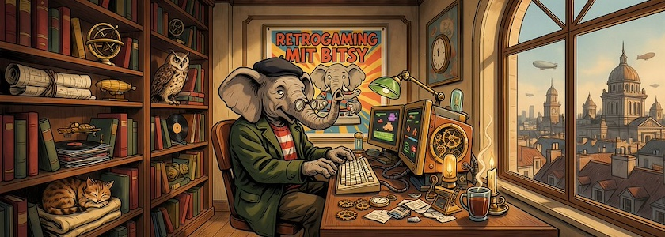

Die [NarraScope](https://narrascope.org/) ist eine jährlich stattfindende Konferenz, die Autoren, Entwickler, Wissenschaftler und Spieler interaktiver Erzählungen zusammenbringen will. Sie fand in diesem Jahr vom 12. bis 14. Juni an der *University at Albany, NY* statt. Wie jedes Jahr wurden auch dieses Mal die Talks aller Veranstaltungen aufgenommen und auf YouTube hochgeladen (eine [Playlist](https://www.youtube.com/playlist?list=PLbTgViUvfchfMf1RnZnLs1Yiv6WJcps1-) mit fünfzig Videos).

<iframe class="if16_9" src="https://www.youtube.com/embed/HzR7MpYg9Zc?si=J8eNHelGggxVz-SN" title="YouTube video player" frameborder="0" allow="accelerometer; autoplay; clipboard-write; encrypted-media; gyroscope; picture-in-picture; web-share" referrerpolicy="strict-origin-when-cross-origin" allowfullscreen></iframe>

Ein Vortrag gefiel mir davon besonders gut: »[The Intertextual Materials of a Narrative Game Poem: Bitsy Hacks as Citational Poetics](https://www.youtube.com/watch?v=HzR7MpYg9Zc)« von *Brendan Allan*. Er zeigte darin, wie man in [Bitsy](http://cognitiones.kantel-chaos-team.de/multimedia/spieleprogrammierung/bitsy.html), der kleinen, bewußt minimalistisch gehaltenen Spieleengine von *Adam Le Doux* und einem Remix klassischer Gedichte, wunderbare, neue und poetische Gedichte schaffen kann. Das brachte mich darauf, daß ich Bitsy [seit über einem Jahr](https://kantel.github.io/posts/2024050401_bitsy_8_12/) sträflich vernachlässigt hatte. Dem möchte ich nun mit dem Hinweis auf ein paar weiteren Bitsy-Workshops abhelfen.

<iframe class="if16_9" src="https://www.youtube.com/embed/XC1hrajwC6c?si=OuEj6-BYqzvBo-Zx" title="YouTube video player" frameborder="0" allow="accelerometer; autoplay; clipboard-write; encrypted-media; gyroscope; picture-in-picture; web-share" referrerpolicy="strict-origin-when-cross-origin" allowfullscreen></iframe>

Ein Klasiker, der im *Schockwellenreiter* schon öfter Erwähnung fand, ist »[Epoch's Bitsy Tutorials](https://www.youtube.com/playlist?list=PLIvHGSlL5cSS3ZCaU88TGc9vsGWd4cvEY)«, eine Playlist mit zehn Videos von *[Haley Price](https://haleyrp1803.itch.io/)* von den [JapanLab](https://www.utjapanlab.com/) der *University of Texas at Austin*. Es entstand als *Spin Off* ihrer Arbeit an dem 2022 entstandenem Spiel »[Death and Taxes: Debt and the Tokugawa Samurai (Bitsy Edition)](https://haleyrp1803.itch.io/death-and-taxes-bitsy)« in dem ihr einen finanziell angeschlagenen Samurai in der Tokugawa-Zeit spielt und ihr dafür Sorge tragen müsst, daß einmal genügend Geld vorhanden ist, um die Familie zu ernähren, auf der anderen Seite ihr aber auch nicht euren Stolz verlieren dürft. *Haley Price* hat das gleiche Spiel auch noch einmal in [Twine](http://cognitiones.kantel-chaos-team.de/multimedia/spieleprogrammierung/twine2.html) realisiert, doch darüber im nächsten Beitrag mehr.

<iframe class="if16_9" src="https://www.youtube.com/embed/6YHBXTp5dOc?si=4GNhrQDZC7T45O3B" title="YouTube video player" frameborder="0" allow="accelerometer; autoplay; clipboard-write; encrypted-media; gyroscope; picture-in-picture; web-share" referrerpolicy="strict-origin-when-cross-origin" allowfullscreen></iframe>

Von *Raumwelten* gibt es die kurze Playlist »[Bitsy - Eigene Spiele im Browser kreieren](https://www.youtube.com/playlist?list=PL9FVRPQNVVrbaZERV1Uz56e_az_ttqpX_)«. Sie war als Anleitung gedacht, wie ihr eigene Spiele für eine 2022 geplante und durchgeführte Online-Ausstellung entwickeln könnt.

<iframe class="if16_9" src="https://www.youtube.com/embed/OE6dTB-WOws?si=QsNf1GcBt5JHWow-" title="YouTube video player" frameborder="0" allow="accelerometer; autoplay; clipboard-write; encrypted-media; gyroscope; picture-in-picture; web-share" referrerpolicy="strict-origin-when-cross-origin" allowfullscreen></iframe>

Ein sehr interessantes Tutorial ist der einstündige GAMERella-Workshop »[Bitsy Game Engine Introduction](https://www.youtube.com/watch?v=OE6dTB-WOws)« der kanadischen *[4TH SPACE Concordia University](https://www.concordia.ca/next-gen/4th-space.html)* in Montreal. Der Workshop ist Teil der Playlist »[Game Design and Education](https://www.youtube.com/playlist?list=PL5pdApUWmJ1zECo7rgyc61WrGDfDaO6Lf)«, in der es noch viele weitere Perlen zu entdecken gilt.

<iframe class="if16_9" src="https://www.youtube.com/embed/AUiRz9KMz2I?si=ABZQJqYg51Nrxv8u" title="YouTube video player" frameborder="0" allow="accelerometer; autoplay; clipboard-write; encrypted-media; gyroscope; picture-in-picture; web-share" referrerpolicy="strict-origin-when-cross-origin" allowfullscreen></iframe>

Natürlich darf und kann bei solch einem Thema die umtriebige *[Nele Hirsch](https://de.wikipedia.org/wiki/Cornelia_Hirsch)* mit ihrem [eBildungslabor](https://ebildungslabor.de/) nicht fehlen. Dort erschien schon 2019 ihr Beitrag »[Bitsy: Mini-Spiele im Browser erstellen](https://ebildungslabor.de/blog/bitsy/)«, aus dem auch das [obige Video](https://www.youtube.com/watch?v=AUiRz9KMz2I) stammt. Es ist das zweite von zwei Videos aus diesem Beitrag, das erste heißt »[Einstieg in Bitsy](https://www.youtube.com/watch?v=JRg-9h5LrEM)«, hat aber nicht so einen knallbunten Startbildschirm.&nbsp;🤓

<iframe class="if16_9" src="https://www.youtube.com/embed/SrGtvHe8DNs?si=mSDrIlOtUR0g2yoR" title="YouTube video player" frameborder="0" allow="accelerometer; autoplay; clipboard-write; encrypted-media; gyroscope; picture-in-picture; web-share" referrerpolicy="strict-origin-when-cross-origin" allowfullscreen></iframe>

Auf der NarraScope 2026 gab es noch einen zweiten Talk zu Bitsy mit dem Titel »[Multiplayer Bitsy for Tiny Game Jams](https://www.youtube.com/watch?v=SrGtvHe8DNs)« von *Jasmine Tan Otto*. Sie schreibt dazu: »*Multiplayer Bitsy ist eine Website, auf der man gemeinsam mit Freunden Videospiele entwickeln kann, ähnlich wie Docs und Figma. Sie wurde bereits in New York und Lissabon im Game-Design-Kurs für Studienanfänger eingesetzt. Ich stelle den Multiplayer Bitsy Editor vor, ein selbsthostbares Open-Source-Tool. Wir behandeln Anna Anthropys Itsy Bitsy Exercises, die interaktives digitales Erzählen mit Bitsy vermitteln, und reflektieren über Erkenntnisse aus den Kreativ-Communities d3.js und p5.js.*«

Dieses Material und das für den nächsten Beitrag hatte ich über das Wochenende mühsam zusammengeklaubt. Es sollte über die üblichen Einsteiger-Tutorials hinausgehen. Nun macht was daraus. Vielleicht erfährt ja auch mein Bitsy-Experiment »[Nachts im Park](https://kantel.itch.io/nachts-im-park)« aus diesen Inspirationen das längst überfällige Update. *Still digging!*

---

**Bild**: *[Retrogaming mit Bitsy](https://www.flickr.com/photos/schockwellenreiter/55353309575/)*, erstellt mit [Ideogram 4.0](https://ideogram.ai/). Prompt: »*A friendly, anthropomorphic elephant wearing a green coat, a red-and-white striped T-shirt, and a black beret sits at a massive desk in front of a steampunk-style computer, using an old-fashioned keyboard. Shelves line the wall, crammed with books and steampunk knick-knacks. Through a window, one can see an alternative steampunk Berlin. A big brilliantly colorful poster on one wall, between the shelves, reads "Retrogaming with Bitsy". Colored classic Amiercan comic style. Language: German. No textboxes, no speech bubbles, no headlines.*«