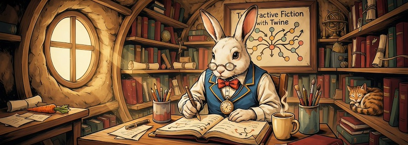

Die Inspirationen aus dem [letzten Beitrag](https://kantel.github.io/posts/2026062301_bitsy_workshops/) im Nachtrag zur [NarraScope&nbsp;2026](https://narrascope.org/) betrafen jedoch nicht nur [Bitsy](http://cognitiones.kantel-chaos-team.de/multimedia/spieleprogrammierung/bitsy.html) sondern auch [Twine](http://cognitiones.kantel-chaos-team.de/multimedia/spieleprogrammierung/twine2.html). Das ist nicht verwunderlich, da die [Interactive Fiction Technology Foundation](https://www.iftechfoundation.org/) nicht nur die NarraScope veranstaltet, sondern zu ihren geförderten Stiftungsprojekten auch Twine gehört.

<iframe class="if16_9" src="https://www.youtube.com/embed/J14sV1iXcRE?si=RrZKo6jLq6WiYTDt" title="YouTube video player" frameborder="0" allow="accelerometer; autoplay; clipboard-write; encrypted-media; gyroscope; picture-in-picture; web-share" referrerpolicy="strict-origin-when-cross-origin" allowfullscreen></iframe>

Da ist es schon eher verwunderlich, daß sich nur der Beitrag »[Narrative Nonfictions: Using IF tools to reach students, workers, consumers and voters](https://www.youtube.com/watch?v=J14sV1iXcRE)« von *Michael Stage* explizit auf Twine bezieht. *Michael Stage* unterrichtete Astronomie und Physik an diversen Universitäten und nutzte dabei alle erdenklichen Lehrmittel, einschließlich interaktiver Fiction (mit Twine). In seinem Vortrag präsentiert er Prototypen, wie sein Ansatz zur Vermittlung praktischer, technischer oder regelbasierter Informationen eingesetzt werden kann, um Mitarbeiter zu schulen, mit Kunden zu interagieren oder Kandidaten bei der Kontaktaufnahme mit Wählern zu unterstützen.

<iframe class="if16_9" src="https://www.youtube.com/embed/NsnFaC3W5Ck?si=MozhZN8hDGrBVfla" title="YouTube video player" frameborder="0" allow="accelerometer; autoplay; clipboard-write; encrypted-media; gyroscope; picture-in-picture; web-share" referrerpolicy="strict-origin-when-cross-origin" allowfullscreen></iframe>

Wie ich schon im letzten Beitrag erwähnte, hat *[Haley Price](https://haleyrp1803.itch.io/)* vom *JapanLab der University of Texas at Austin* und der *[EPOCH History Games Initiative](https://epochutaustin.itch.io/)* an der gleichen Universität ihr Spiel »Death and Taxes: Debt and the Tokugawa Samurai« nicht nur in Bitsy, sondern auch in Twine realisiert. Als *Spin-Off* kam auch hier eine Playlist »[Epoch's Twine Tutorials](https://www.youtube.com/playlist?list=PLIvHGSlL5cSQxNosixvLe0mUSvlm8QCh5)« mit neun sehr lehrreichen Videos heraus. Und die [Twine-Version des Spiels](https://haleyrp1803.itch.io/death-and-taxes) ist ebenfalls auf Itch.io online.

<iframe class="if16_9" src="https://www.youtube.com/embed/GbZ6sU8QL1I?si=rew1X4fD8WURReo9" title="YouTube video player" frameborder="0" allow="accelerometer; autoplay; clipboard-write; encrypted-media; gyroscope; picture-in-picture; web-share" referrerpolicy="strict-origin-when-cross-origin" allowfullscreen></iframe>

Von *Austin Lim* gibt es nicht nur interessante Videos zu Neuroscience (zum Beispiel »[Neuroscience in Pop Culture](https://www.youtube.com/playlist?list=PLXTsg1_kGxE8GH_cjZ0fbLAt7LEggDYho)« oder »[Neuroscience Beyond the Mouse](https://www.youtube.com/playlist?list=PLXTsg1_kGxE-nUWE3ioCd0oARqnquVoBG)«) sondern auch eine Kurze Playlist »[Twine tutorials](https://www.youtube.com/playlist?list=PLXTsg1_kGxE_C4ttPxzbvOvLMFtjZNXhG)« die in drei Videos etwas ausgefallenere Twine-Themen behndelt.

Die bisherigen Videos behandelten alle das Twine-Storyformat [Harlowe](https://twine2.neocities.org/), doch die letzten beiden Beiträge nutzen [Chapbook](https://klembot.github.io/chapbook/guide/)

<iframe class="if16_9" src="https://www.youtube.com/embed/DjybCLkgbxc?si=yi4_dwCFW9jblvED" title="YouTube video player" frameborder="0" allow="accelerometer; autoplay; clipboard-write; encrypted-media; gyroscope; picture-in-picture; web-share" referrerpolicy="strict-origin-when-cross-origin" allowfullscreen></iframe>

Schon auf der [NarraScope 2020](https://www.youtube.com/playlist?list=PLbTgViUvfche3d2R99wDG1JmKJVBEl2wf) haben *Chris Klimas* und *Stuart Moulthrop* in dem Workshop »[Chapbook: Coding, Debugging, and Pretty Pictures](https://www.youtube.com/watch?v=DjybCLkgbxc)« das damals noch neue Twine-Storyformat Chapbook vorgestellt:

>Dieser Workshop demonstriert einige fortgeschrittene Funktionen des Chapbook-Story-Formats für Twine: das Mischen von JavaScript mit regulärem Chapbook-Code, die Arbeit mit den Chapbook-Debugging-Tools und die Integration von Multimedia. Wir werden jedoch nicht zu technisch. Wenn Sie bereits andere Twine-Story-Formate wie Harlowe und SugarCube verwendet haben und neugierig sind, was Chapbook ausmacht, ist dieser Workshop eine hervorragende Möglichkeit, es kennenzulernen.

<iframe class="if16_9" src="https://www.youtube.com/embed/IiigLlzdPtw?si=TFgSxw60uMqJV6JH" title="YouTube video player" frameborder="0" allow="accelerometer; autoplay; clipboard-write; encrypted-media; gyroscope; picture-in-picture; web-share" referrerpolicy="strict-origin-when-cross-origin" allowfullscreen></iframe>

Und *last but not least* zeigt *[Chris Godber](https://www.chrisgodber.co.uk/main.html)* in »[Tips for working with Twine and the Chapbook Format](https://www.youtube.com/watch?v=IiigLlzdPtw)« einen etwas ausführlicherer Einblick in die Möglichkeiten, mit der Twine-Engine und dem Chapbook-Format verschiedene Dinge zu erreichen, darunter benutzerdefinierte Hintergründe, das Hinzufügen von Bildern, Verzögerungen für Text, Variablen, Bedingungen, Zufallselemente, das Auslösen von Sounds, UI-Design und die Anzeige eines Endbildschirms mit einigen Statistiken zur Spielsitzung. Das Beispielspiel heißt »[Tammi's Tale](https://drnoir.itch.io/tammis-tale)«, eine interaktive Visual Novel, die in einer alternativen Zukunft nach dem Zusammenbruch der Sowjetunion spielt.

Das Spiel wurde für die Visual Novel Game Jam [SuNoFes 2024](https://itch.io/jam/sunofes24) entwickelt. Wie ich [hier schon einmal schrieb](https://kantel.github.io/posts/2026022601_wunderland_1/), halte auch ich das Storyformat Chapbook wie geschaffen für die Entwicklung von Visual Novels mit Twine.

---

**Bild**: *[Interactive Fiction mit Twine](https://www.flickr.com/photos/schockwellenreiter/55353073178/)*, erstellt mit [Ideogram 4.0](https://ideogram.ai/). Prompt: »*A white rabbit wearing a blue and yellow vest and glasses sits at a desk in a rabbit burrow. It wears a large pocket watch on a chain. On the desk in front of the rabbit lies an enormous notebook, in which the rabbit is writing with an old-fashioned fountain pen. Next to it is a mug of steaming coffee. Writing utensils are in another mug. Many old books and files line the shelves all around the burrow. A big poster on one wall, between the shelves, reads "Interactive Fiction with Twine". Sunlight shines through a window in the burrow wall. Colored classic American comic style. No speech bubbles, no textboxes, no headlines.*«