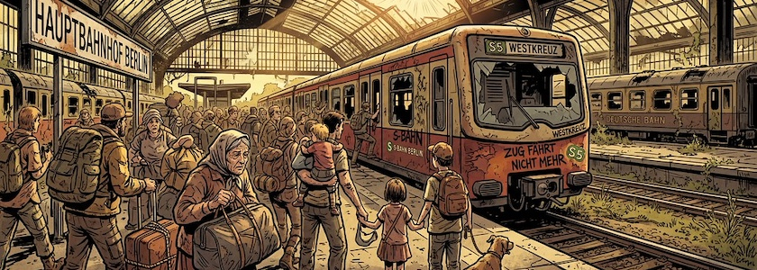

Das meldet der [Tagesspiegel](https://www.tagesspiegel.de/gesellschaft/probleme-mit-zugfunk-zugverkehr-deutschlandweit-ausgesetzt--bahn-stellt-betrieb-ein-15748868.html): Eine bundesweite Störung im Zugfunk hat heute Abend gegen 22:00 Uhr laut [erster Meldungen](https://buchholz-aktuell.de/aktuell/metronom-meldet-stoerung-im-zugfunk-legt-bahnverkehr-lahm-17787/) den gesamten Zugverkehr in Deutschland zum Erliegen gebracht. Betroffen ist auch die komplette Berliner S-Bahn, [der Verkehr ist auf allen S-Bahn-Linien derzeit eingestellt](https://sbahn.berlin/fahren/bauen-stoerung/bauen/2086/auswirkung/2787/). Fahrgäste sollen alternativ die BVG nutzen.

>»Aufgrund einer bundesweiten Störung des digitalen Bahnfunks GSMR werden vorläufig alle Züge an Bahnhöfen zurückgehalten«, teilte die Deutsche Bahn am Dienstagabend mit. »Unsere Techniker sind mit Hochdruck daran, die Störung zu beheben. Weitere Informationen folgen, sobald möglich.«

Auch laut WDR sei der [Bahnverkehr bundesweit komplett eingestellt](https://www1.wdr.de/nrw/verkehr/zugverkehr-in-nrw-komplett-eingestellt-100.html). Ein Ende sei noch nicht abschätzbar.

Das nenne ich mal kaputtgespart.

---

**Bild**: *[Alle Züge stehen still,](https://www.flickr.com/photos/schockwellenreiter/55353675138/)*, erstellt mit [OpenArt](https://openart.ai/home). Prompt: »*In a post-apocalyptic Berlin, a dilapidated S-Bahn train sits on a track at Berlin Central Station. Desperate people carrying luggage are moving around the train. Other decaying trains are visible in the background. It's summer and the sun is shining hot. Classic American comic book style. Language: German. No speech bubbles, no textboxes.*« Modell: Nano Banana&nbsp;2