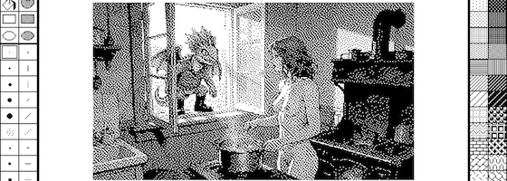

In einem der [gestern vorgestellten](https://kantel.github.io/posts/2026062301_bitsy_workshops/) Videos von der [NarraScope&nbsp;2026](https://narrascope.org/) fand auch **[Decker](http://cognitiones.kantel-chaos-team.de/programmierung/decker.html)** Erwähnung. Das löste bei mir ein schlechtes Gewissen aus. Denn Decker, die freie (MIT-Lizenz) und plattforübergreifende (macOS, Linux, Windows, Web) Multimedia-Plattform zum Erstellen und Teilen interaktiver Dokumente mit Ton, Bildern, Hypertext und Skriptfunktionen, hatte ich schon öfter in diesem ~~Blog~~ Kritzelheft [mit viel Begeisterung vorgestellt](https://kantel.github.io/#category=Decker) vor-, aber nie etwas damit angestellt.

Die Begeisterung kommt daher, daß Decker auf das Erbe von [HyperCard](http://cognitiones.kantel-chaos-team.de/programmierung/hypercard.html)[^1] und der visuellen Ästhetik des klassischen macOS aufbaut. Es behält die Einfachheit und Benutzerfreundlichkeit von HyperCard bei und bietet gleichzeitig viele subtile und offensichtliche Verbesserungen der Benutzerfreundlichkeit, wie zum Beispiel eine detaillierte Rückgängig-Funktion, Unterstützung für Scrollräder und Touchscreens, eine modernere Tastaturnavigation und die Möglichkeit zur Massenbearbeitung.

[^1]: Zu HyperCard hatte ich 1996 schon einmal ein [siebenteiliges Tutorial](http://www.kantel.de/hc/index.html). Es war eines meiner ersten Webveröffentlichungen, bevor ich 2000 begann, das Web systematisch vollzuschreiben. Das Photo von mir auf diesen Seiten solltet Ihr nicht allzu ernst nehmen, es ist ebenfalls mindestens 30 Jahre alt (heute sehe ich natürlich besser aus 😎).

Ebenfalls einen großen Einfluß auf die Entwicklung von Decker haben die »no-code« oder »low-code« Tools [Twine](http://cognitiones.kantel-chaos-team.de/multimedia/spieleprogrammierung/twine2.html) und [Bitsy](http://cognitiones.kantel-chaos-team.de/multimedia/spieleprogrammierung/bitsy.html).

Die aktuelle Version von Decker ist die Version 1.67 und die ist gerade einmal wenige Tage alt. Decker wird also zur Zeit noch fleißg weiterentwickelt. Und die [Phinxel's Phield Notes](https://ahmwma.itch.io/phield-notes) von [ahmwma](https://ahmwwmaaa.neocities.org/)[^2] sind ein nettes, interakivoes Tutorial, um Decker zu lernen.

[^2]: Diese Site liegt bei Neocities und ist Teil des [IndieWebs](https://kantel.github.io/#category=IndieWeb). Und so schließt sich ein weiterer Kreis.

(Native) Decker ist in C geschrieben, aber die Scriptsprache von Decker ist nicht mehr Hypertalk, sondern [Lil](https://beyondloom.com/decker/lil.html), einer Sprache, die stark beeinflusst ist von [Lua](http://www.lua.org/), einer imperativen Sprache, die häufig in Tools und Game-Engines eingebettet wird, und von [Q](https://en.wikipedia.org/wiki/Q_%28programming_language_from_Kx_Systems%29), einer funktionalen Sprache der APL-Familie für Zeitreihendatenbanken. Lil soll leicht zu erlernen und so konventionell sein, daß sie auch Nutzern mit wenig Programmiererfahrung keine Schwierigkeiten bereitet. Gleichzeitig bietet sie angenehme Überraschungen wie implizite Skalar-Vektor-Arithmetik und eine integrierte SQL-ähnliche Abfragesprache. Schon wenige Zeilen Lil können viel bewirken.

### Links

- [Decker Home](https://beyondloom.com/decker/)
- [Decker online](https://beyondloom.com/decker/tour.html)
- [Decker Reference Manual](https://beyondloom.com/decker/decker.html)
- [Decker @ Itch.io](https://internet-janitor.itch.io/decker)
- [Decker @ GitHub](https://github.com/JohnEarnest/Decker)
- [Decker @ IFWiki](https://www.ifwiki.org/Decker)

Ich habe das alles hier niedergeschrieben, damit ich -- sollte ich tatsächlich einmal etwas mit Decker anfangen wollen -- eine Anlaufstelle habe.

---

**Bild**: *[There might be Dragons](https://www.flickr.com/photos/schockwellenreiter/55339514718/)*, erstellt mit [OpenArt](https://openart.ai/home). Prompt: »*@Lilly stands in an old-fashioned kitchen from the late 19th century in front of a coal stove, cooking soup in a copper pot.  @Dino Filz  is peering in through the open window, smiling kindly at @Lilly . It is early moring, and the setting sun casts a warm glow over the scene. Classic American comic book style. No speech bubbles or text boxes.*« Modell: Seedream&nbsp;4.5.