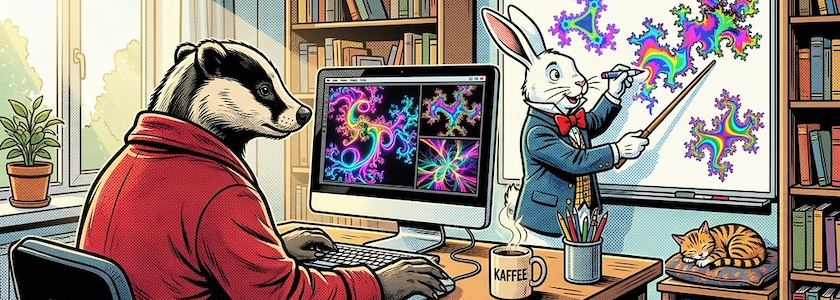

Vor zwei Tagen gab die *Processing Foundation* das Update von [P5.js](http://cognitiones.kantel-chaos-team.de/programmierung/creativecoding/processing/p5js.html), dem JavaScript-Ableger von [Processing (Java)](http://cognitiones.kantel-chaos-team.de/programmierung/creativecoding/processing/processing.html), auf die [Version 2.3.0](https://medium.com/@ProcessingOrg/whats-new-in-p5-js-2-3-0-2e85e5fc56f8) frei. Seit den [letzten Updates](https://kantel.github.io/posts/2026031601_p5js_21_und_22/) im März dieses Jahres haben sie sich auf die Stabilisierung von P5.js und die Optimierung der Arbeitsabläufe konzentriert.

Dazu gehören Refactorings zu `p5.Vector` basierend auf der kürzlich hinzugefügten Decorators API sowie neue Funktionen für `p5.strands`, den neuen, einsteigerfreundlichen Ansatz zur Shader-Programmierung. Außerdem wurde die Entwicklung des experimentellen [WebGPU-Renderers](https://medium.com/@ProcessingOrg/p5-js-2-1-and-2-2-expanding-graphics-avenues-with-p5-strands-improvements-and-webgpu-9771d40c8b1d) fortgesetzt.

Bei der Verwendung von Vektoren zum Beispiel in Physiksimulationen muss nun beim Erstellen eines Vektors angegeben werden, ob er in 2D oder 3D vorliegt. `createVector()` verlangt nun `createVector(0, 0)` für 2D- oder `createVector(0, 0, 0)` für 3D-Vektoren. Hintergrund ist, daß in P5.js bisher alle Vektoren 3D-Vektoren waren. Version 2 unterstützt nun Vektoren beliebiger Dimension, so daß leere Vektoren ihre Größe explizit angeben müssen.

Auch die Shader-Unterstützung wurde aktualisiert. Shader sind Programme, die auf der Graphikkarte ausgeführt werden, um visuelle Effekte zu erzeugen. Mit P5.js 2.0 wurde `p5.strands`, die Shader-Programmierschnittstelle (API), eingeführt, wodurch die Programmierung von visuellen Effekten mithilfe der GPU vereinfacht wurde. Version 2.3 überarbeitet und vereinfacht den `p5.strands`-Code, wodurch die Wartung und Mitarbeit erleichtert wird.

<iframe class="if16_9" src="https://www.youtube.com/embed/TIbHjtfuMoI?si=mB1k78WZK-wprAUP" title="YouTube video player" frameborder="0" allow="accelerometer; autoplay; clipboard-write; encrypted-media; gyroscope; picture-in-picture; web-share" referrerpolicy="strict-origin-when-cross-origin" allowfullscreen></iframe>

Die *Processing Foundation* hat ein [Video-Tutorial veröffentlicht](https://www.youtube.com/watch?v=TIbHjtfuMoI), in dem *Juan Rodríguez García* zeigt, wie Ihr `p5.strands` in P5.js einsetzen könnt.

<iframe class="if16_9" src="https://www.youtube.com/embed/q1xzpZu1KTc?si=ga6X-UqE7ZTGh0WF" title="YouTube video player" frameborder="0" allow="accelerometer; autoplay; clipboard-write; encrypted-media; gyroscope; picture-in-picture; web-share" referrerpolicy="strict-origin-when-cross-origin" allowfullscreen></iframe>

Aber auch von der wunderbaren *Patt Vira* gibt es gleich eine vierteilige Playlist »[Introduction to Shaders: A Beginner's Guide](https://www.youtube.com/playlist?list=PL0beHPVMklwhYSt_ZNC2HzJKo7qO1-xQJ)«in der sie die grundlegenden Unterschiede zwischen CPU- und GPU-Verarbeitung untersucht und erklärt, wie Shader paralleles Rechnen für die graphische Darstellung nutzen. Diese Einführung behandelt die Einrichtung einer WebGL-Umgebung in P5.js, die Definition von Vertex- und Fragment-Shadern mithilfe der GLSL-Syntax und den Datenaustausch zwischen CPU und GPU zur Erzeugung dynamischer visueller Effekte.

<iframe class="if16_9" src="https://www.youtube.com/embed/uJX9bKAEqhM?si=yM_2y2XFymru-UJ8" title="YouTube video player" frameborder="0" allow="accelerometer; autoplay; clipboard-write; encrypted-media; gyroscope; picture-in-picture; web-share" referrerpolicy="strict-origin-when-cross-origin" allowfullscreen></iframe>

Und auf dem [19. Libre Graphics Meeting (LGM)](https://libregraphicsmeeting.org/2026/), dem internationale Treffen für freie und Open-Source-Graphiksoftware, das vom 22. bis 25. April 2026 im Innovationszentrum ZOLLHOF in Nürnberg stattfand, gaben *Dave Pagurek*, *Luke Plowden*, *Perminder Singh*, *Kenneth Lim* und *Kit Kuksenok* den Talk »[Beginner-Friendly Shader Programming in P5.js v2](https://www.youtube.com/watch?v=uJX9bKAEqhM)«. Sie gehören zu den Mitautoren von `p5.strand` und erklären auch die Motivation, die hinter der Entwicklung dieser Bibliothek steht.

<iframe class="if16_9" src="https://www.youtube.com/embed/nT0Kzp7caGg?si=3FYkXFiyMUw8--X5" title="YouTube video player" frameborder="0" allow="accelerometer; autoplay; clipboard-write; encrypted-media; gyroscope; picture-in-picture; web-share" referrerpolicy="strict-origin-when-cross-origin" allowfullscreen></iframe>

**War sonst noch was?** Ach ja, auch die typographischen Möglichkeiten wurden in der Version&nbsp;2 von P5.js enorm ausgebaut. In einem weiteren Tutorial der *Processing Foundation* mit dem Titel »[Typography and Asset Loading](https://www.youtube.com/watch?v=nT0Kzp7caGg)« erläutert die Dozentin und Künstlerin *Qianqian&nbsp;Ye* neuen Typographie-Funktionen von P5.js v2 und zeigt, wie man statische Buchstaben in interaktive, animierte Schriften verwandelt.

Und ich bekomme langsam Lust, auch mal etwas und gerne etwas mehr mit P5.js anzustellen. *So viel zu spielen, so wenig Zeit!*

---

**Bild**: *[Kaffee und Kreativität](https://www.flickr.com/photos/schockwellenreiter/55355269379/)*, erstellt mit [OpenArt](https://openart.ai/home). Prompt: »*@Badger sits in front of a computer in a bright, cheerful room. He holds the mouse in his right hand and uses his left to operate the keyboard. Next to him on the desk sits a mug of steaming coffee and another mug filled with writing utensils. Otherwise, the desk is clear. In front of him, at a white board, @Rabbit is drawing neon-colored fractal images with colorful markers. He holds a pointer in his free hand, aiming it at the board. Colorful fractal-style images are also visible on the computer monitor. Shelves filled with books line the walls. A small cat is curled up asleep on a cushion on one of the shelves. Morning sunlight streams through the window. Classic American comic book style. Language: German. No speech bubbles, no text boxes.*« Modell: Nano Banana&nbsp;2.