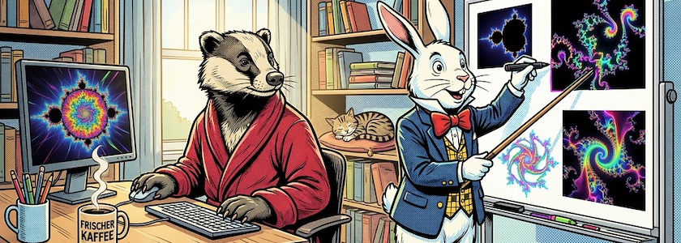
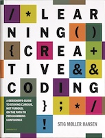

Der [Gorilla](https://www.gorillasun.de/) ist [zurück](https://www.gorillasun.de/blog/a-strange-year/) und stellt in seiner ersten [Newsletter nach einem Jahr Pause](https://www.gorillasun.de/blog/gorilla-newsletter-102/) gleich ein wunderbares Buch vor: »[Learning Creative Coding](https://stigmollerhansen.dk/resume/learning-creative-coding/)«, das *Stig Møller Hansen* Anfang dieses Jahres veröffentlicht hat.

Es ist kein wirklich technisches Buch, ganz im Gegenteil. Es geht vielmehr um den Prozess, die Denkweise und viele psychologische Aspekte des kreativen Programmierens, der Programmierkunst und des Designprogrammierens im Allgemeinen. Es werden dabei einige der wichtigsten Themen behandel:

>Dieses Buch wird Ihnen keine Syntax beibringen. Es wird Sie nicht durch Tutorials führen. Es wird Ihnen das Lernen nicht erleichtern. Was es aber tun wird, ist Ihnen zu helfen, zu verstehen, was Sie erleben und warum es wichtig ist.

Und das Schönste daran ist: Ihr könnt das Buch für umme lesen. Denn der Autor hat es unter eine Creative-Commons-Lizenz (CC BY-NC-SA 4.0) gestellt und Ihr könnt es von *Stig Møller Hansens* Website [kostenlos als PDF herunterladen](https://stigmollerhansen.dk/resume/learning-creative-coding/).

Weitere Themen der Gorilla-Newsletter 102 sind unter anderem:

- HTML in Canvas
- Einführung in die Shader-Programmierung
- KI und die Erosion von Programmierberufen

und vieles andere mehr. Wer den Newsletter noch nicht abonniert hat, sollte es jetzt tun. Denn da werdet Ihr nicht dümmer von.

---

**Bild**: *[Kaffee und Kreativität](https://www.flickr.com/photos/schockwellenreiter/55355488490/)*, erstellt mit [OpenArt](https://openart.ai/home). Prompt: »*@Badger sits in front of a computer in a bright, cheerful room. He holds the mouse in his right hand and uses his left to operate the keyboard. Next to him on the desk sits a mug of steaming coffee and another mug filled with writing utensils. Otherwise, the desk is clear. In front of him, at a white board, @Rabbit is drawing neon-colored fractal images with colorful markers. He holds a pointer in his free hand, aiming it at the board. Colorful fractal-style images are also visible on the computer monitor. Shelves filled with books line the walls. A small cat is curled up asleep on a cushion on one of the shelves. Morning sunlight streams through the window. Classic American comic book style. Language: German. No speech bubbles, no text boxes.*« Modell: Nano Banana&nbsp;2.