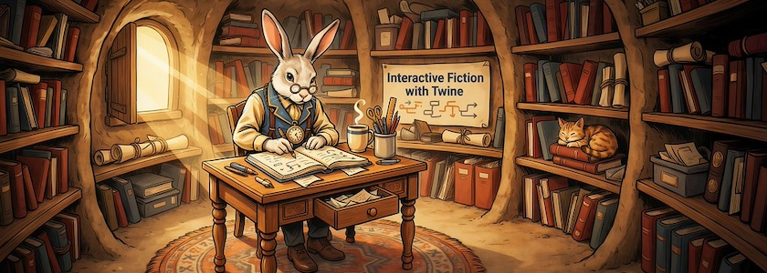

Meine [jüngsten](https://kantel.github.io/posts/2026061701_twine_buch/) [Aktivitäten](https://kantel.github.io/posts/2026062302_twine_workshops/) zu [Twine](http://cognitiones.kantel-chaos-team.de/multimedia/spieleprogrammierung/twine2.html), die auch der Tatsache geschuldet sind, daß ich einen Neustart meiner Tutorialreihe zu Twine plane, sind unser aller Datenkrake nicht verborgen geblieben und sie hat meinen Feedreader wieder mit einer Menge von Links zu Twine-Tutorials gefüttert. Und einige davon waren tatsächlich so, daß ich sie hier aufschreibe, damit ich sie nicht vergesse, aber auch, weil ich sie Euch nicht vorenthalten möchte:

<iframe class="if16_9" src="https://www.youtube.com/embed/-kf1QNB8WjQ?si=jbuHsbPUAOXAzSpI" title="YouTube video player" frameborder="0" allow="accelerometer; autoplay; clipboard-write; encrypted-media; gyroscope; picture-in-picture; web-share" referrerpolicy="strict-origin-when-cross-origin" allowfullscreen></iframe>

Vom User *Demoshmorgon* gibt es drei kleine Tutorials zu Twine, die er für ein Schulprojekt erstellt hatte. Einmal das obige »[Tutorial for Twine Program](https://www.youtube.com/watch?v=-kf1QNB8WjQ)«, gefolgt von einem »[Advanced Twine Tutorial](https://www.youtube.com/watch?v=REnpdj_0DXM)« und schließlich zum Abschluß noch das kurze Tutorial »[How To Export In Twine](https://www.youtube.com/watch?v=0eiLAByd9TE)«.

<iframe class="if16_9" src="https://www.youtube.com/embed/YDUU5yZq4og?si=CFUEM6ExrmLjVs8W" title="YouTube video player" frameborder="0" allow="accelerometer; autoplay; clipboard-write; encrypted-media; gyroscope; picture-in-picture; web-share" referrerpolicy="strict-origin-when-cross-origin" allowfullscreen></iframe>

Der *vegetarische Zombie* fand mit seinen Twine-Tutorials schon mehrfach Erwähnung in diesem ~~Blog~~ Kritzelheft. Jetzt hat er mir den Gefallen getan und sie alle in einer [Playlist mit dreissig Videos](https://www.youtube.com/playlist?list=PLFgjYYTq6xyjBtXJTvEaBTVUWxirY6q24) zusammengefasst. Die Tutorials behandeln sowohl das Storyformat [Harlowe](https://twine2.neocities.org/) wie auch das Storyformat [SugarCube](http://www.motoslave.net/sugarcube/2/). Und auch wenn einige davon schon ein biblisches Alter aufweisen, sind sie immer noch sehr hilfreich.

<iframe class="if16_9" src="https://www.youtube.com/embed/37IT-8GQNpM?si=bv2MHQXxnKLzfzYp" title="YouTube video player" frameborder="0" allow="accelerometer; autoplay; clipboard-write; encrypted-media; gyroscope; picture-in-picture; web-share" referrerpolicy="strict-origin-when-cross-origin" allowfullscreen></iframe>

Und wo ich schon bei alten Bekannten bin: Die Playlist »[Twine or Treat](https://www.youtube.com/playlist?list=PLujRcYYssj76Q_seiXpXnXxzpj1fULa0s)« mit ihren zehn Videos zur Twine-Programmierung mit Storyformat SugarCube war eine der Inspirationen für mein eigenes Spiel »[Smashing Pumpkins](https://kantel.itch.io/smashing-pumpkins)«, in dem ich zum ersten Mal auf mit gekünstelter Intelligenzia erzeugte Bilder setzte. Die Devlogs dazu findet Ihr auch [im *Schockwellenreiter* unter dem Hashtag »SugarCube«](https://kantel.github.io/index.html#category=SugarCube).

<iframe class="if16_9" src="https://www.youtube.com/embed/T2xl9JaGqpM?si=_GdQGIbR2cCSTFb_" title="YouTube video player" frameborder="0" allow="accelerometer; autoplay; clipboard-write; encrypted-media; gyroscope; picture-in-picture; web-share" referrerpolicy="strict-origin-when-cross-origin" allowfullscreen></iframe>

Die Videos der »[Twine 2 Beginners tutorial series](https://www.youtube.com/playlist?list=PLklITFhXtPCCKadv-0Gcbqoj3OCev695D)« von *DigitalExposureTV* behandeln nach der Einführung im ersten Video jeweils einzelne Themen und sind daher meistens in sich abgeschlossen. Daher eignen sie sich gut, wenn man »nur« mal eben etwas Nachschauen möchte.

<iframe class="if16_9" src="https://www.youtube.com/embed/x3LRC7g8QjM?si=Kjl5sAN7CeVsyA1y" title="YouTube video player" frameborder="0" allow="accelerometer; autoplay; clipboard-write; encrypted-media; gyroscope; picture-in-picture; web-share" referrerpolicy="strict-origin-when-cross-origin" allowfullscreen></iframe>

Dann möchte ich noch zum wiederholten Male auf den Kanal *Let's Make A Game* hinweisen, der nahezu im Wochenrhythmus kleine Tutorials zu Twine und SugarCube heraushaut. Nachdem die Playlist »[Essentials](https://www.youtube.com/playlist?list=PLyTbPwKro2ZSKUsTlSum6c9TuHWPTFPst)« mit zwölf Videos jetzt abgeschlossen scheint, ist die aktuelle Playlist »[Extras](https://www.youtube.com/playlist?list=PLyTbPwKro2ZT23U0p0hIgokymCyJkwlsn)«, die auch wieder einzelne, isolierte Themen und Fragen zu SugarCube behandelt, wohl noch in der Mache. Das letzte Video ist gerade mal vor sieben Stunden hochgeladen worden.

<iframe class="if16_9" src="https://www.youtube.com/embed/sLcur4FSxIA?si=OHcz67ujVejjQ_oM" title="YouTube video player" frameborder="0" allow="accelerometer; autoplay; clipboard-write; encrypted-media; gyroscope; picture-in-picture; web-share" referrerpolicy="strict-origin-when-cross-origin" allowfullscreen></iframe>

Dann noch zwei einzelne Videos: Erst einmal »[Create an interactive story game in Twine](https://www.youtube.com/watch?v=sLcur4FSxIA)«, das in knapp fünfzig Minuten Euch dazu befähigen will, eine interaktive Geschichte in Twine mit dem Storyformat Harlowe zu entwickeln und das meiner Meinung nach auch sehr gut macht. Und zu Beginn geht es auch auf einige Grundfragen des Game Designs ein.

Nützlich ist auch der [Twine- und Harlowe-Spickzettel](https://docs.google.com/document/d/1gezaSzglnVG31A30XAvlv_BapTe3V-G5RlaByb9DoBM/edit), auf dem sie in der Beschreibung zum Video verlinkt.

<iframe class="if16_9" src="https://www.youtube.com/embed/K70lS5p2puA?si=lnwg_vrih6etIwtk" title="YouTube video player" frameborder="0" allow="accelerometer; autoplay; clipboard-write; encrypted-media; gyroscope; picture-in-picture; web-share" referrerpolicy="strict-origin-when-cross-origin" allowfullscreen></iframe>

Als letztes noch ein weiteres einzelnes Video »[Twine 2 - Add Images from Your Computer or Web](https://www.youtube.com/watch?v=K70lS5p2puA)« vom Kanal *Twineventure*, der wohl mit größeren Ambitionen gestartet war, aber nicht über dieses eine Video hinausgekommen ist.

---

**Bild**: *[Interactive Fiction mit Twine](https://www.flickr.com/photos/schockwellenreiter/55351980067/)*, erstellt mit [Ideogram 4.0](https://ideogram.ai/). Prompt: »*A white rabbit wearing a blue and yellow vest and glasses sits at a desk in a rabbit burrow. It wears a large pocket watch on a chain. On the desk in front of the rabbit lies an enormous notebook, in which the rabbit is writing with an old-fashioned fountain pen. Next to it is a mug of steaming coffee. Writing utensils are in another mug. Many old books and files line the shelves all around the burrow. A big poster on one wall, between the shelves, reads "Interactive Fiction with Twine". Sunlight shines through a window in the burrow wall. Colored classic American comic style. No speech bubbles, no textboxes, no headlines.*«