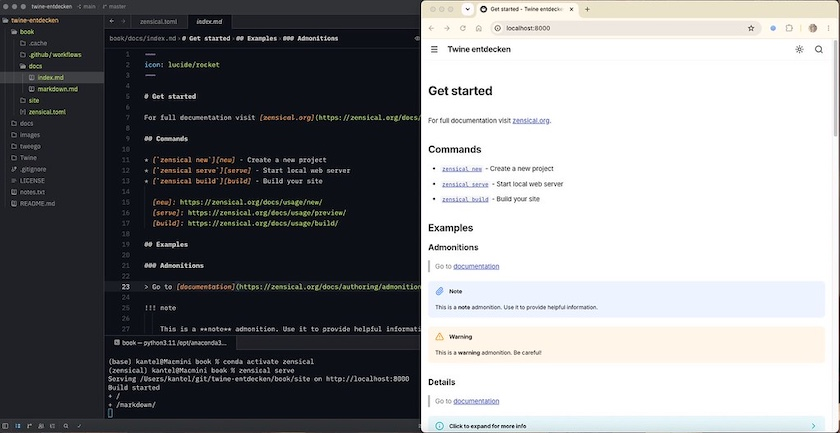

Wie ich [gestern schon andeutete](https://kantel.github.io/posts/2026062703_more_twine_workschops/), plane ich einen Neustart meiner [Twine](http://cognitiones.kantel-chaos-team.de/multimedia/spieleprogrammierung/twine2.html)-Tutorials. Und diese sollen nicht nur in einer digitalen Rumpelkammer gesammelt und kontinuierlich weiterentwickelt, sondern auch auf [meinem Neocities-Account](https://kantel.github.io/posts/2026061101_neocities/) veröffentlicht werden[^1]. Also als eine Art [digitaler Garten](https://kantel.github.io/posts/2024050701_digital_garden/) im [IndieWeb](https://kantel.github.io/#category=IndieWeb).

[^1]: Keine Angst, die Erstveröffentlichung erfolgt natürlich nach wie vor in diesem ~~Blog~~ Kritzelheft.&nbsp;🤓

Als Werkzeug dafür habe ich mir den vor einem [viertel Jahr](https://kantel.github.io/posts/2026042101_zensical/) vorgestellten [MKDocs (Material)](https://squidfunk.github.io/mkdocs-material/)-Nachfolger [Zensical](https://talkpython.fm/episodes/show/542/zensical-a-modern-static-site-generator) ausgeguckt. Denn der verspricht nicht nur, ein hervorragendes, Markdown-basiertes Werkzeug für die Erstellung einer Dokumentation mit statischen Seiten zu sein[^2], sondern will auch in die Fußstapfen von [Notion](https://kantel.github.io/posts/2024021301_notion/) treten. Damit könnte es nicht nur die Lücke zwischen meinem Zettelkasten ([Joplin](http://cognitiones.kantel-chaos-team.de/webworking/staticsites/joplin.html)) und einem Publikationswerkzeug, die bisher [Anytype](https://anytype.io/) ausfüllt, schließen, sondern es wäre beides: Sowohl digitale Rumpelkammer wie auch Publikationstool.

[^2]: Das habe ich bei dem Vorvorgänger [MkDocs](https://kantel.github.io/posts/2024070602_mkdocs_reloaded/) (noch ohne Material) bereits erfolgreich mit meinem Projekt »[Processing.py in Beispielen](https://kantel.github.io/posts/2024070602_mkdocs_reloaded/)« getestet.

Doch dafür sind natürlich Tests notwendig. Also habe ich Zensical erst einmal installiert. Da ich Anaconda nutze, habe ich mit dem [Anaconda-Navigator](https://www.anaconda.com/products/navigator) erst einmal eine virtuelle Python-Umgebung angelegt und sie `zensical` genannt. Dann habe ich im Terminal mit

~~~zsh
conda activate zensical
conda install conda-forge::zensical
~~~

Zensical installert. Danach habe ich den Atom-Nachfolger [Zed](https://kantel.github.io/posts/2026051401_zed/) als Editor angeworfen[^3], ein schon vorher im Finder angelegtes Projektvereichnis geöffnet und das integrierte Terminalfenster geöffnet. Darin habe ich mit 

[^3]: Auch wenn es so aussieht: Ich habe eigentlich nichts gegen [Visual Studio Code](https://kantel.github.io/#category=Visual%20Studio%20Code). Aber mein VS Code ist so überladen, daß ich befürchte, daß sich die vielen Erweiterungen gegenseitig in die Quere kommen und behindern. Daher versuche ich die Last auf mehrere Schultern zu verteilen. Und einen Teil der Last trägt bei mir [Zed](https://kantel.github.io/#category=Zed), einen anderen vielleicht bald [Nextpad++](https://kantel.github.io/posts/2026061801_nextpadplusplus/).

~~~zsh
zensical new .
~~~

ein neues Projekt angelegt.

Das sah dann wie im Screenshot oben aus. Mit

~~~zsh
zensical serve
~~~

wurde dann auch noch der integrierte Live-Server gestartet und dann konnte ich nach Herzensluft mit den Seiten und mit deren Inhalten experimentieren und mich langsam mit Zensical vertraut machen.

Zusätzlich hatte ich noch zwei Quellen gefunden, die sich mit Zensical befassten (das Paket ist so neu, da stößt selbst unser aller Datenkrake an ihre Grenzen):

- Peter Killert: *[Aus »mkdocs« wird »Zensical«](https://www.kultur-magazin.de/blog/2026/260222/)*, Killert.de | Kultur-Magazin.de vom 22. Februar 2026
- Fumiaki Kobayashi: *[Migrating to Zensical, the Successor to MkDocs](https://medium.com/@fumiaki.kobayashi/migrating-to-zensical-the-successor-to-mkdocs-864df7b17819)*, Medium.com vom 15. April 2026

Doch jetzt werde ich mich erst einmal durch die [Zensical-Dokumentation](https://zensical.org/docs/get-started/) wühlen und nachlesen, was ich mit meinem frisch installierten, neuen Spielzeug alles anstellen kann. *Still digging!*

---

**Bild**: *[Der Märzhase auf Ideogram](https://www.flickr.com/photos/schockwellenreiter/55327263504/)*, erstellt mit [Ideogram 4.0](https://ideogram.ai/). Prompt: »*The March Hare sits at a desk in front of an antiquated, steampunk-style computer, typing on a keyboard. He wears a pair of aviator goggles, which he has pushed up onto his forehead. On the desk stands an open card catalog, its contents a chaotic jumble of handwritten index cards and loose scraps of paper. Beside the keyboard sits a mug of steaming coffee. Shelves crammed with books and steampunk knick-knacks line the walls. Through a window, one looks out upon a steampunk version of Berlin. Colored classic American comic style. Language: German. No speech bubbles, no textboxes. No German flags.*«