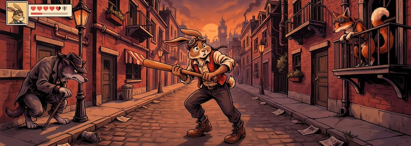
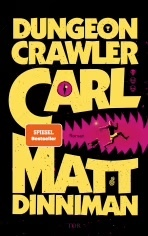

Kürzlich stolperte ich eher absichtslos über eine Buchreihe, die als »**LitRPG**« beworben wurde. Da dämmerte bei mir irgendetwas: LitRPG hatte ich im Dezember 2018 [schon einmal](http://blog.schockwellenreiter.de/2018/12/2018120201.html) auf [den Schirm](http://blog.schockwellenreiter.de/2018/12/2018121003.html). Es ging damals um Artikel von *Edwin McRae*[^1], in denen das Genre vorgestellt wurde. Doch was ist »LitRPG« eigentlich?

[^1]: Die in den Beiträgen genannten Artikel von *Edwin McRae* sind leider im Nirwana des Internets entfleucht. Selbst die *Wayback Machine* verweist nur auf Seiten, auf denen die Domain `edmcrae.com` zum Verkauf angeboten wird.

Ich war damals immerhin so fasziniert, daß ich ein meinem Wiki eine [Seite zu LitRPG](http://cognitiones.kantel-chaos-team.de/medien/games/litrpg.html) angelegt habe. Daher kann ich zitieren:

>**LitRPG**, kurz für *Literary Role Playing Game*, ist ein literarisches Genre, das die Konventionen von RPGs mit Science-Fiction-Fantasy-Romanen verbindet. Es ist ein literarisches Genre, in dem Spiele oder spielähnliche Herausforderungen einen wesentlichen Teil der Geschichte bilden und in dem sichtbare RPG-Statistiken (beispielsweise Stärke, Intelligenz, Schaden) einen bedeutenden Teil dieser Welt darstellen. Dies im Gegensatz zu GameLit, bei dem spielähnliche Welten zum Einsatz kommen, aber keine sichtbaren Statistiken liefern. Zumindest einige der Charaktere in einem LitRPG-Roman können verstehen, daß sie ein Spiel spielen oder sich in einer spielähnlichen Welt befinden: Sie sind »meta-bewußt«.

Dabei ist zu beachten, daß LitRPG kein »Choose Your Own Adventure«-Spiel ist, auch nicht in Papierform. Es ist eher eine Art literarisches Genre für Menschen, die mehr Spaß daran haben, sich ein Spiel als »Let's Play«-Video von Dritten vorführen lassen, als es selber zu spielen. Ich gestehe, ich gehöre auch dazu&nbsp;🤓.

Durch meine Neugierde geweckt, habe ich zwei aktuellere Artikel zu LitRPG aus den Tiefen des Internets gesogen oder unser aller Datenkrake entrissen:

- Alessandra Reß: *[LitRPG: Alles, was du über das Genre wissen musst](https://www.tor-online.de/magazin/fantasy/litrpg-alles-was-du-ueber-das-genre-wissen-musst)*, Tor Online vom 7.&nbsp;März&nbsp;2024
- Lew Marschall: *[LitRPG: Was Ist Das? Die ultimative Erklärung des aufstrebenden Genres](https://lewmarschall.com/litrpg/)*, 28.&nbsp;November&nbsp;2025

Jetzt bin ich Euch nur noch die Erklärung schuldig, welche Bücher meine Neugierde geweckt[^2] haben: Es ist die Reihe »[Dugeon Crawler Carl](https://www.fischerverlage.de/buch/reihe/dungeon-crawler-carl)« von *Matt Dinniman* Es geht dabei um *Carl* und seine Katze *Prinzessin Donut*, die beide von außerirdischen Invasoren gezwungen werden, an einer sadistischen, intergalaktischen Spielshow teilzunehmen. Von der im Original (bisher) siebenbändigen Reihe sind auf Deutsch die ersten beiden Bände erschienen, drei weitere sind in Vorbereitung.

[^2]: Das ist (noch) keine Empfehlung von mir, ich habe die Bücher selber noch nicht gelesen.

Klingt doch ganz interessant und sooo realistisch. Ich sollte mir testweise den ersten Band einmal reinziehen. *So viel zu lesen, so wenig Zeit!*

---

**Bild**: *[Der Märzhase in Dystopia (LitRPG Style)](https://www.flickr.com/photos/schockwellenreiter/55364541803/)*, erstellt mit [Ideogram 4.0](https://ideogram.ai/). Prompt: »*The March Hare creeps fearfully through a dystopian, steampunk-style metropolis. He wears aviator goggles pushed up onto his forehead and a rust-red vest; he carries a baseball bat in his hand. The street appears deserted, yet at two different street corners, a sinister-looking anthropomorphic wolf in a floppy hat and a fox—also wearing aviator goggles—are watching the March Hare. It is a late summer evening, and the sun is already low in the sky. The image resembles a screenshot from an RPG; a status bar and several health points represented by small hearts are visible in the upper-left corner. Classic American comic book style. No speech bubbles or text boxes.*«