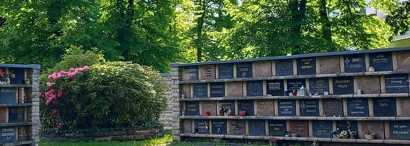
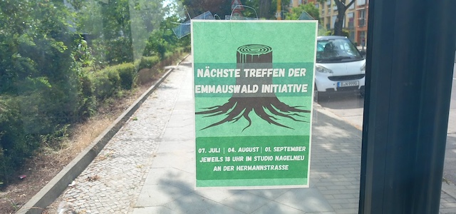

Das Photo im Banner oben ist zwar schon ein paar Tage alt, aber regelmäßige Leserinnen und Leser des *Schockwellenreiters* wissen: Immer, wenn ein Photo des [Emmauskirchhhofs](https://kantel.github.io/posts/2026042301_fruehling_emmauskirchhof/) mit [Gabis](https://kantel.github.io/posts/2026042301_fruehling_emmauskirchhof/) Urnengrab hier in diesem ~~Blog~~ Kritzelheft auftaucht, möchte ich auch an den Kampf um den [Emmauswald](https://emmauswald-bleibt.de/) erinnern.

Denn der größte Neuköllner (und kleinste Berliner) Wald  war früher ebenfalls Teil des [Emmauskirchhofs](https://evfbs.de/start/friedhoefe/region-sued/einzeldarstellung/emmaus/kurzportraet). Und so nutze ich das Photo, um mal wieder an Gabis Vermächtnis zu erinnern: Der Emmauswald darf nicht einer skrupellosen Immobilienmafia (und ihren Handlangern im Berliner Senat) [geopfert werden](https://www.nd-aktuell.de/artikel/1188194.stadtentwicklung-emmauswald-in-neukoelln-kahlschlag-gegen-zahlung.html), die dort in der Hauptsache [teure Eigentumswohnungen hochziehen](https://taz.de/Debatte-um-den-Neukoellner-Emmauswald/!6013694/) wollen. Der Emmauswald gehört den Neuköllnern und der Emmauswald bleibt!

Daher hier der Hinweis auf die nächsten Treffen der Emmauswald-Initiative am 7.&nbsp;Juli&nbsp;2026, am 4.&nbsp;August&nbsp;2026 und am 1.&nbsp;September&nbsp;2026 jeweils um 18:00 Uhr im [Studio ~~nagel~~neu](https://prinzessinnengarten-kollektiv.net/studio-nagelneu/) in der Hermannstraße 103 in 12051&nbsp;Berlin-Neukölln. Für alle, die ebenfalls daran mitarbeiten wollen, daß der Emmauswald bleibt!

---

**Photos** ([cc](https://creativecommons.org/licenses/by-sa/4.0/deed.de)) 2026: *[Jörg Kantel](http://cognitiones.kantel-chaos-team.de/cv.html)*