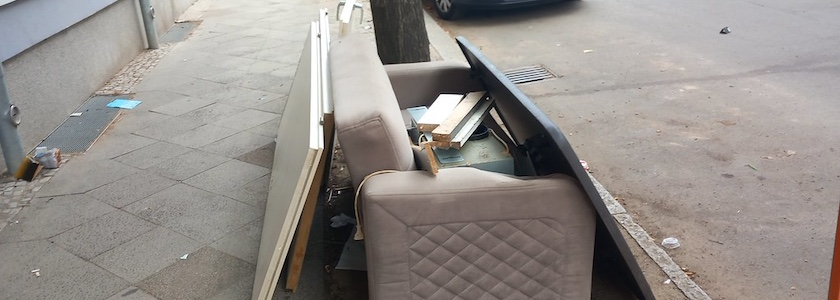

Ich hatte schon lange keine Fundstücke mehr für meine stetig wachsende Sammlung »[Wohnsitz Neukölln](https://www.flickr.com/photos/schockwellenreiter/albums/1244272/)« hier in diesem ~~Blog~~ Kritzelheft veröffentlicht. Das liegt aber nicht daran, daß Neukölln sauberer geworden wäre, sondern eher daran, daß ich mich wegen der sommerlichen Hitze kaum auf die Straße getraut hatte.

Aktuell besteht die Sammlung aus 1.907 Photos. Die Zweitausender-Marke werden ich also bald knacken.

---

**Photo** ([cc](https://creativecommons.org/licenses/by-sa/4.0/deed.de)) 2026: *[Jörg Kantel](http://cognitiones.kantel-chaos-team.de/cv.html)*
