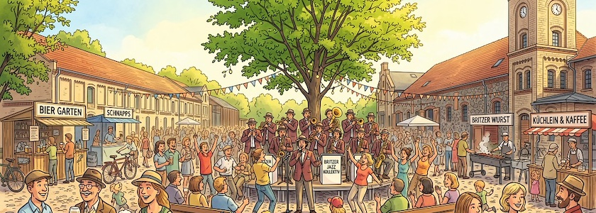
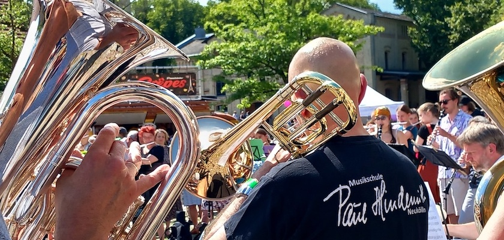

Am Sonntag gibt es in der Nachbarschaft wieder etwas zu feiern: Die Musikschule Paul Hindemith Neukölln, das Museum Neukölln sowie die Kulturstiftung Schloss Britz laden gemeinsam mit den anderen Akteuren auf dem Gelände, der U.S.E. gGmbH (Tierhaltung), dem Schlossrestaurant Hotel Estrel und dem Restaurant Buchholz Gutshof Britz zum **[großen Sommerfest am 5.&nbsp;Juli&nbsp;2026 von 11:00 – 18:00 Uhr](https://www.berlin.de/ba-neukoelln/aktuelles/pressemitteilungen/2026/pressemitteilung.1688121.php)** ein.

Das Sommerfest ist der Höhepunkt des Musikschuljahres und findet auf dem Gelände von Schloss und Gutshof Britz, Alt&nbsp;Britz&nbsp;73-89 in 12359&nbsp;Berlin statt. Der Eintritt ist frei.

Ich werde vermutlich mit der liebsten aller Freundinnen ebenfalls dort mitfeiern. Denn ich war vor zwei Jahren schon einmal auf diesem Fest und ich habe sehr schöne Erinnerungen daran.

---

**Bild**: *[Sommerfest auf Schloss & Gutshof Britz](https://www.flickr.com/photos/schockwellenreiter/55370661599/)*, erstellt mit [OpenArt](https://openart.ai/home). Prompt: »*A musical summer festival at the Britz estate, as shown in @image1. A big band is playing in the courtyard, surrounded by many cheerful people. Some are holding drinks. Stalls offering drinks and snacks are set up around the edge of the courtyard. It is a beautiful summer day. Franco-Belgian comic book style. No speech bubbles, no text boxes. Language: German.*« Modell: Nano Banana 2, nach einem [Photo](https://www.flickr.com/photos/schockwellenreiter/38061450361/) von mir.
