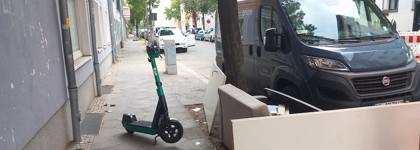

Da -- zumindest in Berlin -- anscheinend nur Gehirnamputierte E-Scooter fahren und sie gedankenlos, wie auf dem [Bannerphoto](hhttps://www.flickr.com/photos/schockwellenreiter/55370729230/) oben, einfach quer auf dem Gehweg parken, so daß gehbehinderte Menschen (wie ich einer bin) nicht mehr an ihnen vorbeikommen (Gehirnamputierte können eben nicht denken), [unterstütze ich die Forderung](https://taz.de/Behinderungen-durch-E-Scooter-in-Berlin/!6191550/), daß die ~~Gehirnamputierten~~ Kunden der Verleiher ihre Fahrten nur auf bestimmten Abstellflächen beenden dürfen. Sie können dann ihrer Fahrzeuge nicht mehr irgendwo in den Weg stellen, sonst tickt die Gebührenuhr weiter. Und das sofort, aber spätestens ab April 2027! In kleinen Teilen Berlins gibt es das bereits, im größten Teil der Stadt (zum Beispiel in Neukölln) aber (noch?) nicht.

Wenn Ihr dieses Bündnis von initial 37 Organisationen unterstützen und die Forderungen nachlesen wollt, [könnt Ihr es hier tun](https://www.fuss-ev.de/blog/aktuelles/e-scooter-aus-dem-weg-breites-berliner-buendnis/). Ich habe bereits unterschrieben und bin nun ebenfalls Teil dieses Bündnisses. Helft bitte mit, das E-Scooter-Chaos zu beenden. Auf das wir nicht weiter von Gehirnamputierten behindert werden und wieder gefahrlos die Gehwege nutzen können.

---

**Photo** ([cc](https://creativecommons.org/licenses/by-sa/4.0/deed.de)) 2026: *[Jörg Kantel](http://cognitiones.kantel-chaos-team.de/cv.html)*

