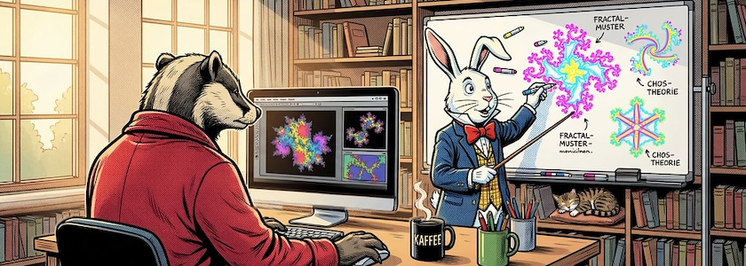

Zwar bin ich momentan in der Hauptsache mit meinen [Twine](http://cognitiones.kantel-chaos-team.de/multimedia/spieleprogrammierung/twine2.html)-[Projekten](https://kantel.github.io/index.html#category=Twine) zur Erstellung interaktiver Geschichten und Spiele beschäftigt, aber in meinem Hinterkopf rumort immer noch meine Liebe zu Creative Coding und Generative Art. Und wenn dann von unser aller Datenkrake dazu etwas Nettes in meinen Feedreader gespült wird, kann ich es Euch doch nicht vorenthalten:

<iframe class="if16_9" src="https://www.youtube.com/embed/ZiVWNAqLDwU?si=PFAD3EeKLxe5YcXn" title="YouTube video player" frameborder="0" allow="accelerometer; autoplay; clipboard-write; encrypted-media; gyroscope; picture-in-picture; web-share" referrerpolicy="strict-origin-when-cross-origin" allowfullscreen></iframe>

*Steve Hingle*, der den Kanal [Steve's Makerspace](https://www.youtube.com/@StevesMakerspace) betreibt, fand ja schon mehrfach hier in diesem ~~Blog~~ Kritzelheft Erwähnung. Er stellt unglaublich kreative Dinge (nicht nur) mit [P5.js](http://cognitiones.kantel-chaos-team.de/programmierung/creativecoding/processing/p5js.html), dem JavaScript-Ableger von [Processing (Java)](http://cognitiones.kantel-chaos-team.de/programmierung/creativecoding/processing/processing.html), an. Leider ist um ihn in der letzten Zeit recht still geworden. Daher hier der Hinweis auf seine Playlist »[How to Code Generative Art using P5.js](https://www.youtube.com/playlist?list=PLnJOmsprq3bE0QLbe7wZ8yb1-Dt0FBcP5)«, die aus 25 informativen und inspirierenden Videos besteht. Einmal möchte ich sie nicht vergessen und zum anderen locke ich ihn damit vielleicht aus seinem Hiatus. Und zum dritten glaube ich, daß ich mich selber verstärkt P5.js zuwenden sollte, denn die Kehrtwendung zur gekünstelten Intelligenzia, die Python derzeit gerade vollzieht, ist nicht wirklich mein Ding[^1].

[^1]: Ich will nicht sagen, daß das schlecht oder gar falsch sei, nur für jemanden wie mich, der Programmieren als kreative Tätigkeit begreift, ist das nicht die Richtung, die ich persönlich einschlagen möchte.

**Ein kleiner Hinweis**: Die Playlist ist zwei Jahre alt, die Skripte sind daher noch mit P5.js Version 1.x erstellt. Für das neue P5.js Version 2.x sind daher an einigen Stellen Anpassungen notwendig. Beachtet dies bitte, wenn Ihr versucht, die Sketche aus Steves Videos nachzuprogrammieren.

---

**Bild**: *[Kaffee und Kreativität](https://www.flickr.com/photos/schockwellenreiter/55355069216/)*, erstellt mit [OpenArt](https://openart.ai/home). Prompt: »*@Badger sits in front of a computer in a bright, cheerful room. He holds the mouse in his right hand and uses his left to operate the keyboard. Next to him on the desk sits a mug of steaming coffee and another mug filled with writing utensils. Otherwise, the desk is clear. In front of him, at a white board, @Rabbit is drawing neon-colored fractal images with colorful markers. He holds a pointer in his free hand, aiming it at the board. Colorful fractal-style images are also visible on the computer monitor. Shelves filled with books line the walls. A small cat is curled up asleep on a cushion on one of the shelves. Morning sunlight streams through the window. Classic American comic book style. Language: German. No speech bubbles, no text boxes.*« Modell: Nano Banana&nbsp;2.